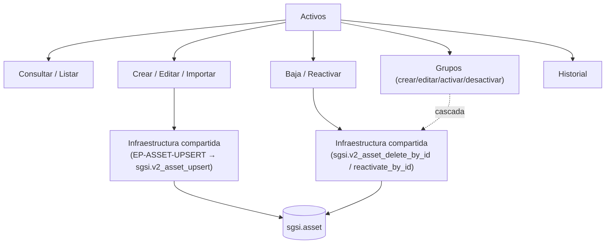

# Activos

## Resumen
Módulo de inventario de activos de información del SGSI: alta, edición, baja/reactivación e importación masiva de activos individuales, agrupación de activos en grupos (con clasificación CIA heredada), y trazabilidad de cambios. Es punto de partida para el análisis de riesgos (cada activo requiere CIA completa antes de poder analizarse en Identificación de Amenazas — dependencia externa, no documentada aquí).

## Frontend Views

| Vista | Ruta | Componente principal |
|---|---|---|
| Inventario (listado) | `/asset-inventory` | `AssetInventory` |
| Nuevo activo | `/asset-inventory/new` | `AssetInventoryDetail(forceNew)` |
| Detalle / edición de activo | `/asset-inventory/[id]` | `AssetInventoryDetail` |
| Grupos (listado dedicado) | `/asset-inventory/groups` | `AssetGroupsList` |
| Detalle de grupo | `/asset-inventory/groups/[id]` | `AssetGroupDetail` |

## Flows

| ID | Flow | Archivo |
|---|---|---|
| FLOW-ACT-001 | Consultar / listar activos | [list-assets.md](../05-flows/assets/list-assets.md) |
| FLOW-ACT-002 | Consultar detalle de activo | [view-asset.md](../05-flows/assets/view-asset.md) |
| FLOW-ACT-003 | Crear activo | [create-asset.md](../05-flows/assets/create-asset.md) |
| FLOW-ACT-004 | Editar activo | [edit-asset.md](../05-flows/assets/edit-asset.md) |
| FLOW-ACT-005 | Dar de baja (eliminar) activo | [delete-asset.md](../05-flows/assets/delete-asset.md) |
| FLOW-ACT-006 | Reactivar activo | [reactivate-asset.md](../05-flows/assets/reactivate-asset.md) |
| FLOW-ACT-007 | Importar activos (Excel masivo) | [import-assets.md](../05-flows/assets/import-assets.md) |
| FLOW-ACT-009 | Exportar activos a Excel (client-side) | [export-assets.md](../05-flows/assets/export-assets.md) |
| FLOW-ACT-010 | Consultar historial de un activo | [asset-history.md](../05-flows/assets/asset-history.md) |
| FLOW-ACT-011 | Consultar / listar grupos de activos | [list-asset-groups.md](../05-flows/assets/list-asset-groups.md) |
| FLOW-ACT-012 | Crear / editar / activar / desactivar grupo | [manage-asset-group.md](../05-flows/assets/manage-asset-group.md) |
| FLOW-ACT-013 | Eliminar grupo de activos | [delete-asset-group.md](../05-flows/assets/delete-asset-group.md) |
| FLOW-ACT-015 | Consultar historial de un grupo | [asset-group-history.md](../05-flows/assets/asset-group-history.md) |

Numeración no consecutiva, intencional: **FLOW-ACT-008** (descargar plantilla Excel) se fusionó como nota dentro de FLOW-ACT-007 por ser una acción trivial 100% client-side sin flow propio reconocible; **FLOW-ACT-014** (activar/desactivar grupo) se fusionó dentro de FLOW-ACT-012; **FLOW-ACT-016** (vincular activos a un grupo) no es un Flow — es una invocación de FLOW-ACT-004 desde una superficie de UI distinta (`LinkAssetsModal`). Ningún ID se reutilizó para otra cosa.

## API

16 endpoints bajo `/asset` (montado en `api-sgsi/src/app.ts` con acceso base `admin-or-usuario`, algunos endurecidos a `admin-only` por middleware de ruta). Índice completo y navegable por Flow en [`docs/06-technical/assets/endpoints/`](../06-technical/assets/endpoints/).

## Database

Esquema `sgsi`, prefijo de función `v2_asset_*` / `v2_asset_group_*` (definidas en `funciones_sgsi.sql`, raíz del repo — no en `_database/functions/`). Tabla principal: `sgsi.asset` (`tablas_sgsi.sql:1843`) y `sgsi.asset_group` (`:1889`). Tablas de apoyo tocadas por las funciones de este módulo: `sgsi.asset_history`, `sgsi.asset_group_history`, `sgsi.asset_threat_risk`, `sgsi.base_asset_type`, `sgsi.cia_level`, `corvus.area`, `corvus.person`, `corvus.customer_person`. Índice completo y navegable por función en [`docs/06-technical/assets/functions/`](../06-technical/assets/functions/).

## Dependencias externas conocidas

| Dominio | Naturaleza de la dependencia | Dónde aparece |
|---|---|---|
| Flujo Documental (`doc-flow`) | La mayoría de las mutaciones de activo/grupo se bloquean (409) si hay un proceso de aprobación activo sobre el inventario (`isAssetFlowLockedByCustomer`, invoca directo `sgsi.doc_flow_is_asset_flow_locked_by_customer`). El listado consulta `useDocFlow` para mostrar el estado del proceso. | FLOW-ACT-003/004/005/006/007/012 (parcial, ver hallazgo) → ahora documentado como `FLOW-DOCFLOW-004` (helper interno de bloqueo) / `FLOW-DOCFLOW-010` (consulta de estado) en [`docs/00-catalog/docflow.md`](../00-catalog/docflow.md) |
| Riesgos (`risk-treatment`, `ai_asset_risk_suggestions`, `group_risk_treatment`) | Cambiar el propietario de un activo o grupo limpia delegaciones de tratamiento de riesgo activas. `AssetRisksControls` (UI del detalle de activo) consulta `useGroupRiskTreatment`. | FLOW-ACT-004, FLOW-ACT-012 |
| IA (`api-ai`) | Al crear un activo sin amenazas/vulnerabilidades en el payload, se dispara enriquecimiento asíncrono vía IA. | FLOW-ACT-003 |
| Wizard (`/wizard/management`) | Punto de entrada alterno a la creación de activos durante el onboarding, reutiliza el mismo endpoint `EP-ASSET-UPSERT`. | No documentado — solo referenciado |

## Hallazgos registrados (no corregidos, fuera de alcance de esta fase)

- `upsertGroup` no verifica el lock de flujo documental, a diferencia del resto de mutaciones del módulo.
- `deleteGroupById` no inserta evento en `sgsi.asset_group_history` (a diferencia de crear/editar/activar/desactivar).
- `getHistoryByGroupId` no valida ownership por `customerId` en el controller, a diferencia de `getById`/`getHistoryByAssetId`.
- Existe una vista de grupos duplicada (dedicada en `/asset-inventory/groups` e inline en `/asset-inventory`) que comparte hook/endpoint pero no implementación de UI.
- Endpoint `GET /asset/getAssetAndSuggestions` sin consumidor confirmado en el frontend inspeccionado.
- `GET /asset/getListByCustomerIdCiaComplete` se expone bajo `/asset` pero su único consumidor confirmado es el módulo Wizard (`FormalizationDashboard`), no Activos.
- Tablas legado `sgsi.asset_criticality`, `asset_iso_clause`, `asset_traceability`, `asset_treatment_status`, `asset_business_continuity_scenario` no están referenciadas por ninguna función `v2_asset_*`.

## Diagrama de alto nivel

No se detallan aquí tablas ni controladores individuales — ese nivel de detalle vive en cada Flow (`docs/05-flows/assets/`) y en el modelo técnico (`docs/06-technical/assets/`).
