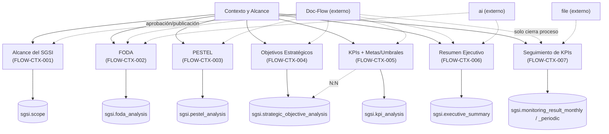

# Contexto y Alcance

## Resumen
Módulo de definición del contexto y alcance del SGSI: Alcance formal, Análisis FODA, Análisis PESTEL, Objetivos Estratégicos (con vínculo N:N a KPIs), KPIs del SGSI (incl. Metas y Umbrales embebidas), Resumen Ejecutivo (asistido por IA) y Seguimiento/Resultados de KPIs (mensual o periódico según frecuencia, con evidencia). Las 6 primeras Operaciones comparten el mismo patrón de ciclo de vida (borrador → completo → aprobación vía Doc-Flow → publicación → nueva versión); la séptima envía a Doc-Flow un snapshot de auditoría sintético sin tabla propia. Cierra 3 de las dependencias entrantes que `DOM-DOCFLOW` había dejado documentadas de forma genérica desde la Fase 7 (`scope`, `kpi_analysis`, `strategic_objective_analysis`, `pestel_analysis`, `foda_analysis`, `executive_summary`).

## Frontend Views

| Vista | Ruta | Componente principal |
|---|---|---|
| Alcance del SGSI | `/context-scope/scope` | `Scope` (+ Wizard: `/wizard/context/scope`, `/wizard/formalization/policies`) |
| Análisis FODA | `/context-scope/foda` | `Foda` |
| PESTEL | `/context-scope/pestel` | `Pestel` |
| Objetivos Estratégicos | `/context-scope/strategic-objective` | `StrategicObjective` |
| KPIs del SGSI | `/context-scope/kpi` | `Kpi` |
| Resumen Ejecutivo | `/context-scope/executive-summary` | `ExecutiveSummary` |
| Seguimiento y Resultados | `/context-scope/monitoring-results` | `MonitoringResults` |
| Contexto organizacional (hub read-only, no es Operación) | `/context-scope/organizational-context` | `OrganizationalContext` |

## Flows

| ID | Operación | Archivo |
|---|---|---|
| FLOW-CTX-001 | Gestionar Alcance del SGSI | [manage-scope.md](../05-flows/context-scope/manage-scope.md) |
| FLOW-CTX-002 | Gestionar Análisis FODA | [manage-foda-analysis.md](../05-flows/context-scope/manage-foda-analysis.md) |
| FLOW-CTX-003 | Gestionar Análisis PESTEL | [manage-pestel-analysis.md](../05-flows/context-scope/manage-pestel-analysis.md) |
| FLOW-CTX-004 | Gestionar Objetivos Estratégicos | [manage-strategic-objectives.md](../05-flows/context-scope/manage-strategic-objectives.md) |
| FLOW-CTX-005 | Gestionar KPIs del SGSI | [manage-kpis.md](../05-flows/context-scope/manage-kpis.md) |
| FLOW-CTX-006 | Gestionar Resumen Ejecutivo | [manage-executive-summary.md](../05-flows/context-scope/manage-executive-summary.md) |
| FLOW-CTX-007 | Registrar Seguimiento y Resultados de KPIs | [manage-monitoring-results.md](../05-flows/context-scope/manage-monitoring-results.md) |

Numeración consecutiva, sin huecos — igual que SoA y Doc-Flow, ninguna Operación candidata se fusionó ni se retiró durante Diseño/Implementación; las convergencias (Contexto Organizacional, Wizard-Scope, Metas/Umbrales, monitoreo mensual/periódico) se resolvieron dentro de las 7 Operaciones existentes, sin crear ni retirar Flows.

## API

65 endpoints físicos, **61 vivos documentados** (4 huérfanos — ver Hallazgos), repartidos en 12 routers: `/scope`, `/foda`, `/pestel`, `/base-pestel`, `/strategic-objective`, `/base-strategic-objective`, `/kpi`, `/threshold-goal`, `/base-kpi`, `/executive-summary`, `/monitoring-result`, `/monitoring-result-periodic` — todos con acceso base `admin-or-usuario`, salvo `/base-pestel` que está montado como `admin-only` (asimetría real frente a `/base-kpi`/`/base-strategic-objective`, no corregida). Índice completo y navegable por Operación en [`docs/06-technical/context-scope/endpoints/`](../06-technical/context-scope/endpoints/).

## Database

Esquema `sgsi`, funciones bajo los prefijos `v2_scope_*`, `v2_foda_*`, `v2_pestel_*`, `v2_strategic_objective_*`, `v2_kpi_*`, `v2_threshold_goal_*`, `v2_frequency_get_all`, `v2_executive_summary_*`, `v2_monitoring_result_monthly_*`, `v2_monitoring_result_periodic_*`, `v2_base_*` (todas definidas en `funciones_sgsi.sql`, raíz del repo). Auditoría de migraciones (`sprint2`/`sprint4`/`sprint5` y sueltas en `api-sgsi/sql/sgsi/migrations/`) confirmó que el snapshot está al día para las 8 migraciones relevantes de este dominio (responsable de objetivo estratégico, N:N KPI↔Objetivos, fix de `delete_by_id`, catálogo base de objetivos, `scope_document_related`, sistema de monitoreo periódico, columnas `is_periodic`, tipo `semiannual`) — sin función crítica desactualizada, a diferencia de lo ocurrido con la Matriz de Riesgo en Activos/Riesgos. Tablas propias principales: `sgsi.scope`, `sgsi.scope_document_related`, `sgsi.foda`, `sgsi.foda_analysis`, `sgsi.pestel`, `sgsi.pestel_analysis`, `sgsi.strategic_objective`, `sgsi.strategic_objective_analysis`, `sgsi.kpi`, `sgsi.kpi_analysis`, `sgsi.kpi_strategic_objective`, `sgsi.threshold_goal`, `sgsi.executive_summary`, `sgsi.monitoring_result_monthly`, `sgsi.monitoring_result_periodic`, más los catálogos de solo lectura `sgsi.base_pestel`, `sgsi.base_kpi`, `sgsi.base_strategic_objective`, `sgsi.kpi_type`, `sgsi.kpi_level`, `sgsi.frequency` (21 tablas en total). Índice completo y navegable por función en [`docs/06-technical/context-scope/functions/`](../06-technical/context-scope/functions/).

## Dependencias externas conocidas

| Dominio | Naturaleza de la dependencia | Dónde aparece |
|---|---|---|
| Flujo Documental (`doc-flow`) | Envío a aprobación (`entity_type` respectivo), publicación e historial — ver mapping exacto en [`docs/00-catalog/docflow.md`](../00-catalog/docflow.md) (`FLOW-DOCFLOW-004`/`006`/`010`). Para `KPI_TRACKING` (`FLOW-CTX-007`), la publicación solo cierra el proceso sobre un snapshot sintético, sin escritura adicional — comportamiento intencional, confirmado con evidencia (ver `manage-monitoring-results.md` § Consideraciones). | Las 7 Operaciones |
| IA (`ai`) | Sugerencias de ítems FODA (`POST /ai/generate-foda-analysis`) y redacción asistida del Resumen Ejecutivo (`GET /ai/generate-executive-summary-resumen`, que lee FODA/PESTEL vía `FN-V2-EXECUTIVE-SUMMARY-GET-DATA-BY-CUSTOMER-ID-TO-AI` y bloquea si FODA no está completo). Confirmado que **no** aparece en Scope/PESTEL/Objetivos Estratégicos/KPI desde su pantalla principal (`GET /ai/getScope` existe pero solo lo consume el Wizard). | FLOW-CTX-002, FLOW-CTX-006 |
| Archivos (`file`) | Evidencia de cumplimiento de KPIs con seguimiento periódico (`FileModel.upsert`/`updateEntityId`). | FLOW-CTX-007 |
| Gobierno del SGSI (`governance`, saliente, dominio aún no documentado) | `communications_matrix_analysis` (Matriz/Registro de Comunicaciones) es escrita por `sgsi.doc_flow_publish` bajo `entity_type='COMMUNICATIONS_MATRIX'`, pero su UI real (`sgsi-communications-log.tsx`) vive en la sección de menú Gobierno del SGSI, no en Contexto y Alcance — mencionada aquí solo como nota de deslinde, sin Operación ni Function propia de `DOM-CTX`. | — |

## Hallazgos registrados (no corregidos, fuera de alcance de esta fase)

- **Corrección de conteo (functions)**: el conteo original de Discovery/Diseño (64) no incluía `sgsi.v2_monitoring_result_periodic_upsert` (`funciones_sgsi.sql:21861-22007`), pasada por alto en el grep inicial de consumidores TypeScript por la longitud de su firma (12 parámetros con `DEFAULT`). El total real físico es **65 functions**, no 64.
- **Corrección de conteo (tables)**: `sgsi.kpi_type`, `sgsi.kpi_level` y `sgsi.frequency` (catálogos de solo lectura alcanzados por `FN-V2-KPI-TYPE-GET-ALL`/`FN-V2-KPI-LEVEL-GET-ALL`/`FN-V2-FREQUENCY-GET-ALL`) no habían sido listados en Checkpoint A/B. Derivadas correctamente de `function.tables[]` en Checkpoint C — el total real es **21 tablas**, no 18.
- **Reclasificación LIVE → ORPHAN (endpoints/functions)**: `POST /strategic-objective/analysis/complete` (`v2_strategic_objective_analysis_mark_complete`) y `POST /executive-summary/complete` (`v2_executive_summary_mark_complete`) tienen toda la cadena técnica (router/controller/model/función SQL) completa y correcta, pero **ningún handler de UI real los invoca** (confirmado con grep de `onClick`/llamadas en los componentes, no solo de imports) y **ninguna otra function SQL los llama internamente** (0 ocurrencias adicionales en `funciones_sgsi.sql` más allá de su propia definición). Reclasificados de LIVE a ORPHAN en Checkpoint C — no se generó YAML de endpoint ni de function para ninguno de los dos.
- `POST /scope/publish` + `sgsi.v2_scope_publish` — función completa y correcta, sin ningún consumidor real en `app-sgsi` (el botón real de publicación de Scope usa `publishProcess`, de Doc-Flow). ORPHAN puro, reconfirmado en los 3 checkpoints.
- `GET /kpi/frequencies/listByCustomerId` — alias del mismo handler que `GET /kpi/frequencies`, comentado en el propio código como "mantener por compatibilidad" pero sin consumidor real. ORPHAN, reconfirmado.
- **Redundancia de publicación (Technical Debt) — comportamiento asimétrico real, no uniforme**: en FODA/PESTEL/Resumen Ejecutivo, Doc-Flow hace el flip real (`is_active`/`is_current` + `is_complete`) y la llamada local de "publish" queda no-op (mismo guard `is_complete=false`, ya no vigente cuando se ejecuta); en Objetivos Estratégicos el orden está invertido — la llamada local hace el trabajo real y Doc-Flow repite el mismo `UPDATE` sin guard; en KPI la responsabilidad está dividida (`is_complete` local, `is_active` solo en Doc-Flow, sin publish local); en Scope ambos lados hacen cambios reales sobre flags distintos (`is_complete` local vía `markComplete`, `is_current` en Doc-Flow) — nunca se llama al publish local. Clasificado uniformemente como Technical Debt (no Functional Divergence): ninguna secuencia produce un estado incorrecto, solo hay escrituras SQL de más. No corregido.
- **`EP-BASE-PESTEL-GET-ALL` es el único endpoint del dominio montado como `admin-only`** (`api-sgsi/src/app.ts:81`) — el resto de `DOM-CTX`, incluidos `base-kpi` y `base-strategic-objective`, está montado como `admin-or-usuario`. Asimetría real, no corregida.
- **Inconsistencia de nomenclatura**: la function de publicación de Resumen Ejecutivo se llama `v2_executive_summary_analysis_publish` (con infijo "analysis") pese a que `sgsi.executive_summary` es una tabla única, no un par ítem+análisis como FODA/PESTEL/Objetivos Estratégicos/KPI. No corregido.
- **Security**: se revisaron específicamente (mismo criterio que SoA/Doc-Flow) los 4 `deleteById` (FODA, PESTEL, Objetivos Estratégicos, KPI) y la descarga de evidencia periódica — los 5 filtran correctamente por `customer_id`/`customerId` de sesión, no por parámetro de request. **No se repite el patrón de borrado cross-tenant hallado en SoA/Doc-Flow.**

## Diagrama de alto nivel

No se detallan aquí tablas ni controladores individuales — ese nivel de detalle vive en cada Operación (`docs/05-flows/context-scope/`) y en el modelo técnico (`docs/06-technical/context-scope/`).
