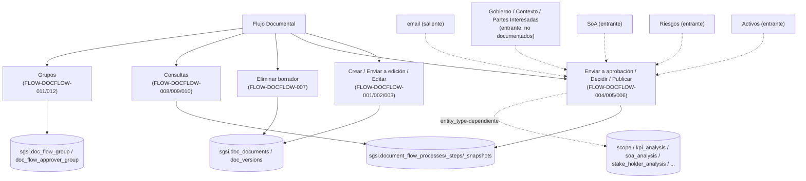

# Flujo Documental

## Resumen
Módulo de gestión de documentos SGSI (creación, edición colaborativa con lock, ciclo de vida BORRADOR→EN_EDICION→EN_APROBACION→VIGENTE) y motor de aprobación polimórfico compartido por todo el sistema (`document_flow_processes`/`_steps`/`_snapshots`), usado por Activos, Riesgos y SoA ya documentados, y por Gobierno, Contexto y Alcance, Partes Interesadas, Iniciativas (no documentados aún) para aprobar sus propias entidades. Incluye grupos de visibilidad de documentos y grupos reutilizables de aprobadores.

## Frontend Views

| Vista | Ruta | Componente principal |
|---|---|---|
| Crear documento (individual + carga masiva) | `/doc-flow/create` | `DocumentFlowCreate` |
| Edición de contenido | `/doc-flow/edition/[id]` | `DocumentEditorView` |
| Bandeja de aprobación | `/doc-flow/inbox`, `.../review/[processId]/[stepId]`, `.../[versionId]/[processId]/[stepId]` | `InboxList`, `EntityReviewView`, `DocumentReviewView` |
| Mis documentos | `/doc-flow/my-documents` | `MyDocuments` |
| Documentos vigentes | `/doc-flow/current-documents` | `CurrentDocuments` |
| Grupos de visibilidad | `/doc-flow/groups` | `DocFlowGroups` |
| Configuración (grupos de aprobadores + procesos en configuración) | `/doc-flow/configuration` | `DocFlowConfigurePage` |

## Flows

| ID | Operación | Archivo |
|---|---|---|
| FLOW-DOCFLOW-001 | Crear documento SGSI | [create-document.md](../05-flows/docflow/create-document.md) |
| FLOW-DOCFLOW-002 | Enviar documento a edición | [send-document-to-editing.md](../05-flows/docflow/send-document-to-editing.md) |
| FLOW-DOCFLOW-003 | Editar contenido de documento | [edit-document-content.md](../05-flows/docflow/edit-document-content.md) |
| FLOW-DOCFLOW-004 | Enviar documento/entidad a aprobación | [submit-to-approval.md](../05-flows/docflow/submit-to-approval.md) |
| FLOW-DOCFLOW-005 | Gestionar decisión de aprobación | [manage-approval-decision.md](../05-flows/docflow/manage-approval-decision.md) |
| FLOW-DOCFLOW-006 | Publicar documento/entidad | [publish-document.md](../05-flows/docflow/publish-document.md) |
| FLOW-DOCFLOW-007 | Eliminar borrador de documento | [delete-draft-document.md](../05-flows/docflow/delete-draft-document.md) |
| FLOW-DOCFLOW-008 | Consultar "Mis documentos" | [view-my-documents.md](../05-flows/docflow/view-my-documents.md) |
| FLOW-DOCFLOW-009 | Consultar documentos vigentes | [view-current-documents.md](../05-flows/docflow/view-current-documents.md) |
| FLOW-DOCFLOW-010 | Consultar procesos, historial y snapshots de aprobación | [view-process-history.md](../05-flows/docflow/view-process-history.md) |
| FLOW-DOCFLOW-011 | Gestionar grupos de visibilidad de documentos | [manage-visibility-groups.md](../05-flows/docflow/manage-visibility-groups.md) |
| FLOW-DOCFLOW-012 | Gestionar grupos de aprobadores | [manage-approver-groups.md](../05-flows/docflow/manage-approver-groups.md) |

Numeración consecutiva, sin huecos — al igual que SoA, ninguna Operación candidata se fusionó ni se retiró durante Diseño/Implementación (el único ajuste real, "Enviar a edición" vs. "Enviar a aprobación", terminó siendo un split hacia 2 Operaciones, no una fusión ni un retiro).

## API

41 endpoints vivos documentados (de 42 encontrados físicamente; 1 huérfano — ver Hallazgos), repartidos en 4 routers: `/document-flow` (`doc-flow.ts`, 16, motor de aprobación), `/document-flow` (`doc-documents.ts`, montado bajo el mismo prefijo, 16 de 17 vivos, catálogo de documentos), `/document-flow-group` (5, grupos de visibilidad), `/document-flow-approver-group` (4, grupos de aprobadores) — todos con acceso base `admin-or-usuario` sin overrides de middleware por ruta (las restricciones adicionales, ej. `ADMIN_ONLY_ENTITY_TYPES` o exportar inventario, viven en lógica de negocio dentro del controller). Índice completo y navegable por Operación en [`docs/06-technical/docflow/endpoints/`](../06-technical/docflow/endpoints/).

**Corrección vs. Discovery/Diseño**: el conteo físico real de `doc-documents.ts` es 17 endpoints (no 18) — el total físico del módulo es 42 (no 43); descontando el alias huérfano `POST .../unlock`, quedan 41 LIVE (no 42).

## Database

Esquema `sgsi`, funciones bajo los prefijos `doc_flow_*` (motor de aprobación), `doc_*` (catálogo de documentos) y `v2_doc_flow_*` (grupos), más `v2_document_workflow_snapshot_organigrama` (definidas en `funciones_sgsi.sql`, raíz del repo — no en `_database/functions/`). Auditoría sistemática de migraciones (`sprint2`, `sprint4`, `sprint5` y sueltas en la raíz de `api-sgsi/sql/sgsi/migrations/`) confirmó que el snapshot está al día para las funciones centrales del ciclo de vida — sin función crítica desactualizada. Tablas propias principales: `sgsi.doc_documents`, `sgsi.doc_versions`, `sgsi.document_flow_processes`, `sgsi.document_flow_steps`, `sgsi.document_flow_snapshots`, `sgsi.doc_flow_group(_position)`, `sgsi.doc_flow_approver_group(_member)`. Índice completo y navegable por función en [`docs/06-technical/docflow/functions/`](../06-technical/docflow/functions/).

## Dependencias externas conocidas

| Dominio | Naturaleza de la dependencia | Dónde aparece |
|---|---|---|
| Correo (`email`) | Notificaciones fire-and-forget en cada transición del motor de aprobación (siguiente aprobador, publicador, editor en caso de rechazo, editor asignado). Dependencia nueva, no declarada por Activos/Riesgos/SoA. | FLOW-DOCFLOW-002, 004, 005 |
| Archivos (`file`) | Imágenes/archivos adjuntos del editor y de la imagen del organigrama se persisten vía `FileModel.upsert`; se borran en cascada al eliminar un borrador. | FLOW-DOCFLOW-003, 004 (organigrama), 007 |
| Activos (`assets`, entrante) | Activos invoca directamente `sgsi.doc_flow_is_asset_flow_locked_by_customer` desde su propia capa de queries (acoplamiento cross-schema a nivel SQL, no solo HTTP) para bloquear mutaciones (409) mientras hay un proceso de Activos en revisión/publicación; y consume `EP-DOCFLOW-GET-ACTIVE-ASSET-PROCESS` para el banner. | FLOW-DOCFLOW-004 (helper interno), FLOW-DOCFLOW-010 |
| Riesgos (`risk-treatment`, entrante) | El Plan de Tratamiento y la Matriz de Riesgo (`FLOW-RSK-010/011`, `FLOW-RSK-005`) usan `entity_type='RISK_TREATMENT_PLAN'`/`'RISK_MATRIX'` para enviar a aprobación, consultar estado y publicar. | FLOW-DOCFLOW-004, 006, 010 |
| SoA (`soa`, entrante) | La Declaración de Aplicabilidad (`FLOW-SOA-002/004`) usa `entity_type='SOA'` para publicar/consultar estado — y, según el hallazgo de Implementación, la publicación real de `is_active`/`is_complete` de `sgsi.soa_analysis` ocurre dentro de `FN-DOC-FLOW-PUBLISH`, no solo en `sgsi.v2_soa_analysis_mark_complete`. | FLOW-DOCFLOW-004, 006, 010 |
| Gobierno (`governance`, entrante — documentado en [`docs/00-catalog/gobierno.md`](./gobierno.md)) | **Tres** `entity_type`, no dos: Cargos (`'CARGO'`, `FLOW-GOV-009`) y Organigrama (`'ORGANIGRAMA'` con `entity_id = customerId`, `FLOW-GOV-010`) usan el motor con generación automática del documento formal al publicar; y el Registro de Comunicaciones (`'COMMUNICATIONS_MATRIX'`, `FLOW-GOV-012`), que **sí** tiene rama propia en `FN-DOC-FLOW-PUBLISH` y escribe directamente `sgsi.communications_matrix_analysis`. Para `CARGO`, además, el controller reescribe `sgsi.position` (y en cascada `sgsi.asset`) llamando `models/position.ts#upsert` antes de generar el documento — ver `FLOW-DOCFLOW-006` y `EP-DOCFLOW-PUBLISH-PROCESS`. | FLOW-DOCFLOW-004, 006, 010 |
| Contexto y Alcance (`context-scope`, entrante, no documentado) | Alcance, FODA, PESTEL, KPIs, Objetivos Estratégicos, Resumen Ejecutivo (`entity_type` respectivo) usan el motor; `FN-DOC-FLOW-PUBLISH` escribe directamente sobre sus tablas físicas al publicar. La Matriz/Registro de Comunicaciones, que esta fila listaba antes, **no pertenece a este dominio**: su UI y su Operación viven en Gobierno del SGSI (ver fila anterior). | FLOW-DOCFLOW-004, 006, 010 |
| Partes Interesadas (`stakeholder`, entrante, no documentado) | `entity_type='STAKEHOLDER'` usa el motor; `FN-DOC-FLOW-PUBLISH` escribe directo sobre `sgsi.stake_holder_analysis`. | FLOW-DOCFLOW-004, 006, 010 |
| Planificación (`initiatives`, entrante, no documentado) | Iniciativas (`entity_type='INITIATIVE'`) consulta procesos por tipo. | FLOW-DOCFLOW-010 |
| PDF (`pdf`, saliente **descartada**) | Corrección vs. Discovery: `doc_pdf_soa_payload`, `doc_pdf_stakeholder_payload`, `doc_pdf_workflow_document_payload` y `document_flow_snapshot_get_by_version_id` viven y se consumen enteramente en el dominio PDF (`models/pdf.ts`/`queries/pdf.ts`), que LEE de `document_flow_snapshots`/`document_flow_processes` — la dirección de dependencia es inversa a la estimada; no se documenta como dependencia saliente de `DOM-DOCFLOW`. |  — |

## Hallazgos registrados (no corregidos, fuera de alcance de esta fase)

- **SECURITY FINDING — `DELETE /document-flow/documents/versions/:versionId` sin aislamiento por `customerId`** (más severo que el hallazgo equivalente de SoA): confirmado de punta a punta. El router (`api-sgsi/src/routers/doc-documents.ts:44`) solo aplica el acceso base de mount (`admin-or-usuario`, sin middleware propio); el controller (`api-sgsi/src/controllers/doc-documents.ts:164-183`, `handleDeleteDraftVersion`) nunca llama `dataUser(req)` para obtener `customerId`; el model (`api-sgsi/src/models/doc-documents.ts:234-245`) y la query (`api-sgsi/src/queries/doc-documents.ts:8`) reciben un único parámetro (`versionId`); la función SQL (`funciones_sgsi.sql:596-679`) no tiene `customer_id` en ningún `WHERE`. Cualquier usuario autenticado de cualquier cliente puede borrar el borrador de otro cliente conociendo el `versionId` — y, si es la única versión, elimina en cascada `sgsi.file` (imágenes/archivos), `sgsi.document_flow_steps`/`_snapshots`/`_processes` (si `EN_CONFIGURACION`), la versión y **el documento completo** (`sgsi.doc_versions` + `sgsi.doc_documents`). No se corrige aquí — queda registrado para un trabajo de seguridad independiente.
- **Alias endpoint muerto**: `POST /document-flow/documents/versions/:versionId/unlock` apunta al mismo handler que `DELETE .../lock` (`handleReleaseEditLock`), pero `doc-documents.Service.ts` solo consume el `DELETE` — sin consumidor real en `app-sgsi`.
- **4 overloads SQL muertos**: `doc_flow_create_process` (4 args, sin `p_customer_id`), `doc_flow_reassign_step` (2 args), `doc_update_content` (4 args, sin `related_document_ids`), `doc_get_my_editing_assignments` (1 arg, sin `p_customer_id`) — la query TypeScript siempre invoca la variante con más argumentos; los overloads cortos son inalcanzables.
- **6 functions SQL sin ningún consumidor (ni TypeScript ni SQL interno)**: `doc_flow_get_active_process_info` — no, esta SÍ está viva internamente (ver corrección más abajo) — las realmente huérfanas son: `doc_get_detail_by_entity` (su único caller, el modelo `doc-flow.ts#getDocumentById`, nunca se importa en el controller), `doc_flow_replace_step_approver` (sin ninguna referencia en `api-sgsi/src`), `doc_get_asset_document_type_id`, `doc_get_organigrama_document_type_id`, `doc_get_position_document_type_id` (las 3 queries que las envuelven — `_getAssetDocumentTypeId`, `_getOrganigramaDocumentTypeId`, `_getPositionDocumentTypeId` — están definidas en `queries/doc-documents.ts` pero nunca importadas en el modelo), y `doc_get_document_by_asset_source` (su único caller, `upsertPublishedAssetDocument`, está importado en el controller pero nunca invocado — ver punto siguiente).
- **Modelo TS importado pero nunca invocado**: `upsertPublishedAssetDocument` (para activos individuales) está importado en `controllers/doc-flow.ts:57` pero `handlePublishProcess` solo tiene ramas para CARGO/ASSET_INVENTORY/ORGANIGRAMA/STAKEHOLDER, nunca para un "ASSET" individual — código muerto, y arrastra a `doc_get_document_by_asset_source` como huérfano real.
- **Cadena muerta de 2 functions de snapshot** (hallazgo aportado por la documentación de Gobierno del SGSI, Fase 9): `sgsi.v2_document_snapshot_capture` (`funciones_sgsi.sql:16142`) no tiene ningún consumidor TypeScript (0 referencias en `api-sgsi/src`), y su única llamada interna es hacia `sgsi.v2_document_workflow_snapshot_position` (`:16886`), que tampoco tiene consumidor propio — es decir, ambas están muertas en conjunto. El snapshot que sí se usa al enviar un proceso es `sgsi.v2_document_workflow_snapshot_organigrama`, invocada directamente desde `models/doc-flow.ts:145` (`_buildOrganigramaSnapshot`), y el de `CARGO` lo arma la pantalla de configuración en el frontend. **No se generaron nodos** para ninguna de las dos.
- **Deuda legacy con riesgo de bloqueo en `FN-V2-DOCUMENT-WORKFLOW-SNAPSHOT-ORGANIGRAMA`** (hallazgo aportado por Gobierno del SGSI): lee `corvus.person.position_id`, columna congelada desde la migración sprint5. Sin impacto funcional hoy (ningún consumidor lee ese campo del snapshot), pero se romperá cuando se ejecute el `DROP COLUMN` pendiente — ver las `notes:` de esa function y `FLOW-GOV-010`.
- **CORRECCIÓN — 2 functions reclasificadas de ORPHAN a vivas durante Implementación**: `doc_flow_get_active_process_info` (invocada internamente vía `LEFT JOIN LATERAL` por `doc_get_my_documents`, `doc_get_my_editing_assignments` y `doc_get_inventory_report` — ningún TypeScript la llama directo, pero sí otras functions SQL) y `doc_get_document_id_by_customer_and_title` (invocada internamente al inicio de `doc_upsert` para impedir títulos duplicados). Checkpoint A/B solo habían grepeado consumidores TypeScript, no llamadas SQL→SQL.
- **Función referenciada desde TypeScript que no existe en ninguna fuente disponible**: `queries/doc-documents.ts:6` invoca `sgsi.doc_versions_get_snapshot_for_pdf`, pero esa función no existe ni en `funciones_sgsi.sql` ni en ninguna migración (grep exhaustivo, 0 resultados). El modelo que la envuelve (`getSnapshotForPdf`) tampoco tiene consumidor de controller — doblemente inalcanzable en la práctica, por eso no se manifiesta como error visible. No se documenta como Function (no existe), solo se registra aquí la divergencia.
- **DIVERGENCIA MATERIAL — `FN-DOC-FLOW-PUBLISH` escribe 9 tablas físicas de otros dominios directamente en SQL** (no solo genera documentos vía Node como se estimó en Diseño): ver `docs/05-flows/docflow/publish-document.md` § Consideraciones para el detalle completo. No cambia el diseño de 12 Operaciones ni de endpoints — enriquece la trazabilidad real de `FLOW-DOCFLOW-006`.
- El motor de aprobación duplica en SQL (no reutiliza vía `calls`) el mismo catálogo polimórfico de tablas por `entity_type` en al menos 3 funciones distintas (`doc_flow_entity_belongs_to_customer`, `doc_flow_get_my_pending`, `doc_flow_get_my_configurations`) — cualquier `entity_type` nuevo debe agregarse en los 3 lugares (y en `doc_flow_publish` si requiere efecto de publicación), no hay una única fuente de verdad SQL para ese catálogo.

## Diagrama de alto nivel

No se detallan aquí tablas ni controladores individuales — ese nivel de detalle vive en cada Operación (`docs/05-flows/docflow/`) y en el modelo técnico (`docs/06-technical/docflow/`).
