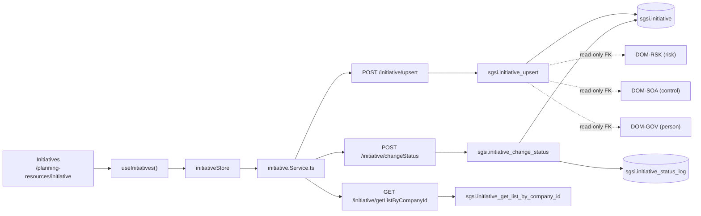

# Iniciativas del SGSI

## Resumen

Módulo que gestiona iniciativas de seguridad de la información: proyectos, programas o acciones estratégicas del SGSI con ciclo de vida definido y estado auditado. Cada iniciativa tiene un responsable designado, puede vincularse con riesgos específicos del plan de tratamiento y con controles del SoA, registra progreso, presupuesto y puede ser completada o cancelada. Cambios de estado requieren justificación explícita y se registran en tabla de auditoría `sgsi.initiative_status_log`.

## Frontend Views

| Vista | Ruta | Componente principal |
|---|---|---|
| Listado de iniciativas | `/planning-resources/initiative` | `Initiatives` |

## Flows

| ID | Operación | Archivo |
|---|---|---|
| FLOW-INIT-001 | Crear/Actualizar iniciativa | [create-update-initiative.md](../05-flows/initiative/create-update-initiative.md) |
| FLOW-INIT-002 | Cambiar estado de iniciativa | [change-initiative-status.md](../05-flows/initiative/change-initiative-status.md) |

## API

**3 endpoints vivos documentados** en router `/initiative`:
- 1 lectura (list)
- 1 escritura (upsert)
- 1 transición de estado

Índice en [`docs/06-technical/initiative/endpoints/`](../06-technical/initiative/endpoints/).

## Database

Schema `sgsi`. **3 functions vivas documentadas**:
- `sgsi.initiative_upsert` — create/update
- `sgsi.initiative_change_status` — state machine
- `sgsi.initiative_get_list_by_company_id` — list

**2 tablas principales**: `sgsi.initiative` (iniciativa), `sgsi.initiative_status_log` (auditoría).

## Dependencias externas conocidas

| Dominio | Naturaleza | Dónde aparece |
|---|---|---|
| Riesgos (`DOM-RSK`) | FK `link_risk_id` — iniciativa puede vincularse con riesgo para tratamiento. Solo lectura desde INIT. | FLOW-INIT-001 (link riesgo) |
| Controles (`DOM-SOA`) | FK `link_control_id` — iniciativa puede implementar un control SoA. Solo lectura desde INIT. | FLOW-INIT-001 (link control) |
| Personas (`DOM-GOV`) | FK `lead_responsible_id` — responsable de la iniciativa (lectura de persona). Solo lectura desde INIT. | FLOW-INIT-001 (asignar responsable) |

**Todas las dependencias son READ-ONLY:** Initiative no escribe en esos dominios, solo establece referencias.

## Hallazgos registrados

- Ninguno. State machine es correctamente restrictivo en función `initiative_change_status`.

## Diagrama de alto nivel

