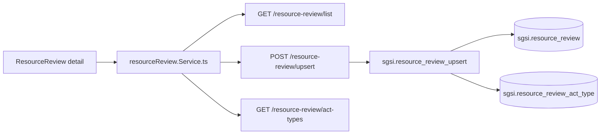

# Revisiones de Recursos del SGSI

## Resumen

Módulo que registra sesiones de revisión de suficiencia de recursos según requisito ISO 27001:C.1 — sesiones en las que la organización analiza si los recursos disponibles (presupuesto, personal, infraestructura, herramientas) son suficientes para el SGSI. Cada revisión se registra como "acto" (comité, asamblea, etc.), con participantes, decisiones y evidencia adjunta. Código autogenerado por año (REV-YYYY-NNN).

## Frontend Views

| Vista | Ruta | Componente principal |
|---|---|---|
| Listado de revisiones | `/planning-resources/resource-review` | `ResourceReview` |
| Nueva revisión | `/planning-resources/resource-review/new` | Detail form |
| Detalle/edición | `/planning-resources/resource-review/{id}` | Detail form |

## Flows

| ID | Operación | Archivo |
|---|---|---|
| FLOW-RESREV-001 | Crear/Actualizar revisión de recursos | [create-update-review.md](../05-flows/resource-review/create-update-review.md) |

## API

**7 endpoints vivos completamente documentados** en router `/resource-review`:
1. `POST /upsert` — create/update (FLOW-RESREV-001)
2. `GET /list` — list (SUPPORT)
3. `GET /summary` — aggregate (SUPPORT)
4. `GET /act-types` — activity types catalog (SUPPORT)
5. `GET /{id}` — get detail (SUPPORT)
6. `POST /{revisionId}/evidence` — upload evidence (SUPPORT)
7. `GET /{id}/evidence` — get evidence (SUPPORT)

Índice en [`docs/06-technical/resource-review/endpoints/`](../06-technical/resource-review/endpoints/).

## Database

Schema `sgsi`. **7 functions vivas documentadas**:
1. `sgsi.resource_review_upsert` — create/update
2. `sgsi.resource_review_get_list_by_customer_id` — list
3. `sgsi.resource_review_get_summary` — aggregate
4. `sgsi.resource_review_get_act_types` — activity types catalog
5. `sgsi.resource_review_get_by_id` — get detail
6. `sgsi.resource_review_upsert_evidence` — upload evidence
7. `resource_review_get_evidence_path` (o similar) — get evidence path

**2 tablas principales**: `sgsi.resource_review` (revisión), `sgsi.resource_review_act_type` (catálogo).

## Dependencias externas conocidas

| Dominio | Naturaleza | Dónde aparece |
|---|---|---|
| Archivos (`file`) | Evidencia se indexa vía `FileModel.upsert` con `entity_type='resource-review-evidence'`. | FLOW-RESREV-001 (upload) |

## Hallazgos registrados

- Ninguno. Código autogenerado REV-YYYY-NNN es confiable.

## Diagrama de alto nivel

