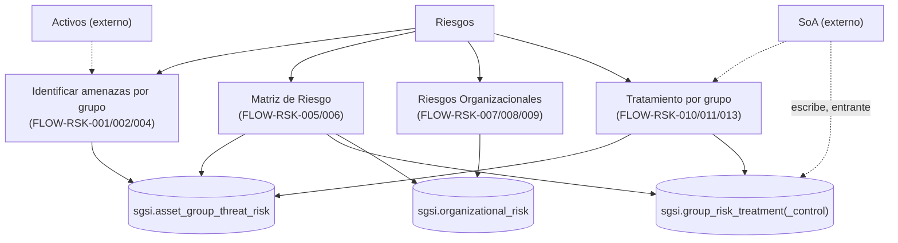

# Riesgos

## Resumen
Módulo de gestión del riesgo del SGSI: identificación de amenazas/vulnerabilidades por grupo de activos, matriz de riesgo consolidada (activo individual legacy + organizacional), configuración de metodología (apetito y rangos de criticidad), registro de riesgos organizacionales, y definición/tratamiento de riesgo con plan de acciones y evidencia — a nivel de grupo de activos. Depende de Activos para la identidad y datos de los grupos, y de SoA para el requisito de controles al mitigar/transferir un riesgo.

## Frontend Views

| Vista | Ruta | Componente principal |
|---|---|---|
| Identificación de Amenazas (listado de grupos) | `/risk-management/identifying-threats-vulnerabilities` | `IdentifyingThreatsVulnerabilities` |
| Análisis de riesgos de un grupo (detalle) | `/risk-management/identifying-threats-vulnerabilities/[groupId]` | `IdentifyingThreatsVulnerabilitiesDetail` |
| Matriz de Riesgo (+ metodología embebida) | `/risk-management/risk-matrix` | `GroupRiskMatrix` |
| Riesgos Aceptados (vista derivada) | `/risk-management/accepted-risks` | `GroupAcceptedRisks` |
| Riesgos Organizacionales | `/risk-management/organizational-risks` | `OrganizationalRisks` |
| Plan de Tratamiento (todos los grupos) | `/risk-treatment` | `GroupRiskTreatmentPlan` |
| Plan de Tratamiento (un grupo) | `/risk-treatment/[groupId]` | `GroupRiskTreatmentPlan` (mismo componente) |

## Flows

| ID | Operación | Archivo |
|---|---|---|
| FLOW-RSK-001 | Consultar grupos pendientes de análisis de amenazas | [list-groups-pending-analysis.md](../05-flows/risks/list-groups-pending-analysis.md) |
| FLOW-RSK-002 | Analizar amenazas y vulnerabilidades de un grupo | [analyze-group-threats-risks.md](../05-flows/risks/analyze-group-threats-risks.md) |
| FLOW-RSK-004 | Finalizar análisis de riesgos de un grupo | [finalize-group-risk-analysis.md](../05-flows/risks/finalize-group-risk-analysis.md) |
| FLOW-RSK-005 | Consultar matriz de riesgo | [view-risk-matrix.md](../05-flows/risks/view-risk-matrix.md) |
| FLOW-RSK-006 | Configurar metodología de riesgo | [configure-risk-methodology.md](../05-flows/risks/configure-risk-methodology.md) |
| FLOW-RSK-007 | Consultar riesgos aceptados (derivado) | [view-accepted-risks.md](../05-flows/risks/view-accepted-risks.md) |
| FLOW-RSK-008 | Crear / editar riesgo organizacional | [manage-organizational-risk.md](../05-flows/risks/manage-organizational-risk.md) |
| FLOW-RSK-009 | Eliminar riesgo organizacional | [delete-organizational-risk.md](../05-flows/risks/delete-organizational-risk.md) |
| FLOW-RSK-010 | Definir tratamiento — vista consolidada (todos los grupos) | [define-group-risk-treatment.md](../05-flows/risks/define-group-risk-treatment.md) |
| FLOW-RSK-011 | Definir tratamiento — por grupo específico | [define-risk-treatment.md](../05-flows/risks/define-risk-treatment.md) |
| FLOW-RSK-013 | Gestionar acciones, avance y evidencia de tratamiento (grupo) | [manage-group-treatment-actions.md](../05-flows/risks/manage-group-treatment-actions.md) |

Numeración no consecutiva, intencional (mismo criterio que en Activos): **FLOW-RSK-003** (excluir amenaza a nivel de grupo) se fusionó como nota dentro de FLOW-RSK-002 — no tiene endpoint dedicado a ese nivel. **FLOW-RSK-012** (gestión de acciones "individual", sobre `/risk-treatment/actions/*`) **no existe** — ese backend está huérfano (ver Hallazgos), no se documenta como Operación. **FLOW-RSK-014 a 017** (variantes de progreso/evidencia que se habían considerado aparte de "gestionar acciones") quedaron fusionadas dentro de FLOW-RSK-013, ya que comparten el mismo entry point y componente. Ningún ID se reutilizó para otra cosa.

## API

21 endpoints vivos documentados, repartidos en 7 routers: `/asset-group-threat-risk` (4), `/asset-threat-risk` (1 vivo de 6 — ver Hallazgos), `/risk-methodology` (2), `/organizational-risk` (6), `/group-risk-treatment` (9, incluyendo las 7 de `actions/*`), `/risk-treatment` (1 vivo de 9 — ver Hallazgos). Índice completo y navegable por Operación en [`docs/06-technical/risks/endpoints/`](../06-technical/risks/endpoints/).

## Database

Esquema `sgsi`, funciones bajo varios prefijos según su origen histórico (`v2_asset_group_threat_risk_*`, `v2_risk_*`, `v2_organizational_risk_*`, `group_risk_treatment_action_*`, sin prefijo `v2_` uniforme a diferencia de Activos — definidas en `funciones_sgsi.sql`, raíz del repo, sincronizado con la BD el 2026-09-08). Tablas propias principales: `sgsi.asset_group_threat_risk`, `sgsi.group_risk_treatment`, `sgsi.group_risk_treatment_action(_progress/_evidence)`, `sgsi.group_risk_treatment_control`, `sgsi.organizational_risk(_control)`, `sgsi.risk_methodology_config`. Tablas legacy (por activo individual, backend huérfano — ver Hallazgos): `sgsi.asset_threat_risk(_evaluation)`, `sgsi.risk_treatment(_action(_progress/_evidence))`, `sgsi.risk_treatment_control` — ya no las lee la Matriz (corregido en Sprint 5, ME-007). Índice completo y navegable por función en [`docs/06-technical/risks/functions/`](../06-technical/risks/functions/).

## Dependencias externas conocidas

| Dominio | Naturaleza de la dependencia | Dónde aparece |
|---|---|---|
| Activos (`assets`) | El listado de grupos pendientes de análisis (FLOW-RSK-001) reutiliza el endpoint de listado de grupos de Activos sin endpoint propio; el detalle de grupo (FLOW-RSK-002) y la rama "asset" de la Matriz (FLOW-RSK-005) leen datos de Activos. | FLOW-RSK-001, FLOW-RSK-002, FLOW-RSK-005 |
| Flujo Documental (`doc-flow`) | La Matriz de Riesgo y el Plan de Tratamiento muestran banner/historial de aprobación y permiten "Enviar a Aprobación" (snapshot en `sessionStorage` hacia `/doc-flow/configuration`). | FLOW-RSK-005, FLOW-RSK-010, FLOW-RSK-011 → ahora documentado como `FLOW-DOCFLOW-004` (enviar a aprobación), `FLOW-DOCFLOW-006` (publicar) y `FLOW-DOCFLOW-010` (consultar procesos/historial) en [`docs/00-catalog/docflow.md`](../00-catalog/docflow.md) |
| SoA / Controles (`soa`, saliente) | Definir tratamiento con estrategia "mitigar" o "transferir" exige al menos un control SoA vinculado (validado en el controller, no en SQL). | FLOW-RSK-010, FLOW-RSK-011 |
| SoA / Controles (`soa`, **entrante**) | La UI **"Vínculo de Controles"** (`/soa-controls/risk-control-linkage`) escribe directamente, de forma incremental, sobre `sgsi.group_risk_treatment_control` — tabla técnica de este módulo. Riesgo de sobrescritura confirmado: `sgsi.v2_group_risk_treatment_upsert` (FLOW-RSK-010/011) reemplaza el set completo de controles (`DELETE`+`INSERT`) en cada guardado del tratamiento. | Documentada como `FLOW-SOA-006` en [`docs/00-catalog/soa.md`](../00-catalog/soa.md) — ownership funcional de `DOM-SOA` |
| Wizard (`wizard`) | FLOW-RSK-002 reutiliza `AddCustomThreatModal`/`SuggestedRisksModal`, ubicados físicamente en `components/functional/wizard/management/`. En sentido inverso, Wizard consume `getAssetIdsWithAnalysisByCustomerId` y `getMatrixByCustomerId` de Riesgos — dependencia de Wizard hacia Riesgos, no documentada como saliente de este módulo. | FLOW-RSK-002 |

**Nota de estándar (learning candidate para v1.1, no aplicado todavía a `docs/TRACEABILITY_STANDARD.md`):** el dominio propietario de una Operación se determina por responsabilidad funcional, no por ownership físico de las tablas que toca. "Vínculo de Controles" pertenece funcionalmente a SoA/Controles aunque escriba tablas de Riesgos; se registra aquí como dependencia entrante, no se reasigna a `DOM-RSK`, y su trazabilidad completa está documentada en `DOM-SOA` (`FLOW-SOA-006`, ver [`docs/05-flows/soa/link-controls-to-risk.md`](../05-flows/soa/link-controls-to-risk.md)).

## Hallazgos registrados (no corregidos, fuera de alcance de esta fase)

- **Router `/asset-threat-risk` mayormente huérfano (legacy / unreachable-from-current-frontend)**: de sus 6 endpoints, `upsert`, `exclude`, `finalizeRiskAnalysis` y `getListByAssetId` no tienen ningún llamador confirmado en `app-sgsi` (verificado por grep exhaustivo de todos los métodos expuestos por `useAssetThreatRisk()`). El análisis de amenazas "por activo individual" fue reemplazado por el flujo "por grupo" (FLOW-RSK-002) sin desactivar el backend legacy. Como consecuencia, el efecto secundario `RiskTreatmentModel.syncResidualRiskByAssetId` (disparado solo desde `upsert`/`exclude` de este router) es también inalcanzable en la práctica. Solo `getMatrixByCustomerId` y `getAssetIdsWithAnalysisByCustomerId` siguen vivos (el segundo, consumido únicamente por Wizard, no por ninguna pantalla de Riesgos).
- **Router `/risk-treatment-control` completo huérfano**: existen router, controller, model, query, schema y hasta un hook `useRiskTreatmentControl` en el frontend, pero ningún componente lo importa.
- **Router `/risk-treatment` mayormente huérfano**: de sus 9 endpoints, solo `GET /risk-treatment/strategies` (catálogo de estrategias) tiene consumidor real dentro de Riesgos (usado por el formulario de tratamiento de FLOW-RSK-010/011). `GET /risk-treatment/getList` solo lo consume `FormalizationPolicies` del Wizard (fuera de Riesgos). `POST /risk-treatment/upsert` y los 7 endpoints de `actions/*` (incluyendo su efecto de convergencia interna activo/organizacional en `sgsi.v2_risk_treatment_upsert`) no tienen ningún llamador confirmado — `useRiskTreatment()` nunca expone ni se usa para invocar esos métodos de escritura en ningún componente del repo.
- **Overload muerto de `sgsi.v2_risk_treatment_upsert`**: existen dos definiciones con firmas distintas (`funciones_sgsi.sql:25032`, parámetros `uuid,jsonb,uuid`, y `:25249`, parámetros `uuid,uuid,jsonb`). Ninguna de las dos es invocada por el frontend actual (ver punto anterior), pero de las dos, solo la primera coincide con el orden de parámetros de la query TypeScript (`queries/riskTreatment.ts`) — la segunda es además inalcanzable por firma.
- **Posible discrepancia de nombre de función**: la query de `getAssetIdsWithAnalysisByCustomerId` (`api-sgsi/src/queries/assetThreatRisk.ts`) invoca `sgsi.v2_asset_get_asset_ids_with_risk_analysis_finalized_by_customer_id`, pero `funciones_sgsi.sql` solo define `sgsi.v2_asset_get_asset_ids_with_risk_analysis_finalized_by_customer` (sin el sufijo `_id`). No se pudo confirmar contra la base de datos real cuál nombre está efectivamente desplegado (fuera de alcance de esta documentación ejecutar contra la BD) — documentado como hallazgo, no como `CONFIRMED` sin reservas.
- ~~La Matriz de Riesgo no incluye riesgos analizados por grupo~~ — **corregido (2026-09-08)**: `sgsi.v2_risk_matrix_get` combinaba únicamente una rama "asset" legada por activo individual y la rama "organizational". La migración `api-sgsi/sql/sgsi/migrations/sprint5/5_2026-09-07_me007_risk_matrix_4x4_functions.sql` (ME-007) corrigió esa rama para leer `sgsi.asset_group` vía `sgsi.v2_asset_group_threat_risk_get_scenarios` + `sgsi.group_risk_treatment` — ya aplicada y confirmada contra `funciones_sgsi.sql` sincronizado desde la BD. FLOW-RSK-002 sí se refleja ahora en la Matriz. La misma migración también reescribió `sgsi.get_operative_risk_matrix` (bandeja de entrada) con el mismo criterio, y migró el modelo de niveles de 5x5 a 4x4 (`sgsi.probability_impact_level`, `sgsi.v2_risk_methodology_upsert` valida apetito/rangos en escala 1-16).
- `matrix5x5` en la respuesta de la Matriz es un alias idéntico a `matrix4x4` ("retrocompatibilidad", comentario propio de la función) — no son datasets distintos.
- **Tratamiento de riesgo organizacional sin Operación de definición propia**: `sgsi.risk_treatment` tiene una columna `organizational_risk_id` y `sgsi.v2_risk_matrix_get`/`sgsi.v2_risk_treatment_get_list` la leen, pero no se encontró en el frontend actual un formulario o botón que permita definir tratamiento específicamente para un riesgo organizacional fuera del backend huérfano de `/risk-treatment` (ver hallazgo anterior) — queda como AMBIGUOUS si existe una vía viva para esto.
- **Reemplazo completo (no incremental) de controles vinculados** en `sgsi.v2_group_risk_treatment_upsert` y `sgsi.v2_organizational_risk_upsert` (`DELETE` + `INSERT` del set completo en cada guardado) — mismo patrón en ambas funciones, sin relación entre sí.

## Diagrama de alto nivel

No se detallan aquí tablas ni controladores individuales — ese nivel de detalle vive en cada Operación (`docs/05-flows/risks/`) y en el modelo técnico (`docs/06-technical/risks/`).
