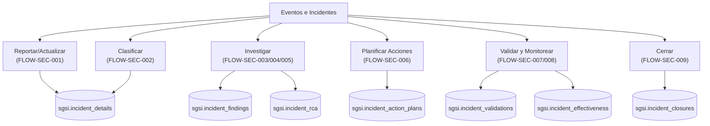

# Eventos e Incidentes de Seguridad

## Resumen

Módulo de gestión del ciclo de vida completo de eventos e incidentes de seguridad del SGSI: reporte/captura, clasificación (descartar/confirmar), investigación, análisis de causa raíz (RCA), planificación de acciones correctivas, validación de efectividad, monitoreo post-cierre y cierre formal. Implementa una máquina de estados estricta con 10 estados y roles especializados (investigador, revisor, controlador). Soporta evidencia adjunta y múltiples evaluaciones de efectividad en el mismo período de monitoreo.

## Frontend Views

| Vista | Ruta | Componente principal |
|---|---|---|
| Listado de eventos (bandeja) | `/security-events/list` | `SecurityEventsList` |
| Reporte nuevo evento | `/security-events/report` | `ReportEventForm` |
| Detalle de evento (modal/tabs) | `/security-events/[id]` | `EventDetailView` (5 tabs) |
| Modal clasificación | Inline en `/security-events/list` | `ClassificationForm` |
| Workspace RCA | Inline en `/security-events/[id]` | `RcaWorkspaceView` |
| Workspace validación | Inline en `/security-events/[id]` | `ValidationWorkspace` |
| Workspace acciones | Inline en `/security-events/[id]` | `ActionPlanningWorkspace` |
| Workspace cierre | Inline en `/security-events/[id]` | `ClosureWorkspaceView` |
| Workspace efectividad | Inline en `/security-events/[id]` | `EffectivenessWorkspaceView` |

## Flows

| ID | Operación | Archivo |
|---|---|---|
| FLOW-SEC-001 | Reportar o Actualizar Evento | [report-or-update-event.md](../05-flows/security-events/report-or-update-event.md) |
| FLOW-SEC-002 | Clasificar Evento | [classify-event.md](../05-flows/security-events/classify-event.md) |
| FLOW-SEC-003 | Registrar Hallazgos de Investigación | [register-findings.md](../05-flows/security-events/register-findings.md) |
| FLOW-SEC-004 | Avanzar a Fase de Causa Raíz | [advance-to-rca.md](../05-flows/security-events/advance-to-rca.md) |
| FLOW-SEC-005 | Registrar Análisis de Causa Raíz | [register-rca.md](../05-flows/security-events/register-rca.md) |
| FLOW-SEC-006 | Gestionar Plan de Acciones Correctivas | [manage-action-plans.md](../05-flows/security-events/manage-action-plans.md) |
| FLOW-SEC-007 | Validar Efectividad de Acciones | [validate-effectiveness.md](../05-flows/security-events/validate-effectiveness.md) |
| FLOW-SEC-008 | Monitorear Efectividad Post-Cierre | [monitor-effectiveness.md](../05-flows/security-events/monitor-effectiveness.md) |
| FLOW-SEC-009 | Cerrar Incidente | [close-incident.md](../05-flows/security-events/close-incident.md) |

Numeración no consecutiva (intencionalmente): FLOW-SEC-010 (Consultar Listado de Eventos) no es un Flow — es una capacidad técnica de lectura/navegación que actúa como hub de entrada a otras operaciones, no una operación funcional independiente. Su endpoint permanece documentado bajo soporte técnico.

## API

26 endpoints bajo `/security-events` (montados en `api-sgsi/src/app.ts` con acceso base por rol: investigador, revisor, controlador). Incluyen mutaciones (POST/PUT), lectura (GET) y catálogos técnicos (6 endpoints de lectura solo). Índice completo y navegable por Flow en [`docs/06-technical/security-events/endpoints/`](../06-technical/security-events/endpoints/).

## Database

Esquema `sgsi`, prefijo de función `v2_security_event_*` e `v2_incident_*` (definidas en `funciones_sgsi.sql`, raíz del repo — no en `_database/functions/`). Tabla principal: `sgsi.incident_details` (`tablas_sgsi.sql:XXXX`). Tablas de soporte tocadas por las funciones de este módulo: `sgsi.incident_findings`, `sgsi.incident_rca`, `sgsi.incident_action_plans`, `sgsi.incident_validations`, `sgsi.incident_validation_checks`, `sgsi.incident_effectiveness`, `sgsi.incident_closures`, `sgsi.incident_failure_categories`, `sgsi.incident_severities`. Índice completo y navegable por función en [`docs/06-technical/security-events/functions/`](../06-technical/security-events/functions/).

## Dependencias externas conocidas

| Dominio | Naturaleza de la dependencia | Dónde aparece |
|---|---|---|
| Partes Interesadas (`stakeholders` / `dom-gov`, Personas) | Lookup de investigador, revisor, controlador asignables al incidente; validación de permisos por rol. | FLOW-SEC-002, FLOW-SEC-007, FLOW-SEC-009 (asignación de roles en clasificación; validación en cierre) |
| KPI (`dom-ctx`) | Referencia opcional: incidente puede dispararse desde KPI en rojo (`originKpiId`). Lectura débil, no requerida. | FLOW-SEC-001 (campo opcional en reporte) |

**No integrados (verificado):**
- DocFlow: Cierre no requiere aprobación formal; roles/autorizaciones están hardcodeadas en código.
- Riesgos (DOM-RSK), Activos (DOM-ACT), SoA (DOM-SOA): Sin integración técnica confirmada.

## Máquina de Estados

```
[INICIO]
    ↓
pending_classification (evento nuevo)
    ├─ FLOW-SEC-002: action=discard
    │  └─ → discarded [TERMINAL]
    │
    └─ FLOW-SEC-002: action=confirm
       └─ → incident_confirmed
           ↓ (asignar roles: investigador, revisor, controlador)
           FLOW-SEC-004: transition
           └─ → in_investigation
               ├─ [Paralelo: FLOW-SEC-003, FLOW-SEC-005]
               └─ FLOW-SEC-004: advance
                  └─ → in_rca
                      ├─ FLOW-SEC-005: save RCA
                      └─ FLOW-SEC-006: transition
                         └─ → action_planning
                             ├─ FLOW-SEC-006: create actions bulk
                             └─ FLOW-SEC-006: transition status
                                └─ → pending_validation
                                    ├─ FLOW-SEC-007: validate
                                    └─ → pending_effectiveness
                                        ├─ FLOW-SEC-008: monitor (repetible)
                                        └─ → monitoring_effectiveness
                                            └─ FLOW-SEC-009: close
                                               └─ → closed [TERMINAL]
```

**Características:**
- Cada transición es **EXPLÍCITA** vía endpoint dedicado (no automática).
- `incident_confirmed` e `in_investigation` son **SECUENCIALES** (no redundantes).
- Acciones paralelas posibles: findings/RCA se registran sin bloquear transición.
- Efectividad es operación **REPETIBLE** en el mismo período (`upsert` pattern).

## Hallazgos registrados (no corregidos)

- **Customer isolation confirmada**: Parámetro `customerId` en todas las queries; filtros en functions SQL.
- **Role-based access confirmada**: `validateClosurePermission()` verifica `personId === incident.incidentReviewerId`; `validateInvestigationPermission()` similar para investigador.
- **UUID direct access (PARTIAL)**: Parámetros como `/:eventId` son UUIDs; dependen del filtro `customerId` en backend.
- **Evidence upload (PARTIAL)**: Validación de tipo archivo y tamaño no verificada en investigación de código.
- **Reopen closure NOT FOUND**: No existe endpoint de reapertura; cierre es TERMINAL — comportamiento esperado.
- **Incident vs Event naming (LOW)**: Código usa ambos términos (`v2_security_event_*` y `sgsi.incident_details`); denominación legacy sin impacto funcional.

## Catálogos técnicos (no son Flows)

| Catálogo | Endpoint | Función | Propósito |
|----------|----------|---------|-----------|
| Impact Levels | `GET /security-events/impact-levels` | `v2_security_event_impact_levels_get_all()` | SELECT en formulario evento |
| Classification Masters | `GET /security-events/classification-masters` | `v2_security_event_classification_masters_get_all()` | SELECT en clasificación |
| Failure Categories | `GET /security-events/rca/failure-categories` | `v2_incident_failure_categories_get_all()` | SELECT en RCA |
| Action Plan Types | `GET /security-events/action-plans/catalogs` | `v2_incident_action_plans_get_action_types()` | SELECT en plan |
| Observation Periods | `GET /security-events/effectiveness/catalog` | `v2_incident_effectiveness_get_observation_periods()` | SELECT en monitoreo |
| Closure Decisions | `GET /security-events/closure/catalog` | `v2_incident_closure_decisions_get_all()` | SELECT en cierre |

## Diagrama de alto nivel


