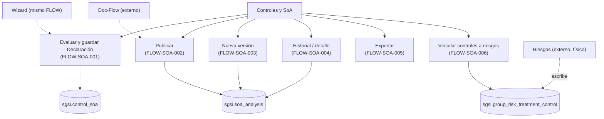

# Controles y SoA

## Resumen
Módulo de Declaración de Aplicabilidad (SoA) del SGSI: evaluación de aplicabilidad de los 93 controles ISO del catálogo, con justificación, evidencia, remediación y políticas de gobernanza asociadas; ciclo de vida de la Declaración (borrador → publicación → nueva versión → historial); y vínculo de esos mismos controles a los escenarios de riesgo por grupo que se están tratando. Depende de Riesgos para el listado de escenarios a vincular (`FLOW-SOA-006` escribe una tabla física de `DOM-RSK`, por ownership funcional — ver Dependencias externas) y converge con Wizard, que reutiliza íntegramente la evaluación de este módulo como parte del onboarding.

## Frontend Views

| Vista | Ruta | Componente principal |
|---|---|---|
| Declaración de Aplicabilidad (SoA) | `/soa-controls/applicability-statement` | `SoaApplicabilityStatement` |
| Relación Controles ↔ Riesgos | `/soa-controls/risk-control-linkage` | `RiskControlLinkage` (`GroupRiskControlLinkage`) |
| Evaluación SOA (Wizard, mismo store) | `/wizard/management/soa` | `ManagementSoa` |
| Progreso SOA (solo lectura, no es Operación) | `/wizard/management`, `/wizard/formalization` | `FormalizationPolicies`, `FormalizationDashboard` |

## Flows

| ID | Operación | Archivo |
|---|---|---|
| FLOW-SOA-001 | Evaluar y guardar Declaración SoA | [evaluate-and-save-soa-declaration.md](../05-flows/soa/evaluate-and-save-soa-declaration.md) |
| FLOW-SOA-002 | Publicar Declaración SoA | [publish-soa-declaration.md](../05-flows/soa/publish-soa-declaration.md) |
| FLOW-SOA-003 | Crear nueva versión de Declaración SoA | [create-new-soa-version.md](../05-flows/soa/create-new-soa-version.md) |
| FLOW-SOA-004 | Consultar historial/detalle de Declaración SoA | [view-soa-history.md](../05-flows/soa/view-soa-history.md) |
| FLOW-SOA-005 | Exportar Declaración SoA | [export-soa-declaration.md](../05-flows/soa/export-soa-declaration.md) |
| FLOW-SOA-006 | Vincular / desvincular controles a escenarios de riesgo | [link-controls-to-risk.md](../05-flows/soa/link-controls-to-risk.md) |

Numeración consecutiva, sin huecos — a diferencia de Activos y Riesgos, no se fusionó ni se retiró ninguna Operación candidata durante Discovery/Diseño (ver Checkpoint A/B).

## API

18 endpoints vivos documentados (de 20 encontrados; 2 huérfanos — ver Hallazgos), repartidos en 2 routers: `/soa` (15 vivos de 17, montado con acceso base `admin-or-usuario`, endurecido a `admin-only` en las mutaciones) y `/group-risk-treatment-control` (3, acceso `admin-or-usuario`, sin overrides por ruta). Índice completo y navegable por Operación en [`docs/06-technical/soa/endpoints/`](../06-technical/soa/endpoints/).

## Database

Esquema `sgsi`, funciones bajo los prefijos `v2_control_soa_*` / `v2_soa_analysis_*` / `v2_soa_get_all_controls*` (definidas en `funciones_sgsi.sql`, raíz del repo — no en `_database/functions/`; verificado que ninguna migración de `sprint4/`/`sprint5/` las toca, snapshot confiable para este módulo). Tablas propias principales: `sgsi.control_soa`, `sgsi.control_soa_evidence`, `sgsi.control_soa_remediation`, `sgsi.control_soa_governance_policy`, `sgsi.soa_analysis`, `sgsi.iso_control_context`. Índice completo y navegable por función en [`docs/06-technical/soa/functions/`](../06-technical/soa/functions/).

## Dependencias externas conocidas

| Dominio | Naturaleza de la dependencia | Dónde aparece |
|---|---|---|
| Flujo Documental (`doc-flow`) | Publicación/aprobación de la Declaración SOA vía `publishProcess`/`getProcessByEntity('SOA', analysisId)`; banner e historial de aprobación en el detalle de versión. La publicación real de `is_active`/`is_complete` en `sgsi.soa_analysis` ocurre dentro de `sgsi.doc_flow_publish`. | FLOW-SOA-002 (ambas ramas), FLOW-SOA-004 → ahora documentado como `FLOW-DOCFLOW-004`, `FLOW-DOCFLOW-006` y `FLOW-DOCFLOW-010` en [`docs/00-catalog/docflow.md`](../00-catalog/docflow.md) |
| IA (`ai`) | Sugerencias de aplicabilidad (`ai_asset_risk_suggestions`/`ai_asset_risk_control_suggestions`) alimentan el badge "sugerido por IA" y el botón "Generar según contexto". | FLOW-SOA-001 |
| Wizard / Contexto (`wizard`) | `get_controles_aplicables()` lee 8 tablas de respuestas del cuestionario Wizard para calcular aplicabilidad sugerida por reglas. (La reutilización de la evaluación SOA por `/wizard/management/soa` no es una dependencia — es el mismo FLOW, ver convergencia en FLOW-SOA-001). | FLOW-SOA-001 |
| Riesgos (`risk-treatment`, saliente) | El vínculo de controles escribe `sgsi.group_risk_treatment_control` y lee `sgsi.group_risk_treatment` / escenarios de riesgo por grupo — tablas y funciones físicas de `DOM-RSK`. Ownership funcional de esta Operación es `DOM-SOA` (regla aprendida durante Riesgos — learning candidate v1.1, no aplicada aún a `TRACEABILITY_STANDARD.md`). | FLOW-SOA-006 |
| PDF (`pdf`) | Exportación a PDF de la Declaración SOA vía servicio compartido (`usePdf`/`pdfStore`), también usado por Doc-Flow y Partes Interesadas — no exclusivo de este módulo. | FLOW-SOA-005 |
| Archivos (`file`) | Subida/descarga de archivos de evidencia (`FileModel.upsert`, entidad `soa-evidence`). | FLOW-SOA-001 |
| Documentos (`doc-documents`) | El selector de políticas de gobernanza lee el catálogo de documentos tipo "Política" (`useDocDocuments`). | FLOW-SOA-001 |

## Hallazgos registrados (no corregidos, fuera de alcance de esta fase)

- **SECURITY FINDING — `DELETE /soa/evidence/:evidenceId` sin aislamiento por `customerId`**: confirmado de punta a punta. El router (`api-sgsi/src/routers/soa.ts:34`) solo aplica `verifyAdminOnly` (valida rol, no tenant); el controller (`api-sgsi/src/controllers/soa.ts:210-228`) nunca lee `dataUser(req).customerId`, a diferencia de todos los demás handlers del mismo archivo; el model (`api-sgsi/src/models/soa.ts:158-185`) y la query (`api-sgsi/src/queries/soa.ts:6`) reciben un único parámetro (`evidenceId`); la función SQL (`funciones_sgsi.sql:14067-14078`) hace `DELETE FROM sgsi.control_soa_evidence WHERE id = p_evidence_id` sin filtro de `customer_id`. Cualquier admin autenticado de cualquier cliente podría borrar evidencia de otro cliente conociendo o adivinando el UUID. No se corrige aquí — queda registrado para un trabajo de seguridad independiente.
- `GET /soa/getById/:id` y `POST /soa/upsert` — endpoints HTTP huérfanos (sin consumidor en `soaStore.ts`); sus funciones SQL (`v2_control_soa_get_one`, `v2_control_soa_upsert`) siguen vivas porque `upsertBatch` las invoca internamente en loop.
- Router `/risk-treatment-control` completo huérfano (router/controller/model/query/schema/hook sin consumidor) — ya documentado también desde Riesgos, reconfirmado desde este módulo.
- Overloads muertos de `sgsi.v2_group_risk_treatment_control_upsert`/`_delete` (variante de 2 argumentos, sin `customerId`) — la query TypeScript siempre invoca con 3 argumentos; el overload de 2 es inalcanzable.
- Acción `linkControl` (singular) en `groupRiskTreatmentControlStore.ts` — implementada y expuesta por el hook, pero `GroupRiskControlLinkage` solo llama `linkControlsBatch` (incluso para un único control) y `unlinkControl`.
- `sgsi.v2_soa_analysis_get_active` y `sgsi.get_controles_aplicables` mutan datos (`INSERT`/`UPSERT` de auto-siembra) aunque solo se alcanzan desde endpoints `GET` — comportamiento real documentado en `notes:` de ambas functions, sin corregirse.
- `linkControlsBatch` (frontend) sugiere un endpoint de batch real; el backend solo expone upsert individual (`POST /group-risk-treatment-control/`) — el "batch" es enteramente client-side (`Promise.all` de N llamadas).
- `sgsi.v2_control_upsert` (`funciones_sgsi.sql:14529`) es un falso amigo de nombre — pertenece al catálogo "Controles" legado (`sgsi.asset_control`), no a SoA. Señalado para no confundirlo en trazabilidad futura.

## Diagrama de alto nivel

No se detallan aquí tablas ni controladores individuales — ese nivel de detalle vive en cada Operación (`docs/05-flows/soa/`) y en el modelo técnico (`docs/06-technical/soa/`).
