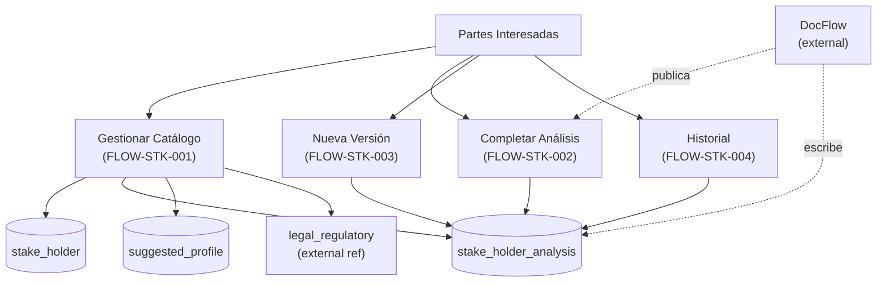

# Partes Interesadas

## Resumen

Módulo de gestión de partes interesadas del SGSI: identificación, análisis y registro de actores externos (clientes, reguladores, socios, empleados) que impactan o son impactados por la seguridad de la información. Incluye captura de necesidades, expectativas, requisitos legales/regulatorios, y niveles de influencia. Soporta versionado de análisis con publicación a través de flujo documental.

## Frontend Views

| Vista | Ruta | Componente |
|---|---|---|
| Gestión de Partes Interesadas | `/stake-holder` | `StakeHolder` |
| Detalle de cuadrantes (matriz) | `/stake-holder` (modal) | `StakeholderDetailQuadrants` |
| Lista horizontal de partes | `/stake-holder` (embedded) | `StakeholderListHorizontal` |

## Flows

| ID | Operación | Archivo |
|---|---|---|
| FLOW-STK-001 | Gestionar Catálogo de Partes Interesadas | [manage-stakeholder-catalog.md](../05-flows/stakeholder/manage-stakeholder-catalog.md) |
| FLOW-STK-002 | Completar Análisis de Partes Interesadas | [complete-stakeholder-analysis.md](../05-flows/stakeholder/complete-stakeholder-analysis.md) |
| FLOW-STK-003 | Crear Nueva Versión del Análisis | [create-new-stakeholder-analysis-version.md](../05-flows/stakeholder/create-new-stakeholder-analysis-version.md) |
| FLOW-STK-004 | Consultar Historial y Versiones | [view-stakeholder-version-history.md](../05-flows/stakeholder/view-stakeholder-version-history.md) |

## API

9 endpoints vivos: `/stakeholder` (GET getListByCustomerId, GET getSuggestedProfiles, POST upsert, POST deleteById), `/stakeholder/analysis` (GET, POST complete, POST new-version, GET versions, GET version/:id). Índice completo y navegable por Operación en [`docs/06-technical/stakeholder/endpoints/`](../06-technical/stakeholder/endpoints/).

## Database

Esquema `sgsi`, funciones prefijo `stakeholder_*` y `v2_stakeholder_*` / `v2_suggested_profile_*`, definidas en `funciones_sgsi.sql`. Tablas propias: `sgsi.stake_holder_analysis` (versionado), `sgsi.stake_holder` (entidades), `sgsi.stake_holder_needs`, `stake_holder_expectations`, `stake_holder_information_security` (atributos), `stake_holder_legal_regulatory` (mapeador a catálogo), `suggested_profile_stake_holder` (referencial). Índice completo en [`docs/06-technical/stakeholder/functions/`](../06-technical/stakeholder/functions/).

## Dependencias externas conocidas

| Dominio | Naturaleza | Dónde aparece |
|---|---|---|
| Flujo Documental (`doc-flow`) | BIDIRECCIONAL: crear proceso, aprobación, publicación de análisis | FLOW-STK-002, FLOW-STK-004; `doc_flow_publish()` escribe en `stake_holder_analysis` |
| Catálogo Legal/Regulatorio (`legal_regulatory`) | REFERENCE: tabla externa de leyes/normas | Mapeador `stake_holder_legal_regulatory` |

## Hallazgos registrados (no corregidos)

- **Cross-tenant read**: Endpoint GET `/stakeholder/analysis/version/:id` (EP-STK-VERSION-GET) — no valida que `analysis_id` pertenezca al `customerId` de sesión. Router → Controller → Model → Query → SQL: ninguna capa realiza validación de tenant. Usuario autenticado de otro cliente podría leer versión conociendo UUID. Clasificado como **CONFIRMED CROSS-TENANT READ**. (Patrón documentado sin corrección, ver SoA y DocFlow hallazgos equivalentes.)

- **Dead overload SQL**: Función `sgsi.v2_stakeholder_analysis_mark_complete(customer_id uuid, user_id uuid)` (2 parámetros) — sin consumidor TypeScript, SQL→SQL, migrations ni scripts. Versión 3-param con `justification` es la LIVE. Registrado como deuda técnica/legacy.

- **Soft delete y lifecycle**: Cuando `stake_holder` se marca eliminado (`deleted_at`), sus subtablas (`stake_holder_needs`, etc.) permanecen con FK válida referenciando padre "muerto". Posible deuda de ciclo de vida; no corregido.

## Diagrama de alto nivel

