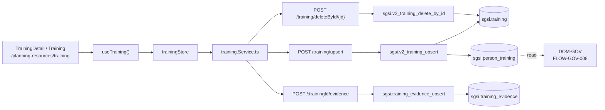

# Capacitaciones del SGSI

## Resumen

Módulo que gestiona la creación, asignación y seguimiento de capacitaciones para el personal del SGSI. Cubre desde la definición de la capacitación (curso, institución, fechas, modalidad) hasta la asignación de participantes, registra estado de la capacitación y evidencia de materialización. Requisito ISO 27001 para demostrar que el personal recibe capacitación pertinente en seguridad de la información. 

La entidad principal es `sgsi.training` (capacitación) con su tabla de asignaciones `sgsi.person_training` (persona ↔ capacitación), la cual también es lectura desde DOM-GOV en FLOW-GOV-008 para registrar certificados y resultados. Deslinde claro: Training es propietario de crear/asignar/eliminar capacitaciones; Gobierno es responsable de registrar evidencia de completitud (certificados y notas).

## Frontend Views

| Vista | Ruta | Componente principal |
|---|---|---|
| Listado de capacitaciones | `/planning-resources/training` | `Training` |
| Nueva capacitación | `/planning-resources/training/new` | `TrainingDetail` |
| Detalle/edición | `/planning-resources/training/{id}` | `TrainingDetail` |

## Flows

| ID | Operación | Archivo |
|---|---|---|
| FLOW-TRAIN-001 | Crear/Actualizar capacitación | [create-update-training.md](../05-flows/training/create-update-training.md) |
| FLOW-TRAIN-002 | Eliminar capacitación | [delete-training.md](../05-flows/training/delete-training.md) |

## API

**7 endpoints vivos documentados**, distribuidos en router `/training`:
- 2 de escritura (create/update, delete)
- 1 de lectura (list)
- 3 de gestión de evidencia
- 1 de consulta de customer_id

Índice en [`docs/06-technical/training/endpoints/`](../06-technical/training/endpoints/).

## Database

Schema `sgsi`. **3 functions vivas documentadas**:
- `sgsi.v2_training_upsert` — create/update
- `sgsi.v2_training_delete_by_id` — delete
- `sgsi.v2_training_get_list_by_customer_id` — list

Más 5 functions de soporte (evidence, customer_id).

**3 tablas principales**: `sgsi.training` (capacitación), `sgsi.person_training` (asignación), `sgsi.training_evidence` (evidencia).

## Dependencias externas conocidas

| Dominio | Naturaleza | Dónde aparece |
|---|---|---|
| Gobierno (`DOM-GOV`) | Ownership de `sgsi.person_training` — Training crea la asignación; Gobierno escribe columnas `certificate_*` y `result_*` sobre esa fila existente. Documentado en FLOW-GOV-008. | FLOW-TRAIN-001 (crea row), FLOW-GOV-008 (usa row) |
| Archivos (`file`) | Evidencia de capacitación adjunta vía `FileModel.upsert` con `entity_type='training-evidence'`. | FLOW-TRAIN-001 (upload) |

## Hallazgos registrados (no corregidos, fuera de alcance)

- Ninguno en el scope de Training. La función `v2_training_upsert` correctamente valida cambios de estado y cascada a participantes.

## Diagrama de alto nivel

