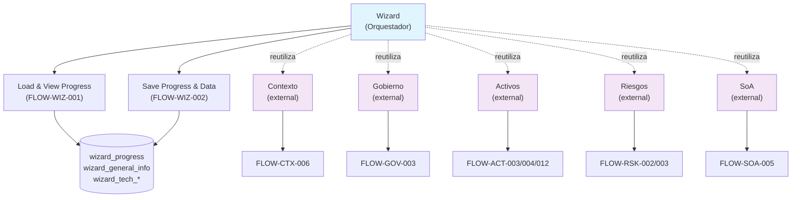

# Wizard

## Resumen

Orquestador e inicializador del SGSI: módulo que guía a usuarios a través de un flujo de configuración inicial multietapa del sistema de gestión de seguridad de la información. Permite captura de contexto organizacional, gobierno, activos, riesgos y controles. El Wizard NO posee las operaciones funcionales de esos dominios, sino que reutiliza sus endpoints y almacena su propio progreso y datos técnicos generales. Soporta versionado de progreso con timestamps y usuarios de cambio.

## Frontend Views

| Vista | Ruta | Componente |
|---|---|---|
| Bienvenida | `/wizard/welcome` | `Welcome` |
| Contexto y Alcance | `/wizard/context/scope` | `Scope` |
| Gobierno SGSI | `/wizard/context/government` | `Government` |
| Gestión de Activos | `/wizard/management/assets` | `ManagementAssets` |
| Análisis de Riesgos | `/wizard/management/risks` | `ManagementRisks` |
| Revisión de SoA | `/wizard/management/soa` | `ManagementSoa` |
| Dashboard de Formalización | `/wizard/formalization/dashboard` | `FormalizationDashboard` |
| Formalización de Políticas | `/wizard/formalization/policies` | `FormalizationPolicies` |
| Formalización de Riesgos | `/wizard/formalization/risks` | `FormalizationRisks` |

## Flows

| ID | Operación | Archivo |
|---|---|---|
| FLOW-WIZ-001 | Load & View Wizard Progress | [load-and-view-wizard-progress.md](../05-flows/wizard/load-and-view-wizard-progress.md) |
| FLOW-WIZ-002 | Save Wizard Progress & Data | [save-wizard-progress-and-data.md](../05-flows/wizard/save-wizard-progress-and-data.md) |

**Nota sobre operaciones omitidas:** Las operaciones "Initialize Scope", "Initialize Governance", "Create/Manage Assets", "Analyze Risks" y "Evaluate SOA" NO son operaciones propias del Wizard. Son FLOW de otros dominios (FLOW-CTX-006, FLOW-GOV-003, FLOW-ACT-003+, FLOW-RSK-002/003, FLOW-SOA-005) que el Wizard reutiliza como UIs alternadas. Ver sección "Convergencias" abajo.

## API

3 endpoints propios bajo `/wizard` y `/wizard-config` (acceso `admin-or-usuario` para GET, `admin-only` para POST). Dos endpoints son FLOW-directos; uno es helper técnico de configuración. Índice completo y navegable en [`docs/06-technical/wizard/endpoints/`](../06-technical/wizard/endpoints/).

## Database

Esquema `sgsi`, funciones prefijo `v2_wizard_*`, definidas en `funciones_sgsi.sql`. Tablas propias divididas en dos categorías:

**Datos de usuario (9):**
- `sgsi.wizard_progress` — progreso: pasos completados, paso actual, fields respondidos, timestamps
- `sgsi.wizard_general_info` — empresa, industria, tamaño, servicios críticos
- `sgsi.wizard_tech_inventory` — inventario técnico: computadoras, IT management
- `sgsi.wizard_tech_infrastructure` — on-premise, cloud, providers
- `sgsi.wizard_identity_access` — identidad, acceso, usuarios, roles
- `sgsi.wizard_specialized_infra` — virtualización, containers, cloud-native
- `sgsi.wizard_digital_exposure` — web apps, APIs, dominios expuestos
- `sgsi.wizard_dev_processes` — SDLC, DevOps, pipelines
- `sgsi.wizard_compliance` — regulaciones, auditorías, certificaciones

**Configuración (maestros, 6):**
- `sgsi.wizard_phase` — fases del wizard (Contexto, Management, Formalization)
- `sgsi.wizard_step` — pasos dentro de cada fase
- `sgsi.wizard_section` — secciones dentro de cada paso
- `sgsi.wizard_field` — campos dentro de cada sección
- `sgsi.wizard_field_dependency` — dependencias entre campos
- `sgsi.wizard_field_option` — opciones de campos select/radio

Índice completo en [`docs/06-technical/wizard/functions/`](../06-technical/wizard/functions/).

## Dependencias externas conocidas

| Dominio | Naturaleza | Dónde aparece |
|---|---|---|
| Contexto y Alcance (`DOM-CTX`) | REUTILIZACIÓN: `/wizard/context/scope` invoca FLOW-CTX-006 directamente | Scope component usa `useScope()`, mismo endpoint EP-CONTEXT-SCOPE-UPSERT |
| Gobierno SGSI (`DOM-GOV`) | REUTILIZACIÓN: `/wizard/context/government` invoca FLOW-GOV-003 directamente | Government component usa `useGovernment()`, mismos endpoints EP-GOVERNMENT-UPSERT, EP-PERSON-UPSERT, EP-POSITION-UPSERT |
| Activos (`DOM-ACT`) | REUTILIZACIÓN: `/wizard/management/assets` invoca FLOW-ACT-003/004/012 directamente | ManagementAssets component usa `useAsset()`, mismo endpoint EP-ASSET-UPSERT |
| Riesgos (`DOM-RSK`) | REUTILIZACIÓN: `/wizard/management/risks` invoca análisis de riesgos directamente | ManagementRisks component usa `useGroupRiskTreatment()` + `useAssetThreatRisk()`, endpoints de DOM-RSK |
| SoA (`DOM-SOA`) | REUTILIZACIÓN: `/wizard/management/soa` invoca FLOW-SOA-005 directamente; FormalizationDashboard solo lee | ManagementSoa component usa `useSoa()`, mismo endpoint EP-SOA-DECLARATION-UPSERT |

**Interpretación:** El Wizard es un ORQUESTADOR. No posee estas operaciones. Solo proporciona UIs alternadas o de coordinación que delegan directamente a los endpoints originales. Los dominios origen continúan siendo propietarios de sus FLOW.

## Convergencias Documentadas

Las vistas `/wizard/context/scope`, `/wizard/context/government`, `/wizard/management/assets`, `/wizard/management/risks` y `/wizard/management/soa` son **puntos de entrada alternativos** (convergencias) a operaciones ya documentadas en otros dominios. Ver `manage-scope.md`, `map-sgsi-government.md`, y otros catálogos respectivos para detalles.

La vista `/wizard/formalization/dashboard` es **lectura pura** de progreso; no ejecuta mutaciones ni posee operaciones propias.

## Hallazgos registrados (no corregidos, fuera de alcance)

### Security

1. **POST /wizard/upsert — Validación de tenant ownership: REVIEW REQUIRED**
   - Endpoint: POST `/wizard/upsert` (admin-only)
   - Controller obtiene customerId desde `dataUser(req).customerId`
   - Verificación: se validó que el controller pasa customerId a la función de BD
   - Pendiente: confirmar exhaustivamente que sgsi.v2_wizard_upsert impide escribir progreso/datos para otro customer
   - **Clasificación:** REVIEW REQUIRED (no vulnerabilidad confirmada, solo punto pendiente)
   - Acción: mantener vigente para auditoría posterior; no corregir durante documentación

2. **GET /wizard-config — Acceso verificado como seguro**
   - Router: `api-sgsi/src/routers/wizard-config.ts`
   - Registered in app.ts with `access: "admin-or-usuario"`
   - Conclusión: Correctamente protegido por autenticación SGSI. NO es vulnerability.

### Debt & Technical

1. **Endpoints sin documentación formal:**
   - GET `/wizard/getByCustomerId` — LIVE (invocado en layout.tsx)
   - POST `/wizard/upsert` — LIVE (invocado en múltiples componentes)
   - GET `/wizard-config` — LIVE (invocado en layout.tsx)
   - Todos documentados en PHASE 3

2. **Tablas no registradas previamente en Explorer:**
   - 15 tablas `sgsi.wizard_*` creadas en migrations previas, ahora documentadas

3. **Funciones sin documentación previa:**
   - sgsi.v2_wizard_get_by_customer_id — LIVE
   - sgsi.v2_wizard_upsert — LIVE
   - sgsi.v2_wizard_config_get — LIVE
   - Todas documentadas en PHASE 3

## Diagrama de alto nivel

## Arquitectura Técnica

**FLOW-WIZ-001 (GET /wizard/getByCustomerId):**
- Router: `api-sgsi/src/routers/wizard.ts`
- Controller: `controllers/wizard.ts#getByCustomerId`
- Model: `models/wizard.ts#getByCustomerId`
- Query: `queries/wizard.ts#_getByCustomerId`
- DB Function: `sgsi.v2_wizard_get_by_customer_id`
- Tables: wizard_progress, wizard_general_info, wizard_tech_*

**FLOW-WIZ-002 (POST /wizard/upsert):**
- Router: `api-sgsi/src/routers/wizard.ts`
- Controller: `controllers/wizard.ts#upsert` (Joi validation)
- Model: `models/wizard.ts#upsert`
- Query: `queries/wizard.ts#_upsert`
- DB Function: `sgsi.v2_wizard_upsert` (persistencia PROGRESS + DATA)
- Tables: wizard_progress, wizard_general_info, wizard_tech_*, wizard_identity_access, wizard_specialized_infra, wizard_digital_exposure, wizard_dev_processes, wizard_compliance

**SUPPORT — GET /wizard-config:**
- Router: `api-sgsi/src/routers/wizard-config.ts`
- Controller: `controllers/wizard-config.ts#getConfig`
- Model: `models/wizard-config.ts#getConfig`
- Query: `queries/wizard-config.ts#_getConfig`
- DB Function: `sgsi.v2_wizard_config_get`
- Tables: wizard_phase, wizard_step, wizard_section, wizard_field, wizard_field_dependency, wizard_field_option
- **Clasificación:** Helper técnico / infraestructura de configuración. Carga maestros estáticos necesarios para renderizar UI.
