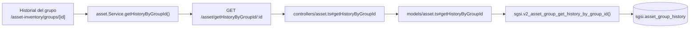

# Consultar historial de un grupo de activos

## Propósito
Mostrar la bitácora de eventos de un grupo de activos: creación, ediciones, vinculación/desvinculación de activos, activación y desactivación.

## Entrada desde UI
Dentro de `/asset-inventory/groups/[id]`, sección de historial (se carga automáticamente al abrir el detalle del grupo).

## Flujo funcional
1. `AssetGroupDetail` dispara `getAssetGroupHistoryByGroupId(groupId)` al montar.
2. El frontend llama `GET /asset/getHistoryByGroupId/:id`.
3. El backend resuelve el historial sin chequeo adicional de ownership por `customerId` en el controller (a diferencia de `getHistoryByAssetId`, verificado por lectura del controller — ver hallazgo).

## Frontend
- `AssetGroupDetail` — tabla de historial embebida.
- `useAsset().getAssetGroupHistoryByGroupId` → `assetStore` → `asset.Service.getHistoryByGroupId()`.

## API
`GET /asset/getHistoryByGroupId/:id` — acceso `admin-only`.

## Backend
`routers/asset.ts` → `controllers/asset.ts#getHistoryByGroupId` → `models/asset.ts#getHistoryByGroupId` → `queries/asset.ts _getHistoryByGroupId`.

## Database
`sgsi.v2_asset_group_get_history_by_group_id(p_group_id)` — solo lectura: `sgsi.asset_group_history`, con join a `corvus."user"` + `corvus.person` para resolver el nombre de quien generó cada evento.

## Reglas relevantes
- Devuelve la lista ordenada por fecha descendente, sin paginación.

## Consideraciones
- Este Flow **lee** los eventos que escriben FLOW-ACT-012 (crear/editar/activar/desactivar grupo) y, de forma indirecta, FLOW-ACT-003/004/005/006 cuando afectan la vinculación de un activo al grupo (esos eventos también se registran en `sgsi.asset_group_history` desde `sgsi.v2_asset_upsert`/`sgsi.v2_asset_delete_by_id`). La relación de quién escribe está declarada una sola vez en cada YAML de función correspondiente, no se repite aquí.
- **Hallazgo**: a diferencia de `getHistoryByAssetId` (FLOW-ACT-010), el controller de este endpoint no valida que el grupo pertenezca al `customerId` del usuario autenticado antes de resolver el historial — posible inconsistencia de autorización entre ambos endpoints de historial, documentada como hallazgo, no corregida (fuera de alcance de esta fase).

## Trazabilidad

