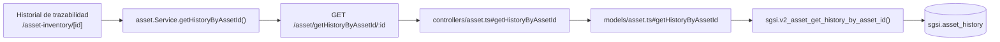

# Consultar historial de trazabilidad de un activo

## Propósito
Mostrar la bitácora de acciones realizadas sobre un activo específico (creación, actualización, eliminación, restauración, finalización de análisis de riesgo).

## Entrada desde UI
Dentro de `/asset-inventory/[id]`, sección **"Historial de trazabilidad"** (se carga automáticamente al abrir el detalle de un activo existente, no requiere una acción adicional del usuario).

## Flujo funcional
1. Al cargar el activo (`asset.id === id`), `AssetInventoryDetail` dispara `getAssetHistoryByAssetId(id)`.
2. El frontend llama `GET /asset/getHistoryByAssetId/:id`.
3. El backend valida ownership del `customerId` (igual que FLOW-ACT-002) antes de resolver el historial.
4. Se renderiza una tabla con fecha, usuario, acción y resumen de cada evento.

## Frontend
- `AssetInventoryDetail` — tabla de historial embebida (no es un componente separado).
- `useAsset().getAssetHistoryByAssetId` → `assetStore` → `asset.Service.getHistoryByAssetId()`.

## API
`GET /asset/getHistoryByAssetId/:id` — acceso `admin-only`.

## Backend
`routers/asset.ts` → `controllers/asset.ts#getHistoryByAssetId` (valida ownership vía `AssetModel.getCustomerId`) → `models/asset.ts#getHistoryByAssetId` → `queries/asset.ts _getHistoryByAssetId`.

## Database
`sgsi.v2_asset_get_history_by_asset_id(p_asset_id)` — solo lectura: `sgsi.asset_history`, con join a `corvus."user"` + `corvus.person` para resolver el nombre de quien generó cada evento.

## Reglas relevantes
- Devuelve la lista ordenada por fecha descendente; no pagina (se asume volumen manejable por activo).

## Consideraciones
- Esta es la tabla que **reciben** los eventos escritos por FLOW-ACT-003 (Crear), FLOW-ACT-004 (Editar), FLOW-ACT-005 (Dar de baja) y FLOW-ACT-006 (Reactivar) — este Flow solo lee, no escribe. La relación de qué funciones escriben en `sgsi.asset_history` está declarada una vez en cada uno de los YAML de esas funciones (`docs/06-technical/assets/functions/FN-V2-ASSET-*.yaml`), no se repite aquí.

## Trazabilidad

