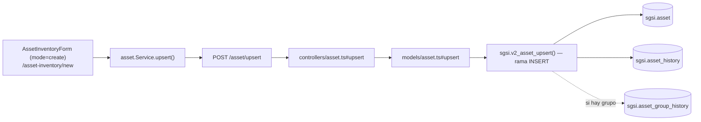

# Crear activo

## Propósito
Registrar un nuevo activo de información en el inventario del cliente, con su clasificación CIA, propietario y tipo.

## Entrada desde UI
`/asset-inventory` → botón **"Agregar activo"** → `/asset-inventory/new`. Deshabilitado si existe un flujo de aprobación activo (`activeAssetProcess`).

## Flujo funcional
1. El usuario completa el formulario en blanco (`AssetInventoryForm`, `mode="create"`, validado con Zod): nombre, propietario, tipo de activo y CIA obligatorios; descripción, administrador, área y grupo opcionales.
2. Al enviar, el frontend arma un payload explícito (no `...asset` completo, para no arrastrar campos prohibidos como `positionId`) **sin `id`** y llama `POST /asset/upsert`.
3. El backend valida contra `upsertSchema` (Joi) y verifica que no haya un flujo de aprobación bloqueando el módulo.
4. `sgsi.v2_asset_upsert` detecta `v_id IS NULL` → toma la rama `INSERT`: genera código automático si falta (`corvus.generate_sgsi_code`), inserta el activo, registra el evento en `asset_history` y, si se asigna a un grupo, en `asset_group_history`.
5. Tras responder al cliente, se dispara en background un enriquecimiento por IA de amenazas/vulnerabilidades sugeridas (no bloquea la respuesta HTTP).

## Frontend
- `AssetInventoryDetail(forceNew=true)` → `AssetInventoryForm` (`mode="create"`).
- `useAsset().upsertAsset` → `assetStore` → `asset.Service.upsert()`.

## API
`POST /asset/upsert` — acceso `admin-only`.

## Backend
`routers/asset.ts` → `controllers/asset.ts#upsert` (Joi + chequeo de lock) → `models/asset.ts#upsert` → `queries/asset.ts _upsert`.

## Database
`sgsi.v2_asset_upsert` (rama INSERT, `funciones_sgsi.sql:12507-12532`):
- `INSERT INTO sgsi.asset`.
- `INSERT INTO sgsi.asset_history` (`action='create'`).
- `INSERT INTO sgsi.asset_group_history` si se crea ya asignado a un grupo.
- Retorna el detalle completo vía `sgsi.v2_asset_get_by_id(v_asset_id)`.

## Reglas relevantes
- No se permiten dos activos con el mismo nombre (case-insensitive) ni el mismo código para el mismo cliente → error 409.
- El tipo de activo del activo debe coincidir con el tipo de activo del grupo, si se asigna uno al crear.
- El propietario **es obligatorio al crear** (`v_owner_id IS NULL AND v_id IS NULL` → excepción); a diferencia de Editar, donde puede omitirse.
- CIA es obligatorio salvo que el activo tenga `position_id` (no aplica en creación manual desde este flow, ya que `position_id` solo existe para activos originados desde un cargo).

## Consideraciones
- **Convergencia técnica**: este mismo endpoint (`EP-ASSET-UPSERT`) y esta misma función (`FN-V2-ASSET-UPSERT`) son también el camino de FLOW-ACT-004 (Editar activo) — la diferencia funcional es exclusivamente si el payload trae `id`. También son reutilizados fila por fila por FLOW-ACT-007 (Importar activos), vía `sgsi.v2_asset_upsert_massive`. Esta convergencia está declarada como dato en `docs/06-technical/assets/functions/FN-V2-ASSET-UPSERT.yaml` — no es necesario abrir esos otros Flows para entender este.
- Vincular un activo a un grupo desde el modal `LinkAssetsModal` (dentro de la gestión de grupos) reutiliza este mismo endpoint con `id` presente — es, en la práctica, una invocación de FLOW-ACT-004, no un flujo aparte.

## Trazabilidad

