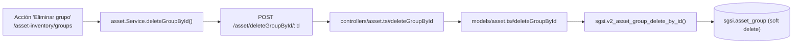

# Eliminar grupo de activos

## Propósito
Eliminar (soft delete) un grupo de activos que no tiene activos vinculados.

## Entrada desde UI
Acción "Eliminar" sobre un grupo, disponible tanto en `/asset-inventory/groups` como en la vista inline de grupos dentro de `/asset-inventory`. Ambas muestran primero, en el frontend, la lista de activos vinculados si los hay (bloqueando la confirmación) — la misma regla se revalida en el backend.

## Flujo funcional
1. El usuario confirma la eliminación del grupo.
2. El frontend llama `POST /asset/deleteGroupById/:id`.
3. El backend no tiene aquí el chequeo de `isAssetFlowLockedByCustomer` que sí existe en `deactivateGroupById`/`activateGroupById`/`upsert` (verificado por lectura completa del controller — ver hallazgo en el catálogo del módulo).
4. `sgsi.v2_asset_group_delete_by_id` cuenta los activos vigentes (`deleted_at IS NULL`) vinculados al grupo; si hay al menos uno, lanza excepción y no elimina nada. Si no hay ninguno, marca el grupo como eliminado.

## Frontend
- `AssetGroupsList` / vista inline de `AssetInventory` — `useAsset().deleteAssetGroupById(id)`.
- `assetStore` → `asset.Service.deleteGroupById()`.

## API
`POST /asset/deleteGroupById/:id` — acceso `admin-or-usuario`.

## Backend
`routers/asset.ts` → `controllers/asset.ts#deleteGroupById` → `models/asset.ts#deleteGroupById` → `queries/asset.ts _deleteGroupById`.

## Database
`sgsi.v2_asset_group_delete_by_id(p_group_id, p_user_id, p_customer_id)`:
- Excepción si `COUNT(*) FROM sgsi.asset WHERE asset_group_id = p_group_id AND deleted_at IS NULL > 0`.
- `UPDATE sgsi.asset_group SET deleted_at = now(), deleted_by = ...` (soft delete).

## Reglas relevantes
- No se puede eliminar un grupo con activos vigentes vinculados — validado tanto en frontend (UX preventiva) como en backend (regla real, no solo cosmética).
- **Hallazgo**: a diferencia de crear/editar/activar/desactivar grupo, esta función **no inserta un registro en `sgsi.asset_group_history`** — la eliminación de un grupo no queda reflejada en su propio historial de trazabilidad (confirmado por lectura completa del cuerpo de la función).

## Consideraciones
- Esta regla de bloqueo por activos vinculados es la razón por la que, en la práctica, el flujo esperado es: desvincular o mover todos los activos del grupo (vía FLOW-ACT-004, editando cada activo) antes de poder ejecutar este Flow.

## Trazabilidad

