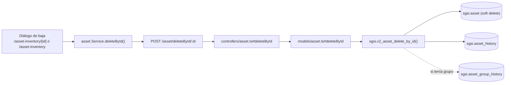

# Dar de baja (eliminar) activo

## Propósito
Dar de baja (soft delete) un activo que ya no debe considerarse vigente en el inventario, dejando registro de la justificación.

## Entrada desde UI
Dos puntos de entrada equivalentes: botón **"Dar de baja el activo"** en el detalle (`/asset-inventory/[id]`), o icono de papelera en la fila de la tabla del listado (`/asset-inventory`, vista móvil y de escritorio). Ambos abren el mismo diálogo de confirmación con campo de justificación obligatorio (mínimo 10 caracteres).

## Flujo funcional
1. El usuario confirma la baja e ingresa una justificación.
2. El frontend llama `POST /asset/deleteById/:id` con `{ justification }`.
3. El backend valida `deleteByIdSchema` (Joi, mínimo 10 caracteres) y verifica el lock de flujo.
4. `sgsi.v2_asset_delete_by_id` bloquea la operación si el activo tiene `position_id IS NOT NULL` (proviene de un cargo, se gestiona desde ese módulo). Si no, marca `deleted_at`/`deleted_by`, registra el evento en `asset_history` y, si el activo pertenecía a un grupo, un evento de desvinculación en `asset_group_history`.

## Frontend
- `AssetInventory` (tabla, acción por fila) y `AssetInventoryDetail` (botón de detalle) — ambos usan `useAsset().deleteAssetById(id, justification)`.
- `assetStore` → `asset.Service.deleteById()`.

## API
`POST /asset/deleteById/:id` — acceso `admin-only`.

## Backend
`routers/asset.ts` → `controllers/asset.ts#deleteById` (Joi + chequeo de lock; mapea el error de negocio de Postgres `P0001` a HTTP 409) → `models/asset.ts#deleteById` → `queries/asset.ts _deleteById`.

## Database
`sgsi.v2_asset_delete_by_id(p_asset_id, p_user_id, p_customer_id, p_justification)`:
- Excepción si `p_justification` tiene menos de 10 caracteres (doble validación: Joi en backend y aquí también).
- Excepción si el activo tiene `position_id IS NOT NULL`.
- `UPDATE sgsi.asset SET deleted_at = now(), deleted_by = ...` (soft delete).
- `INSERT INTO sgsi.asset_history` (`action='delete'`, incluye la justificación en el resumen).
- `INSERT INTO sgsi.asset_group_history` si el activo pertenecía a un grupo.

## Reglas relevantes
- Justificación obligatoria, mínimo 10 caracteres (validada dos veces: Joi y la función DB).
- Activos originados desde un cargo (`position_id IS NOT NULL`) no pueden eliminarse desde este flow.
- Es un soft delete: el registro permanece en `sgsi.asset` con `deleted_at` poblado (recuperable vía FLOW-ACT-006).

## Consideraciones
- **Convergencia técnica**: esta misma función (`FN-V2-ASSET-DELETE-BY-ID`) es invocada también, en cascada, por `sgsi.v2_asset_group_deactivate_by_id` (una vez por cada activo vigente del grupo) cuando se desactiva un grupo completo — ver FLOW-ACT-012 (Gestionar grupo de activos). Esa convergencia está declarada como dato en `docs/06-technical/assets/functions/FN-V2-ASSET-DELETE-BY-ID.yaml` (`notes`), no requiere abrir ese otro Flow para entender este.

## Trazabilidad

