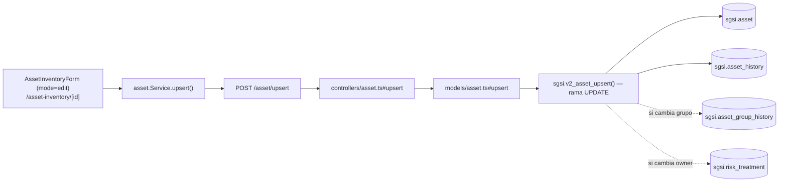

# Editar activo

## Propósito
Modificar los datos de un activo existente: clasificación CIA, propietario, administrador, tipo, grupo, área o descripción.

## Entrada desde UI
`/asset-inventory/[id]` (detalle de un activo ya existente) → botón **"Editar"**. Deshabilitado si `!canEditAsset`: el activo está en flujo de aprobación en un estado distinto de `DEVUELTO`/`FINALIZADO`/`VIGENTE`.

## Flujo funcional
1. El usuario abre el detalle de un activo y pulsa "Editar" → el formulario pasa de solo lectura a editable (`AssetInventoryForm`, `mode="edit"`, precargado con los datos actuales).
2. Modifica los campos permitidos y guarda.
3. El frontend llama `POST /asset/upsert` **con el `id` del activo en el payload**.
4. El backend valida con `upsertSchema` (mismo esquema Joi que Crear) y verifica el lock de flujo.
5. `sgsi.v2_asset_upsert` detecta `v_id IS NOT NULL` → toma la rama `UPDATE`.

## Frontend
- `AssetInventoryDetail` (modo edición, `isEditing=true`) → `AssetInventoryForm` (`mode="edit"`, `readOnly` controlado por `canEditAsset`).
- `useAsset().upsertAsset` → `assetStore` → `asset.Service.upsert()`.

## API
`POST /asset/upsert` — acceso `admin-only`.

## Backend
`routers/asset.ts` → `controllers/asset.ts#upsert` (Joi + chequeo de lock) → `models/asset.ts#upsert` → `queries/asset.ts _upsert`.

## Database
`sgsi.v2_asset_upsert` (rama UPDATE, `funciones_sgsi.sql:12422-12505`):
- `SELECT ... FOR UPDATE` sobre el activo (bloqueo de fila).
- Construye un resumen legible de cambios (`sgsi.v2_asset_history_build_update_summary`).
- `UPDATE sgsi.asset` — si el activo tiene `position_id` (viene de un cargo), **no** se actualizan `name`, `area_id` ni `base_asset_type_id` (se preservan los del cargo).
- Si cambia el grupo asignado: `INSERT INTO sgsi.asset_group_history` (uno para el grupo anterior "desvinculado", otro para el nuevo "vinculado").
- Si cambia el propietario: limpia delegaciones activas en `sgsi.risk_treatment` y registra el evento en `sgsi.asset_history`.
- `INSERT INTO sgsi.asset_history` con el resumen de cambios (`action='update'`).
- Retorna el detalle completo vía `sgsi.v2_asset_get_by_id(v_asset_id)`.

## Reglas relevantes
- Mismas reglas de nombre/código únicos que Crear (excluyendo el propio `id`).
- A diferencia de Crear, el propietario **puede omitirse** al editar (la excepción de propietario obligatorio solo aplica cuando `v_id IS NULL`).
- Si el activo tiene `position_id`, ciertos campos quedan protegidos contra edición desde este flow (se gestionan desde el módulo de Cargos — fuera de alcance).

## Consideraciones
- **Convergencia técnica**: este flow usa el mismo endpoint (`EP-ASSET-UPSERT`) y la misma función DB (`FN-V2-ASSET-UPSERT`) que FLOW-ACT-003 (Crear activo); la única diferencia es la presencia de `id` en el payload, lo cual determina la rama INSERT/UPDATE dentro de la función. La relación técnica está declarada una única vez en `docs/06-technical/assets/functions/FN-V2-ASSET-UPSERT.yaml` — no se repite como dato en ambos Flows, solo se describe en prosa en cada uno con sus reglas propias.
- El modal `LinkAssetsModal` (vincular activos a un grupo desde la pantalla de grupos) invoca `upsertAsset` con `id` presente — es una instancia de este mismo flow, con origen de UI distinto.

## Trazabilidad

