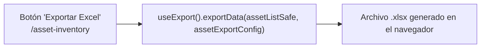

# Exportar activos a Excel

## Propósito
Descargar un archivo `.xlsx` con el listado de activos actualmente cargado en pantalla.

## Entrada desde UI
`/asset-inventory` → botón **"Exportar Excel"**. Deshabilitado si no hay activos vigentes cargados.

## Flujo funcional
1. El usuario pulsa "Exportar Excel".
2. `handleExportExcel` invoca `useExport().exportData(assetListSafe, assetExportConfig)` — un hook genérico (`customHooks/useExport.ts`, no exclusivo de Activos) que serializa el arreglo `assetList` **ya presente en el store**, usando la configuración de columnas de `data/massive-upload/asset-export-config.ts`.
3. El navegador genera y descarga el archivo directamente. **No se realiza ninguna llamada HTTP nueva** — los datos exportados son los que ya trajo FLOW-ACT-001 (Consultar/listar activos).

## Frontend
- `AssetInventory` → `useExport<IAsset>()` (hook genérico) + `assetExportConfig` (`data/massive-upload/asset-export-config.ts`, específico de Activos: define qué columnas exportar).

## API
Ninguna. Flow completamente client-side.

## Backend
No aplica.

## Database
No aplica — no hay lectura ni escritura nueva; reutiliza en memoria el resultado de FLOW-ACT-001.

## Reglas relevantes
- Exporta únicamente lo que ya está cargado en el store (`assetListSafe`), no relanza una consulta al backend ni aplica filtros de la tabla (exporta el conjunto completo, no la vista filtrada).

## Consideraciones
- Este flow depende en tiempo de ejecución de que FLOW-ACT-001 se haya ejecutado antes (para que `assetList` tenga datos) — es una dependencia de **estado de UI**, no una dependencia técnica de backend/base de datos, por eso no se declara como `externalDependencies`.

## Trazabilidad

