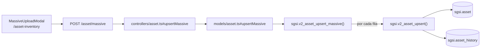

# Importar activos (carga masiva Excel)

## Propósito
Crear o actualizar múltiples activos de una sola vez a partir de un archivo Excel.

## Entrada desde UI
`/asset-inventory` → botón **"Importar Excel"** → abre `MassiveUploadModal` (componente compartido, configurado para Activos vía `assetMassiveUploadConfig`, `data/massive-upload/asset-config.ts`). Deshabilitado si hay un flujo de aprobación activo.

Nota: el botón contiguo **"Descargar plantilla"** (`generateAssetExcelTemplate`, `lib/excel/asset-template-generator.ts`) genera el archivo `.xlsx` de referencia enteramente en el navegador, a partir de listas ya cargadas (tipos de activo, áreas, personas, cargos) — no involucra backend ni Flow propio.

## Flujo funcional
1. El usuario carga un Excel con una fila por activo (columnas: nombre, descripción, tipo, propietario, administrador, CIA, grupo, área — resueltas por nombre y transformadas a IDs vía `buildAssetMassivePayload` antes de enviar).
2. El frontend llama `POST /asset/massive` con el arreglo de activos transformado (`chunkSize: 100` según configuración, aunque el envío observado en el controller procesa el arreglo completo recibido).
3. El backend valida `assetMassiveSchema` (Joi: arreglo de `upsertSchema`, mínimo 1 elemento) y verifica el lock de flujo.
4. `sgsi.v2_asset_upsert_massive` recorre el arreglo fila por fila e invoca `sgsi.v2_asset_upsert` por cada una, capturando errores individuales sin abortar el resto del lote.
5. La respuesta incluye `processed`, `errors` y `errorDetails` por fila, más la lista actualizada de activos.

## Frontend
- `AssetInventory` → `MassiveUploadModal` con `assetUploadConfig` (envuelve `assetMassiveUploadConfig` + `preSubmitTransform: buildAssetMassivePayload`).
- Tras éxito, refresca `getAssetListByCustomerId()` y `getAssetListGroupByCustomerId()`.

## API
`POST /asset/massive` — acceso `admin-only`.

## Backend
`routers/asset.ts` → `controllers/asset.ts#upsertMassive` (Joi + chequeo de lock) → `models/asset.ts#upsertMassive` → `queries/asset.ts _upsertMassive`.

## Database
`sgsi.v2_asset_upsert_massive(p_user_connected, p_customer_id, p_assets_data)`:
- No accede a tablas directamente.
- **Por cada fila**, invoca `sgsi.v2_asset_upsert(...)` — la misma función que usan FLOW-ACT-003 (Crear) y FLOW-ACT-004 (Editar). Esa función es la que efectivamente escribe en `sgsi.asset`, `sgsi.asset_history`, `sgsi.asset_group_history` y `sgsi.asset_threat_risk`.
- Al finalizar, devuelve la lista completa actualizada vía `sgsi.v2_asset_get_list_by_customer_id`.

## Reglas relevantes
- Cada fila se valida individualmente con las mismas reglas de negocio que Crear/Editar (nombre y código únicos, tipo de activo obligatorio, CIA obligatorio salvo activos con `position_id`, etc.) — no hay reglas "especiales" de importación a nivel de base de datos.
- Un error en una fila (`EXCEPTION WHEN OTHERS`) no aborta el procesamiento de las demás filas del lote.

## Consideraciones
- **Convergencia técnica explícita**: Importar activos **no** reimplementa la lógica de creación/edición. `sgsi.v2_asset_upsert_massive` delega en `sgsi.v2_asset_upsert` fila por fila — esta relación está declarada una sola vez como dato en `docs/06-technical/assets/functions/FN-V2-ASSET-UPSERT-MASSIVE.yaml` (`calls: [FN-V2-ASSET-UPSERT]`). Si una fila trae `id`, esa fila específica actualiza (rama UPDATE); si no trae `id`, crea (rama INSERT) — el mismo comportamiento que FLOW-ACT-003/004, fila por fila.
- Si un activo del Excel ya pertenece a un grupo de tipo distinto al que se le intenta asignar, esa fila fallará con la misma excepción que en Crear/Editar manual.

## Trazabilidad

