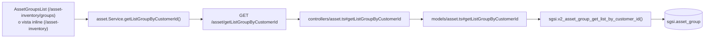

# Consultar / listar grupos de activos

## Propósito
Mostrar el listado de grupos de activos del cliente, con su clasificación CIA heredada (la más alta entre sus activos) y cantidad de activos vinculados.

## Entrada desde UI
Dos superficies de UI equivalentes, mismo hook y endpoint:
1. `/asset-inventory/groups` — vista dedicada (`AssetGroupsList`), con filtros por tipo/propietario/estado y paginación propia.
2. `/asset-inventory` con el toggle **"Vista por grupos"** — tabla inline dentro de `AssetInventory`, con panel de detalle lateral al seleccionar un grupo.

## Flujo funcional
1. Al montar cualquiera de las dos vistas, se llama `getAssetListGroupByCustomerId()`.
2. El frontend llama `GET /asset/getListGroupByCustomerId` (con `onlyActive` opcional por query string, no usado por ninguna de las dos vistas actuales — ambas cargan todos los grupos).
3. El backend resuelve el `customerId` del usuario autenticado y consulta la función de base de datos.

## Frontend
- `AssetGroupsList` (`/asset-inventory/groups`) y `AssetInventory` (`viewMode="groups"`, `/asset-inventory`).
- `useAsset().getAssetListGroupByCustomerId` → `assetStore` → `asset.Service.getListGroupByCustomerId()`.

## API
`GET /asset/getListGroupByCustomerId` — acceso `admin-or-usuario`.

## Backend
`routers/asset.ts` → `controllers/asset.ts#getListGroupByCustomerId` → `models/asset.ts#getListGroupByCustomerId` → `queries/asset.ts _getListGroupByCustomerId`.

## Database
`sgsi.v2_asset_group_get_list_by_customer_id(p_customer_id, p_only_active)` — solo lectura: `sgsi.asset_group`, con joins a `sgsi.base_asset_type`, `corvus.person` (propietario y administrador), `sgsi.cia_level` (x3), y subconsulta de conteo sobre `sgsi.asset` (`assetCount`).

## Reglas relevantes
- `p_only_active` filtra grupos inactivos si se pasa `true`; ninguna de las dos vistas de frontend inspeccionadas lo activa actualmente.

## Consideraciones
- **Duplicación de superficie de UI, no de relación técnica**: existen dos implementaciones de tabla de grupos (`AssetGroupsList` dedicado y la vista inline de `AssetInventory`) que consumen exactamente el mismo hook/endpoint/función — no hay dos fuentes de datos, solo dos renders distintos. Se documenta como hallazgo de posible consolidación futura, no como error.

## Trazabilidad

