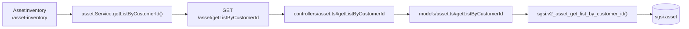

# Consultar / listar activos

## Propósito
Mostrar el inventario completo de activos de información del cliente (vigentes y no vigentes), con sus indicadores de clasificación CIA, propietario y estado.

## Entrada desde UI
Menú lateral → sección **"Inventario de Activos"** → `/asset-inventory`. Es la vista por defecto del módulo.

## Flujo funcional
1. Al montar `AssetInventory`, se dispara `getAssetListByCustomerId()` (y en paralelo `getPersonListByCustomerId`, `getBaseAssetTypeAll`, `getAreaListByCustomerId`, `getCiaLevelAll` para poblar filtros/formularios de apoyo — pertenecen a otros dominios, referencia externa).
2. El frontend llama `GET /asset/getListByCustomerId`.
3. El backend resuelve el `customerId` desde el usuario autenticado (`dataUser(req).customerId`) y consulta la función de base de datos.
4. La tabla se renderiza en dos pestañas: **Vigentes** y **No Vigentes** (filtradas client-side sobre `deletedAt`).

## Frontend
- `AssetInventory` (`components/functional/asset-inventory/asset-inventory.tsx`) — orquesta listado, búsqueda, tabs, métricas y acciones (importar/exportar/eliminar/reactivar).
- `asset-inventory-table-columns.tsx` — definición de columnas de la tabla (`DataTable`).
- `useAsset().getAssetListByCustomerId` → `assetStore` → `asset.Service.getListByCustomerId()`.

## API
`GET /asset/getListByCustomerId` — acceso `admin-or-usuario`.

## Backend
`routers/asset.ts` → `controllers/asset.ts#getListByCustomerId` → `models/asset.ts#getListByCustomerId` → `queries/asset.ts _getListByCustomerId`.

## Database
`sgsi.v2_asset_get_list_by_customer_id(p_customer_id)` — solo lectura:
- `sgsi.asset` (base), con joins a `corvus.area`, `sgsi.asset_group`, `corvus.customer_person` + `corvus.person` (propietario y administrador), `sgsi.cia_level` (x3: confidencialidad/integridad/disponibilidad), `sgsi.base_asset_type`, y subconsulta agregada sobre `sgsi.asset_threat_risk`.

## Reglas relevantes
- Solo devuelve activos del `customer_id` del usuario autenticado (aislamiento multi-tenant a nivel de función DB).
- Incluye tanto activos vigentes como no vigentes; el filtrado por estado ocurre en el frontend (`assetListSafe.filter(a => !a.deletedAt)`), no en la función DB.

## Consideraciones
- Este mismo hook (`getAssetListByCustomerId`) también alimenta la vista de grupos inline dentro de este mismo componente (`viewMode="groups"`) y el modal `LinkAssetsModal`, sin llamadas adicionales.
- El indicador "Pendientes clasificar" y "Sin propietario" en las tarjetas de métricas se calculan client-side sobre la respuesta de este mismo endpoint, no son consultas separadas.

## Trazabilidad

