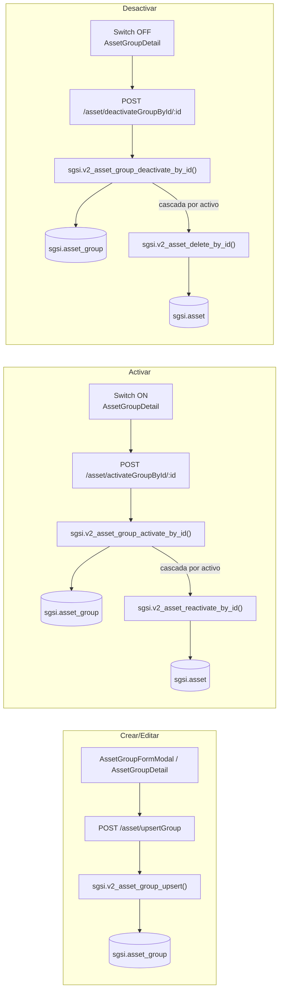

# Crear / editar / activar / desactivar grupo de activos

## Propósito
Administrar el ciclo de vida de un grupo de activos: crearlo, editar sus datos (nombre, tipo, propietario, CIA), y alternar su estado vigente/no vigente.

## Entrada desde UI
- **Crear**: botón "Crear grupo" en `/asset-inventory` (vista de grupos) o en `/asset-inventory/groups`, vía `AssetGroupFormModal`.
- **Editar**: dentro de `/asset-inventory/groups/[id]` (`AssetGroupDetail`), edición inline de los campos del grupo.
- **Activar / Desactivar**: switch "Grupo activo" dentro de `/asset-inventory/groups/[id]`.

Estas cuatro acciones se agrupan en un solo Flow porque comparten la misma pantalla/componente principal y el mismo ciclo de vida funcional del grupo — no porque compartan un único endpoint (ver tabla de convergencia más abajo).

## Flujo funcional

### Crear / Editar
1. El usuario completa nombre, tipo de activo (obligatorio), propietario, administrador y CIA.
2. El frontend llama `POST /asset/upsertGroup` con (o sin) `id`.
3. El backend valida `assetGroupUpsertSchema` (Joi).
4. `sgsi.v2_asset_group_upsert` inserta o actualiza `sgsi.asset_group`, registra el evento en `asset_group_history` y, si cambia el propietario, limpia delegaciones de tratamiento de riesgo grupal.

### Activar
1. El usuario activa el switch "Grupo activo" sobre un grupo inactivo.
2. El frontend llama `POST /asset/activateGroupById/:id`.
3. El backend chequea el lock de flujo documental.
4. `sgsi.v2_asset_group_activate_by_id` marca `active = true` y **reactiva en cascada** (invocando `sgsi.v2_asset_reactivate_by_id`) cada activo del grupo que estuviera dado de baja.

### Desactivar
1. El usuario desactiva el switch sobre un grupo activo.
2. El frontend llama `POST /asset/deactivateGroupById/:id`.
3. El backend chequea el lock de flujo documental.
4. `sgsi.v2_asset_group_deactivate_by_id` marca `active = false` y **da de baja en cascada** (invocando `sgsi.v2_asset_delete_by_id`) cada activo vigente del grupo.

## Frontend
- `AssetGroupFormModal` (crear, también reutilizado dentro de `AssetInventoryForm` para crear grupo al vuelo mientras se edita un activo) → `useAsset().upsertAssetGroup`.
- `AssetGroupDetail` (editar + activar/desactivar) → `useAsset().upsertAssetGroup`, `activateAssetGroupById`, `deactivateAssetGroupById`, y `getAssetGroupById` para cargar el estado previo a editar.
- `LinkAssetsModal` / `SelectAssetTypeModal` — utilidades de selección dentro de `AssetGroupDetail`; `LinkAssetsModal` no llama a un endpoint de grupo, reutiliza `upsertAsset` (ver FLOW-ACT-004).

## API
| Acción | Endpoint | Acceso |
|---|---|---|
| Crear/editar | `POST /asset/upsertGroup` | admin-or-usuario |
| Consultar antes de editar | `GET /asset/getGroupById/:id` | admin-or-usuario |
| Activar | `POST /asset/activateGroupById/:id` | admin-or-usuario |
| Desactivar | `POST /asset/deactivateGroupById/:id` | admin-or-usuario |

## Backend
- `controllers/asset.ts#upsertGroup` → `models/asset.ts#upsertGroup` → `queries/asset.ts _upsertGroup`.
- `controllers/asset.ts#activateGroupById` (chequea lock) → `models/asset.ts#activateGroupById` → `queries/asset.ts _activateGroupById`.
- `controllers/asset.ts#deactivateGroupById` (chequea lock) → `models/asset.ts#deactivateGroupById` → `queries/asset.ts _deactivateGroupById`.

## Database
- `sgsi.v2_asset_group_upsert`: WRITE `sgsi.asset_group`, `sgsi.asset_group_history`; WRITE condicional `sgsi.group_risk_treatment` (cambio de propietario); READ `corvus.person`, `sgsi.base_asset_type`, `sgsi.cia_level`, `sgsi.asset_group_threat_risk`. Bloquea la edición si el grupo está inactivo ("Actívelo primero").
- `sgsi.v2_asset_group_activate_by_id`: WRITE `sgsi.asset_group`, `sgsi.asset_group_history`; READ `sgsi.asset`; **llama a `sgsi.v2_asset_reactivate_by_id` en cascada** por cada activo no vigente del grupo.
- `sgsi.v2_asset_group_deactivate_by_id`: WRITE `sgsi.asset_group`, `sgsi.asset_group_history`; READ `sgsi.asset`; **llama a `sgsi.v2_asset_delete_by_id` en cascada** por cada activo vigente del grupo.

## Reglas relevantes
- Nombre y código de grupo únicos por cliente (case-insensitive).
- No se puede editar un grupo inactivo directamente — debe activarse primero.
- El tipo de activo del grupo es obligatorio y determina qué activos pueden vincularse (regla validada también del lado de `sgsi.v2_asset_upsert`, ver FLOW-ACT-003/004).
- La activación/desactivación de un grupo **arrastra en cascada** el estado de todos sus activos vinculados; los fallos individuales (p. ej. un activo con `position_id` que no puede darse de baja) se registran en el resumen del evento de historial del grupo pero no abortan la operación completa.

## Consideraciones
- **Hallazgo de inconsistencia**: `upsertGroup` (crear/editar) **no** verifica `isAssetFlowLockedByCustomer`, a diferencia de `activateGroupById`, `deactivateGroupById` y de todas las mutaciones de activo individual (`upsert`, `deleteById`, `reactivateById`, `massive`). Es decir, se puede crear o editar un grupo mientras el inventario de activos está bloqueado por un flujo de aprobación, pero no se puede activar/desactivar ni tocar activos individuales. Confirmado por lectura completa de `controllers/asset.ts`; documentado como hallazgo, no corregido.
- **Convergencia técnica real (no aparente)**: activar/desactivar un grupo no solo cambia el estado del grupo — internamente ejecuta el mismo camino de FLOW-ACT-005 (Dar de baja activo) y FLOW-ACT-006 (Reactivar activo) para cada activo del grupo, vía llamada función→función. Esta relación está declarada como dato en `docs/06-technical/assets/functions/FN-V2-ASSET-GROUP-ACTIVATE-BY-ID.yaml` y `FN-V2-ASSET-GROUP-DEACTIVATE-BY-ID.yaml` (`calls: [...]`) — no fue mencionada en el discovery original (Checkpoint A) porque requería leer el cuerpo completo de estas dos funciones.
- **Vincular activos a un grupo** (`LinkAssetsModal`) no aparece en la tabla de endpoints de este Flow porque técnicamente no usa ninguno de los cuatro: reutiliza `POST /asset/upsert` (FLOW-ACT-004) fijando `group.id` en el payload del activo.

## Trazabilidad

