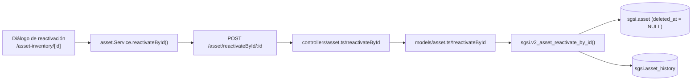

# Reactivar activo

## Propósito
Revertir la baja de un activo (soft delete), devolviéndolo al estado vigente.

## Entrada desde UI
`/asset-inventory/[id]` de un activo dado de baja (`isDeleted=true`) → botón **"Reactivar Activo"**. También accesible desde la pestaña "No Vigentes" del listado en `/asset-inventory`.

## Flujo funcional
1. El usuario confirma la reactivación e ingresa una justificación (mínimo 10 caracteres).
2. El frontend llama `POST /asset/reactivateById/:id` con `{ justification }`.
3. El backend valida `reactivateByIdSchema` (idéntico a `deleteByIdSchema`) y verifica el lock de flujo.
4. `sgsi.v2_asset_reactivate_by_id` limpia `deleted_at`/`deleted_by` y registra el evento en `asset_history`.

## Frontend
- `AssetInventoryDetail` — `useAsset().reactivateById(id, justification)`.
- `assetStore` → `asset.Service.reactivateById()`.

## API
`POST /asset/reactivateById/:id` — acceso `admin-only`.

## Backend
`routers/asset.ts` → `controllers/asset.ts#reactivateById` (Joi + chequeo de lock) → `models/asset.ts#reactivateById` → `queries/asset.ts _reactivateById`.

## Database
`sgsi.v2_asset_reactivate_by_id(p_asset_id, p_user_id, p_customer_id, p_justification)`:
- Excepción si `p_justification` tiene menos de 10 caracteres.
- `UPDATE sgsi.asset SET deleted_at = NULL, deleted_by = NULL WHERE ... deleted_at IS NOT NULL` — solo afecta activos actualmente dados de baja (excepción si ya está vigente).
- `INSERT INTO sgsi.asset_history` (`action='restore'`).

## Reglas relevantes
- Justificación obligatoria, mínimo 10 caracteres.
- Solo aplica a activos con `deleted_at IS NOT NULL`; falla con excepción explícita si el activo ya está vigente.

## Consideraciones
- **Convergencia técnica**: esta misma función (`FN-V2-ASSET-REACTIVATE-BY-ID`) es invocada también, en cascada, por `sgsi.v2_asset_group_activate_by_id` (una vez por cada activo no vigente del grupo) cuando se reactiva un grupo completo — ver FLOW-ACT-012 (Gestionar grupo de activos). Declarado como dato en `docs/06-technical/assets/functions/FN-V2-ASSET-REACTIVATE-BY-ID.yaml`.

## Trazabilidad

