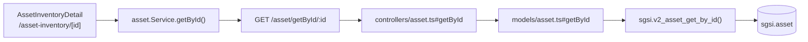

# Consultar detalle de activo

## Propósito
Mostrar toda la información registrada de un activo específico: datos generales, clasificación CIA, propietario/administrador, grupo, tipo, y amenazas/vulnerabilidades asociadas.

## Entrada desde UI
Click en una fila de la tabla en `/asset-inventory`, o navegación directa a `/asset-inventory/{id}`.

## Flujo funcional
1. `AssetInventoryDetail` lee el `id` de la URL y llama `getAssetById(id)`.
2. El frontend llama `GET /asset/getById/:id`.
3. El backend primero valida que el activo pertenezca al `customerId` del usuario (`AssetModel.getCustomerId` → `sgsi.v2_asset_get_customer_id`) antes de resolver el detalle completo; si no coincide, responde 404.
4. Se renderiza el formulario en modo solo lectura (`AssetInventoryForm readOnly`), más el bloque de riesgos/controles del grupo y el historial de trazabilidad (ver FLOW-ACT-010, referenciado únicamente por su `endpoint` técnico, no como dependencia documental).

## Frontend
- `AssetInventoryDetail` (sin `forceNew`, `id` presente) → `AssetInventoryForm` (`readOnly=true` mientras no se pulse "Editar").
- `useAsset().getAssetById` → `assetStore` → `asset.Service.getById()`.

## API
`GET /asset/getById/:id` — acceso `admin-only`.

## Backend
`routers/asset.ts` → `controllers/asset.ts#getById` (valida ownership vía `AssetModel.getCustomerId`) → `models/asset.ts#getById` → `queries/asset.ts _getById`.

## Database
`sgsi.v2_asset_get_by_id(p_asset_id)` — solo lectura: `sgsi.asset`, `corvus.area`, `sgsi.asset_group`, `corvus.customer_person` + `corvus.person`, `sgsi.cia_level` (x3), `sgsi.base_asset_type`, `sgsi.asset_threat_risk`. Lanza excepción si el activo no existe o está eliminado.

## Reglas relevantes
- El controller verifica explícitamente que `assetCustomerId === customerId` del usuario antes de llamar a la función de detalle — doble control de aislamiento multi-tenant (a nivel de controller y, adicionalmente, implícito en el filtro `deleted_at IS NULL` de la función).

## Consideraciones
- Esta misma función DB (`sgsi.v2_asset_get_by_id`) es también el valor de retorno de `sgsi.v2_asset_upsert` (ver FLOW-ACT-003 / FLOW-ACT-004): cada vez que se crea o edita un activo, el backend reutiliza esta función para devolver el estado final — no hay dos implementaciones de "cómo se ve un activo".

## Trazabilidad

