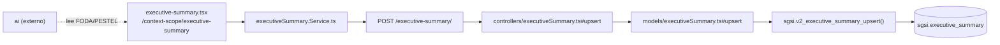

# Gestionar Resumen Ejecutivo

## Propósito
Redactar el Resumen Ejecutivo del SGSI (texto libre, asistido por IA) como tabla única (igual que Scope, no un par ítem+análisis), sujeta al mismo ciclo borrador → aprobación → publicación.

## Entrada desde UI
`/context-scope/executive-summary` — única pantalla del módulo.

## Flujo funcional
1. Carga del Resumen vigente/borrador (`getByCustomerId` → `EP-EXECUTIVE-SUMMARY-GET-BY-CUSTOMER-ID`).
2. El usuario redacta el contenido, opcionalmente asistido por IA (`useAI().generateExecutiveSummaryResumen` → `GET /ai/generate-executive-summary-resumen`, que internamente llama a `FN-V2-EXECUTIVE-SUMMARY-GET-DATA-BY-CUSTOMER-ID-TO-AI` para leer FODA/PESTEL y **bloquea la generación si FODA no está completo** — PESTEL es solo una advertencia, no bloqueante).
3. Guardar → `upsert` → `EP-EXECUTIVE-SUMMARY-UPSERT`.
4. Envío a aprobación: `/doc-flow/configuration?type=EXECUTIVE_SUMMARY&entityId=<summaryId>` (`FLOW-DOCFLOW-004`).
5. Publicación: la UI llama primero a `publishProcess` (Doc-Flow, flip real `is_current`+`is_complete`) y **después** a `EP-EXECUTIVE-SUMMARY-PUBLISH` — mismo patrón de no-op que FODA/PESTEL (ver Consideraciones). Nota: este flujo **no** invoca ningún paso local de "completar" — `completeExecutiveSummary` existe en el hook pero no se llama desde ningún handler (ver Hallazgos).
6. Historial: `getVersions`/`getVersionById`, enriquecido con `getProcessByEntity('EXECUTIVE_SUMMARY', ...)`.
7. Nueva versión: `createNewVersion` → `EP-EXECUTIVE-SUMMARY-CREATE-NEW-VERSION`.

## Frontend
`executive-summary.tsx` → `useExecutiveSummary()` → `executiveSummaryStore` → `executiveSummary.Service.ts`.

## API
`GET /executive-summary/`, `POST /executive-summary/`, `POST /executive-summary/publish`, `GET /executive-summary/versions`, `POST /executive-summary/new-version`, `GET /executive-summary/version/:id` — acceso `admin-or-usuario`. (`POST /executive-summary/complete` existe pero es huérfano, ver Hallazgos).

## Backend
`routers/executiveSummary.ts` → `controllers/executiveSummary.ts` → `models/executiveSummary.ts` → `sgsi.v2_executive_summary_*`.

## Database
`sgsi.v2_executive_summary_get_by_customer_id`, `v2_executive_summary_upsert`, `v2_executive_summary_analysis_publish`, `v2_executive_summary_create_new_version`, `v2_executive_summary_get_versions`, `v2_executive_summary_get_version_by_id` (`funciones_sgsi.sql`) + `v2_executive_summary_get_data_by_customer_id_to_ai` (invocada desde el dominio `ai`, no desde este router). Tabla: `sgsi.executive_summary`.

## Consideraciones
- **Redundancia de publicación (Technical Debt)**: mismo patrón que FODA/PESTEL — Doc-Flow hace el flip real primero, `FN-V2-EXECUTIVE-SUMMARY-ANALYSIS-PUBLISH` queda no-op después (mismo guard `is_complete=false`). No corregido.
- `POST /executive-summary/complete` (`completeExecutiveSummary` en `useExecutiveSummary.tsx`, que envuelve `v2_executive_summary_mark_complete`) tiene toda la cadena técnica completa y correcta, pero **ningún componente lo invoca** (solo se destructura en `executive-summary.tsx:48`, sin uso posterior) — a diferencia de FODA/PESTEL/Scope, este módulo no tiene un paso de "marcar completo" separado en su flujo real de UI. Reclasificado como huérfano en Checkpoint C.
- El nombre real de la function de publicación incluye el infijo "analysis" (`v2_executive_summary_analysis_publish`) pese a que `sgsi.executive_summary` es tabla única, no un par ítem+análisis — inconsistencia de nomenclatura heredada, no corregida.

## Trazabilidad

