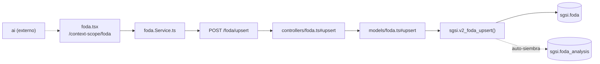

# Gestionar Análisis FODA

## Propósito
Evaluar Fortalezas, Oportunidades, Debilidades y Amenazas del cliente como ítems individuales agrupados en un análisis versionado (`sgsi.foda_analysis`), con sugerencias asistidas por IA.

## Entrada desde UI
`/context-scope/foda` es la única pantalla que edita FODA. `/context-scope/organizational-context` la consulta en modo 100% lectura (hub de navegación, ver Consideraciones) — no es una entrada de edición.

## Flujo funcional
1. Carga de ítems y cabecera (`getByCustomerId`/`getAnalysis` → `EP-FODA-GET-BY-CUSTOMER-ID`/`EP-FODA-ANALYSIS-GET-BY-CUSTOMER-ID`); si no existe análisis activo, `FN-V2-FODA-UPSERT` lo auto-siembra al primer guardado.
2. El usuario agrega/edita ítems en las 4 categorías (`strengths.tsx`/`weaknesses.tsx`/`opportunities.tsx`/`threats.tsx`) → `upsert` → `EP-FODA-UPSERT`; puede eliminarlos (`EP-FODA-DELETE-BY-ID`).
3. `foda-ai-card.tsx` puede pedir sugerencias de ítems vía `POST /ai/generate-foda-analysis` (dominio externo `ai`).
4. Al finalizar, `markComplete` → `EP-FODA-ANALYSIS-MARK-COMPLETE` fija `is_complete=true` sobre el análisis en borrador.
5. Envío a aprobación: `/doc-flow/configuration?type=FODA&entityId=<analysisId>` (`FLOW-DOCFLOW-004`).
6. Publicación: la UI llama primero a `publishProcess` (Doc-Flow, flip real `is_active`+`is_complete`) y **después** a `EP-FODA-ANALYSIS-PUBLISH` — esta segunda llamada resulta no-op en la práctica (ver Consideraciones).
7. Historial: `getVersions`/`getVersionById` (`EP-FODA-ANALYSIS-GET-VERSIONS`/`-GET-VERSION-BY-ID`), enriquecido con `getProcessByEntity('FODA', ...)`.
8. Nueva versión: `createNewVersion` → `EP-FODA-ANALYSIS-CREATE-NEW-VERSION`.

## Frontend
`foda.tsx` → `useFoda()` → `fodaStore` → `foda.Service.ts`. `organizational-context.tsx` también usa `useFoda()`, pero solo para leer (sin ninguna mutación).

## API
`GET /foda/getByCustomerId`, `POST /foda/upsert`, `DELETE /foda/deleteById/:id`, `GET /foda/analysis`, `POST /foda/analysis/complete`, `POST /foda/analysis/new-version`, `GET /foda/analysis/versions`, `GET /foda/analysis/version/:id`, `POST /foda/analysis/publish` — acceso `admin-or-usuario`.

## Backend
`routers/foda.ts` → `controllers/foda.ts` → `models/foda.ts` → `queries/foda.ts` → `sgsi.v2_foda_*`.

## Database
`sgsi.v2_foda_get_by_customer_id`, `v2_foda_upsert`, `v2_foda_delete_by_id`, `v2_foda_analysis_get_by_customer_id`, `v2_foda_analysis_mark_complete`, `v2_foda_analysis_create_new_version`, `v2_foda_analysis_get_versions`, `v2_foda_analysis_get_version_by_id`, `v2_foda_analysis_publish` (`funciones_sgsi.sql`). Tablas: `sgsi.foda`, `sgsi.foda_analysis`.

## Reglas relevantes
- No se puede editar un análisis con `is_complete=true`.

## Consideraciones
- **Contexto Organizacional no es Operación propia**: `organizational-context.tsx` reutiliza `useFoda()` (y `usePestel()`) únicamente para mostrar accesos rápidos de solo lectura — converge en esta Operación y en `FLOW-CTX-003`, sin Flow ni endpoint propio.
- **Redundancia de publicación (Technical Debt)**: Doc-Flow publica primero y ya deja `is_complete=true`; `FN-V2-FODA-ANALYSIS-PUBLISH` comparte ese mismo guard `is_complete=false`, por lo que al ejecutarse después no encuentra fila que actualizar y responde `success:false` sin modificar nada — no-op real, no solo idempotente. No corregido.

## Trazabilidad

