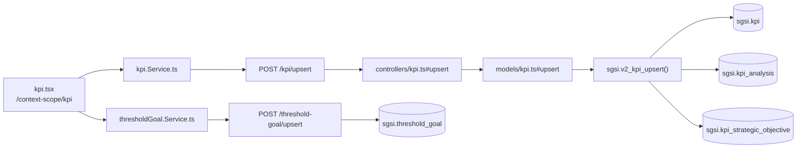

# Gestionar KPIs del SGSI

## Propósito
Definir los KPIs del SGSI (fórmula, frecuencia, tipo, nivel, unidad de medida, responsable, vínculo N:N a Objetivos Estratégicos) agrupados en un análisis versionado (`sgsi.kpi_analysis`), incluyendo sus Metas y Umbrales (verde/amarillo/rojo) embebidas en la misma pantalla.

## Entrada desde UI
`/context-scope/kpi` — única pantalla del módulo. "Metas y Umbrales" no es una ruta separada: se edita dentro de `kpi-edit-modal.tsx` y se consulta en `kpi-card-thresholds.tsx`, ambos parte de esta misma pantalla.

## Flujo funcional
1. Carga de KPIs, catálogos (tipos/niveles/frecuencias/sugerencias) y objetivos activos disponibles para vincular (`getByCustomerId`, `getTypes`, `getLevels`, `getFrequencyList`, `useBaseKpi`, `getActiveStrategicObjectives` desde `DOM-CTX`/`FLOW-CTX-004`).
2. El usuario crea/edita un KPI (`kpi-edit-modal.tsx`), incluyendo sus Metas y Umbrales (`useThresholdGoal`) → `upsert` → `EP-KPI-UPSERT`, que reemplaza el set completo de `sgsi.kpi_strategic_objective` del KPI en cada guardado.
3. Metas y Umbrales se guardan aparte, mismo modal: `upsert` → `EP-THRESHOLD-GOAL-UPSERT`.
4. `calculate` (`EP-KPI-CALCULATE-VALUE`) trae el valor vigente del KPI para mostrarlo en `kpi-card.tsx`.
5. `markComplete` → `EP-KPI-ANALYSIS-MARK-COMPLETE` fija `is_complete=true` — **no existe un paso local de publish**: el flip de `is_active` de `sgsi.kpi_analysis` ocurre únicamente dentro de `sgsi.doc_flow_publish` (ver Consideraciones).
6. Envío a aprobación: `/doc-flow/configuration?type=KPI&entityId=<analysisId>` (`FLOW-DOCFLOW-004`).
7. Historial: `getVersions`/`getVersionById`.
8. Nueva versión: `createNewVersion` → `EP-KPI-ANALYSIS-CREATE-NEW-VERSION`.

## Frontend
`kpi.tsx` → `useKpi()`/`useThresholdGoal()`/`useBaseKpi()` → `kpiStore`/`thresholdGoalStore` → `kpi.Service.ts`/`thresholdGoal.Service.ts`.

## API
`GET /kpi/getByCustomerId`, `POST /kpi/upsert`, `DELETE /kpi/deleteById/:id`, `POST /kpi/analysis/complete`, `POST /kpi/analysis/new-version`, `GET /kpi/versions`, `GET /kpi/version/:id`, `GET /kpi/types`, `GET /kpi/levels`, `GET /kpi/frequencies`, `GET /kpi/:id/calculate`, `GET /kpi/getByCustomerIdWithThresholds`, `GET /threshold-goal/getByCustomerId`, `POST /threshold-goal/upsert`, `GET /base-kpi/getAll` — acceso `admin-or-usuario`. (`GET /kpi/frequencies/listByCustomerId` existe como alias pero es huérfano, ver Hallazgos).

## Backend
`routers/kpi.ts` + `routers/thresholdGoal.ts` + `routers/baseKpi.ts` → `controllers/kpi.ts`/`thresholdGoal.ts`/`baseKpi.ts` → `models/kpi.ts`/`thresholdGoal.ts`/`baseKpi.ts` → `sgsi.v2_kpi_*`/`v2_threshold_goal_*`/`v2_base_kpi_get_all`.

## Database
`sgsi.v2_kpi_get_by_customer_id`, `v2_kpi_upsert`, `v2_kpi_delete_by_id`, `v2_kpi_analysis_mark_complete`, `v2_kpi_analysis_create_new_version`, `v2_kpi_analysis_get_versions`, `v2_kpi_analysis_get_version_by_id`, `v2_kpi_type_get_all`, `v2_kpi_level_get_all`, `v2_frequency_get_all`, `v2_kpi_calculate_value`, `v2_kpi_get_by_customer_id_with_thresholds`, `v2_threshold_goal_get_by_customer_id`, `v2_threshold_goal_upsert`, `v2_base_kpi_get_all` (`funciones_sgsi.sql`). Tablas: `sgsi.kpi`, `sgsi.kpi_analysis`, `sgsi.kpi_strategic_objective`, `sgsi.threshold_goal`, más catálogos de solo lectura `sgsi.kpi_type`, `sgsi.kpi_level`, `sgsi.frequency`, `sgsi.base_kpi`.

## Reglas relevantes
- El vínculo N:N a Objetivos Estratégicos se reemplaza completo (DELETE+INSERT) en cada guardado del KPI, no es incremental.

## Consideraciones
- **Metas y Umbrales no es Operación separada** — su consumidor funcional está embebido dentro de esta pantalla (`kpi-edit-modal.tsx`/`kpi-card-thresholds.tsx`), sin ruta propia.
- **KPI es la única entidad de la familia sin publish local**: a diferencia de Scope/FODA/PESTEL/Objetivos Estratégicos/Resumen Ejecutivo, no existe `POST /kpi/analysis/publish` — el flip de `is_active` es responsabilidad exclusiva de `sgsi.doc_flow_publish` (`FLOW-DOCFLOW-006`).
- `GET /kpi/frequencies/listByCustomerId` — alias del mismo handler que `GET /kpi/frequencies`, comentado en el propio código como "mantener por compatibilidad" pero sin consumidor real en `app-sgsi`. Reconfirmado huérfano en Checkpoint C.
- **Corrección de conteo de tablas (Checkpoint C)**: `sgsi.kpi_type`, `sgsi.kpi_level` y `sgsi.frequency` no habían sido listadas en Checkpoint A/B — son catálogos de solo lectura alcanzados por `v2_kpi_type_get_all`/`v2_kpi_level_get_all`/`v2_frequency_get_all`, derivados correctamente de `function.tables[]` en este pase.

## Trazabilidad

