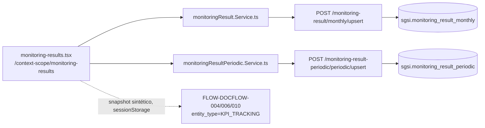

# Registrar Seguimiento y Resultados de KPIs

## Propósito
Registrar periódicamente los resultados reales de cada KPI (mensual/anual o con frecuencia propia: diaria/semanal/quincenal/trimestral/semestral, con evidencia adjunta), compilar un snapshot anual y enviarlo a un proceso de aprobación formal como cierre de auditoría.

## Entrada desde UI
`/context-scope/monitoring-results` — única pantalla del módulo.

## Flujo funcional
1. La pantalla arma la grilla de KPIs (`getByCustomerIdWithThresholds` → `EP-KPI-GET-BY-CUSTOMER-ID-WITH-THRESHOLDS`) y decide en runtime, **por cada KPI**, qué rama usar según `kpi.is_periodic`:
   - **Rama mensual/anual** (`kpi.is_periodic=false`): `monitoring-result-monthly-modal.tsx` → `useMonitoringResult()` → `EP-MONITORING-RESULT-MONTHLY-GET-BY-YEAR`/`-UPSERT`.
   - **Rama periódica** (`kpi.is_periodic=true`): `monitoring-result-tracking-modal.tsx` + vistas por frecuencia (`views/Frequency*View.tsx`) → `useMonitoringResultPeriodic()` → `EP-MONITORING-RESULT-PERIODIC-GET-BY-KPI-YEAR`/`-UPSERT`, con evidencia opcional (`evidence-upload-panel.tsx` → `EP-MONITORING-RESULT-PERIODIC-UPLOAD-EVIDENCE`, vinculada al registro real después del guardado).
2. `calculateKpi` (`EP-KPI-CALCULATE-VALUE`) se usa para mostrar el valor calculado de cada KPI en la grilla.
3. Al cerrar el período, `compileKpiSnapshot()` arma un snapshot **de solo lectura** combinando ambas ramas, con un `entityId = crypto.randomUUID()` sintético (sin fila propia en ninguna tabla) y lo guarda en `sessionStorage`.
4. Envío a aprobación: redirige a `/doc-flow/configuration?type=KPI_TRACKING&entityId=<uuid-sintético>` (`FLOW-DOCFLOW-004`); `doc-flow-configure-page.tsx` toma el snapshot de `sessionStorage` y lo envía como `entity_data` al crear el proceso.
5. Publicación: `publishProcess` (Doc-Flow, `FLOW-DOCFLOW-006`) — ver Consideraciones (KPI_TRACKING, Caso A).
6. Historial: `getAllProcessesByType('KPI_TRACKING')` (`FLOW-DOCFLOW-010`).

## Frontend
`monitoring-results.tsx` → `useMonitoringResult()` + `useMonitoringResultPeriodic()` + `useKpi()` (para `calculateKpi`) → `monitoringResultStore`/`monitoringResultPeriodicStore` → `monitoringResult.Service.ts`/`monitoringResultPeriodic.Service.ts`.

## API
`GET /monitoring-result/monthly/year/:year`, `POST /monitoring-result/monthly/upsert`, `GET /monitoring-result-periodic/periodic`, `POST /monitoring-result-periodic/periodic/upsert`, `POST /monitoring-result-periodic/periodic/upload`, `GET /monitoring-result-periodic/periodic/evidence/:filename` — acceso `admin-or-usuario`.

## Backend
`routers/monitoringResult.ts` + `routers/monitoringResultPeriodic.ts` → `controllers/monitoringResult.ts`/`monitoringResultPeriodic.ts` → `models/monitoringResult.ts`/`monitoringResultPeriodic.ts` → `sgsi.v2_monitoring_result_monthly_*`/`v2_monitoring_result_periodic_*`.

## Database
`sgsi.v2_monitoring_result_monthly_get_by_customer_year`, `v2_monitoring_result_monthly_upsert`, `v2_monitoring_result_periodic_get_by_kpi_year`, `v2_monitoring_result_periodic_upsert` (`funciones_sgsi.sql`). Tablas: `sgsi.monitoring_result_monthly`, `sgsi.monitoring_result_periodic`. No hay tabla propia de "KPI_TRACKING" — el snapshot enviado a Doc-Flow es sintético.

## Reglas relevantes
- El archivo de evidencia se sube primero (con un `entity_id` placeholder igual al `customerId`) y se re-vincula al registro real de monitoreo recién creado en el mismo guardado.

## Consideraciones — KPI_TRACKING (CASO A, comportamiento correcto)
Publicar `KPI_TRACKING` significa **exclusivamente cerrar el proceso de aprobación** sobre un snapshot de auditoría ya inmutable — no existe ni debe existir ninguna escritura adicional sobre `monitoring_result_monthly`/`_periodic`, porque esos datos ya fueron persistidos antes, vía sus propios endpoints, de forma independiente a la aprobación. Evidencia verificada línea a línea:
- `sgsi.doc_flow_entity_belongs_to_customer` (`funciones_sgsi.sql:1248-1254`) documenta en su propio comentario que `KPI_TRACKING`/`RISK_MATRIX` no tienen tabla propia — su aislamiento depende del `customer_id` forzado server-side en el snapshot, no de una fila previa que consultar.
- El cuerpo completo de `sgsi.doc_flow_publish` (`funciones_sgsi.sql:2217-2491`) no tiene rama `IF/ELSIF` para `KPI_TRACKING` (cubre `DOCUMENT, STAKEHOLDER, SCOPE, KPI, STRATEGIC_OBJECTIVE, PESTEL, FODA, SOA, EXECUTIVE_SUMMARY, COMMUNICATIONS_MATRIX`, termina en `END IF` sin `ELSE`) — el `UPDATE ... status='FINALIZADO'` corre igual, incondicionalmente, antes de ese bloque.
- `docs/05-flows/docflow/publish-document.md` (§ Consideraciones) ya documenta el alcance exacto de esa función y no menciona `KPI_TRACKING` entre las 9 tablas que sí toca — no hay ninguna afirmación incorrecta que corregir en `DOM-DOCFLOW`. **No se requiere diff sobre `docflow.md`.**

## Trazabilidad

