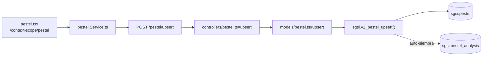

# Gestionar Análisis PESTEL

## Propósito
Evaluar factores Políticos, Económicos, Sociales, Tecnológicos, Ecológicos y Legales del entorno del cliente como ítems agrupados en un análisis versionado (`sgsi.pestel_analysis`), asistido por un catálogo de sugerencias precargadas.

## Entrada desde UI
`/context-scope/pestel` es la única pantalla que edita PESTEL. `/context-scope/organizational-context` la consulta en modo 100% lectura — no es una entrada de edición (ver Consideraciones).

## Flujo funcional
1. Carga de ítems, cabecera y catálogo de sugerencias (`getByCustomerId`/`getAnalysis`/`getAll` → `EP-PESTEL-GET-BY-CUSTOMER-ID`/`EP-PESTEL-ANALYSIS-GET-BY-CUSTOMER-ID`/`EP-BASE-PESTEL-GET-ALL`); auto-siembra del análisis al primer guardado.
2. El usuario agrega/edita ítems en las 6 dimensiones → `upsert` → `EP-PESTEL-UPSERT`; puede eliminarlos (`EP-PESTEL-DELETE-BY-ID`).
3. `markComplete` → `EP-PESTEL-ANALYSIS-MARK-COMPLETE`.
4. Envío a aprobación: `/doc-flow/configuration?type=PESTEL&entityId=<analysisId>` (`FLOW-DOCFLOW-004`).
5. Publicación: Doc-Flow primero (flip real), luego `EP-PESTEL-ANALYSIS-PUBLISH` (no-op en la práctica, mismo patrón que FODA).
6. Historial: `getVersions`/`getVersionById`, enriquecido con `getProcessByEntity('PESTEL', ...)`.
7. Nueva versión: `createNewVersion` → `EP-PESTEL-ANALYSIS-CREATE-NEW-VERSION`.

## Frontend
`pestel.tsx` → `usePestel()`/`useBasePestel()` → `pestelStore` → `pestel.Service.ts`. `organizational-context.tsx` también usa `usePestel()`, solo lectura.

## API
`GET /pestel/getByCustomerId`, `POST /pestel/upsert`, `DELETE /pestel/deleteById/:id`, `GET /pestel/analysis`, `POST /pestel/analysis/complete`, `POST /pestel/analysis/new-version`, `POST /pestel/analysis/publish`, `GET /pestel/analysis/versions`, `GET /pestel/analysis/version/:id`, `GET /base-pestel/getAll` — acceso `admin-or-usuario`, salvo `base-pestel` que está montado como `admin-only` (asimetría real, ver Hallazgos).

## Backend
`routers/pestel.ts` + `routers/basePestel.ts` → `controllers/pestel.ts`/`basePestel.ts` → `models/pestel.ts`/`basePestel.ts` → `sgsi.v2_pestel_*`/`v2_base_pestel_get_all`.

## Database
`sgsi.v2_pestel_get_by_customer_id`, `v2_pestel_upsert`, `v2_pestel_delete_by_id`, `v2_pestel_analysis_get_by_customer_id`, `v2_pestel_analysis_mark_complete`, `v2_pestel_analysis_create_new_version`, `v2_pestel_analysis_publish`, `v2_pestel_analysis_get_versions`, `v2_pestel_analysis_get_version_by_id`, `v2_base_pestel_get_all` (`funciones_sgsi.sql`). Tablas: `sgsi.pestel`, `sgsi.pestel_analysis`, `sgsi.base_pestel` (catálogo, solo lectura).

## Consideraciones
- **Contexto Organizacional no es Operación propia** — mismo criterio que FODA (`FLOW-CTX-002`).
- **Redundancia de publicación (Technical Debt)**: mismo patrón que FODA — `FN-V2-PESTEL-ANALYSIS-PUBLISH` queda no-op tras el flip real de Doc-Flow. No corregido.
- `EP-BASE-PESTEL-GET-ALL` es el único endpoint de todo `DOM-CTX` montado como `admin-only` (el resto es `admin-or-usuario`) — asimetría real, no corregida.

## Trazabilidad

