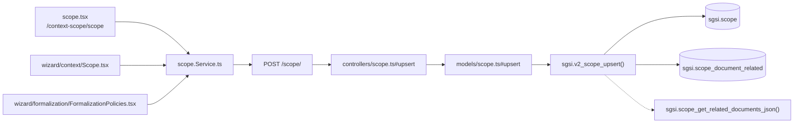

# Gestionar Alcance del SGSI

## Propósito
Definir y versionar el Alcance del SGSI (nombre + texto libre) con documentos relacionados, como única tabla (no hay un par ítem+análisis como en FODA/PESTEL/Objetivos/KPI) sujeta al mismo ciclo borrador → completo → aprobación → publicación.

## Entrada desde UI
- `/context-scope/scope` — pantalla principal del módulo Contexto y Alcance.
- `/wizard/context/scope` y `/wizard/formalization/policies` — mismo formulario, embebido como paso del Wizard de onboarding y en el dashboard de formalización.

Las 3 rutas son puntos de entrada de la **misma Operación**: comparten literalmente el hook `useScope()`, el mismo store (`scopeStore.ts`) y los mismos endpoints — no hay ningún parámetro de "instancia de wizard" que aísle los datos; el `customerId` se resuelve siempre server-side desde la sesión (ver Consideraciones).

## Flujo funcional
1. Al entrar, la pantalla carga el Alcance vigente o el borrador en curso (`getByCustomerId` → `EP-SCOPE-GET-BY-CUSTOMER-ID`), junto con los documentos relacionados embebidos (vía `FN-SCOPE-GET-RELATED-DOCUMENTS-JSON`, interna).
2. El usuario edita nombre y texto libre, y opcionalmente vincula documentos del catálogo (`related_document_ids`). Guardar dispara `upsert` → `EP-SCOPE-UPSERT`, bloqueado (409 funcional) si el Alcance vigente tiene un proceso Doc-Flow en `EN_APROBACION`/`PENDIENTE_PUBLICAR`.
3. Al finalizar la redacción, `completeScope(justification)` → `EP-SCOPE-MARK-COMPLETE` fija `is_complete=true` sobre la versión en borrador — **este paso corre antes de enviar a aprobación**, a diferencia del resto de la familia (ver Consideraciones de versionado).
4. Envío a aprobación: redirige a `/doc-flow/configuration?type=SCOPE&entityId=<scopeId>` (`FLOW-DOCFLOW-004`).
5. Publicación: el botón de publicar llama únicamente a `publishProcess` (Doc-Flow, `FLOW-DOCFLOW-006`) — **nunca** a `EP-SCOPE-PUBLISH`/`FN-V2-SCOPE-PUBLISH`, que quedan como código huérfano (ver Hallazgos).
6. Historial: `getVersions`/`getVersionById` (`EP-SCOPE-GET-VERSIONS`/`EP-SCOPE-GET-VERSION-BY-ID`) alimentan `scope-history.tsx`/`scope-version-modal.tsx`, enriquecidos con el historial de aprobación real (`getProcessByEntity('SCOPE', ...)`, dominio doc-flow).
7. Nueva versión: `createNewVersion` → `EP-SCOPE-CREATE-NEW-VERSION` abre un nuevo borrador tras la publicación.

## Frontend
`scope.tsx` (pantalla principal) y `wizard/context/Scope.tsx`/`wizard/formalization/FormalizationPolicies.tsx` (Wizard) → todos consumen `useScope()` directamente → `scopeStore` → `scope.Service.ts`.

## API
`GET /scope/`, `POST /scope/`, `POST /scope/complete`, `GET /scope/versions`, `POST /scope/new-version`, `GET /scope/version/:id` — acceso `admin-or-usuario`. (`POST /scope/publish` existe pero es huérfano, ver Hallazgos).

## Backend
`routers/scope.ts` → `controllers/scope.ts` → `models/scope.ts` → `queries/scope.ts` → `sgsi.v2_scope_*`.

## Database
`sgsi.v2_scope_get_by_customer_id`, `v2_scope_upsert`, `v2_scope_mark_complete`, `v2_scope_get_versions`, `v2_scope_create_new_version`, `v2_scope_get_version_by_id` (todas en `funciones_sgsi.sql`) + interna `sgsi.scope_get_related_documents_json`. Tablas: `sgsi.scope`, `sgsi.scope_document_related`.

## Reglas relevantes
- No se puede editar un Alcance con `is_complete=true` — hay que crear una nueva versión.
- `markComplete` exige una justificación de texto.
- El model bloquea la edición si existe un proceso Doc-Flow activo para la entidad (`getProcessByEntity`).

## Consideraciones
- **Convergencia real con Wizard**: `wizard/context/Scope.tsx` y `wizard/formalization/FormalizationPolicies.tsx` ejecutan exactamente esta misma Operación — mismo store, mismos endpoints, mismo `customerId` de sesión. No se documenta como Flow aparte ni como dependencia externa.
- **Versionado asimétrico dentro de la propia familia de Contexto y Alcance**: a diferencia de FODA/PESTEL/Objetivos Estratégicos/Resumen Ejecutivo (donde el publish local, si se llama, queda no-op porque corre después de Doc-Flow), en Scope el orden es `completeScope` (real, marca complete en borrador) → Doc-Flow (real, flip `is_current`). No hay redundancia porque **nunca se llama a `v2_scope_publish`**.
- `POST /scope/publish` + `sgsi.v2_scope_publish` — función completa y correcta (incluso maneja el caso "ya publicado") pero **sin ningún consumidor real en `app-sgsi`** — el botón real de publicación llama a `publishProcess` (Doc-Flow). Reconfirmado ORPHAN en Checkpoint C, no corregido.

## Trazabilidad

