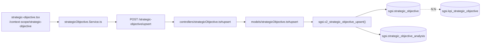

# Gestionar Objetivos Estratégicos

## Propósito
Definir los objetivos estratégicos del SGSI, cada uno con un responsable asignado, agrupados en un análisis versionado (`sgsi.strategic_objective_analysis`), con vínculo N:N hacia los KPIs que los miden.

## Entrada desde UI
`/context-scope/strategic-objective` — única pantalla del módulo.

## Flujo funcional
1. Carga de objetivos, cabecera y catálogo de sugerencias (`getByCustomerId`/`getAnalysis`/`getAll`); `kpi.tsx` también consulta este mismo endpoint físico con `?onlyActive=true` para poblar su selector (`FN-V2-STRATEGIC-OBJECTIVE-GET-ACTIVE-BY-CUSTOMER-ID`, ver Consideraciones).
2. El usuario crea/edita objetivos con responsable asignado (`objective-card.tsx`/`strategic-objective-edit-modal.tsx`) → `upsert` → `EP-STRATEGIC-OBJECTIVE-UPSERT`.
3. Eliminar un objetivo (`EP-STRATEGIC-OBJECTIVE-DELETE-BY-ID`) está bloqueado (success:false, sin excepción HTTP) si tiene al menos un KPI activo vinculado en `sgsi.kpi_strategic_objective` — la respuesta incluye la lista de KPIs afectados para que la UI la muestre.
4. Antes de enviar a aprobación, se valida que todos los objetivos tengan responsable asignado (`strategic-objective.tsx`, validación client-side).
5. Envío a aprobación: `/doc-flow/configuration?type=STRATEGIC_OBJECTIVE&entityId=<analysisId>` (`FLOW-DOCFLOW-004`).
6. Publicación: **orden invertido respecto a FODA/PESTEL** — la UI llama primero a `EP-STRATEGIC-OBJECTIVE-ANALYSIS-PUBLISH` (hace el trabajo real, `is_complete=false` aún vigente) y recién después a `publishProcess` (Doc-Flow, que repite el mismo flip sin guard — redundante pero no destructivo).
7. Historial: `getVersions`/`getVersionById`, enriquecido con `getProcessByEntity('STRATEGIC_OBJECTIVE', ...)`.
8. Nueva versión: `createNewVersion` → `EP-STRATEGIC-OBJECTIVE-ANALYSIS-CREATE-NEW-VERSION`.

## Frontend
`strategic-objective.tsx` → `useStrategicObjective()`/`useBaseStrategicObjective()` → `strategicObjectiveStore` → `strategicObjective.Service.ts`.

## API
`GET /strategic-objective/getByCustomerId`, `POST /strategic-objective/upsert`, `DELETE /strategic-objective/deleteById/:id`, `GET /strategic-objective/analysis`, `POST /strategic-objective/analysis/publish`, `POST /strategic-objective/analysis/new-version`, `GET /strategic-objective/versions`, `GET /strategic-objective/version/:id`, `GET /base-strategic-objective/getAll` — acceso `admin-or-usuario`. (`POST /strategic-objective/analysis/complete` existe pero es huérfano, ver Hallazgos).

## Backend
`routers/strategicObjective.ts` + `routers/baseStrategicObjective.ts` → `controllers/strategicObjective.ts`/`baseStrategicObjective.ts` → `models/strategicObjective.ts`/`baseStrategicObjective.ts` → `sgsi.v2_strategic_objective_*`/`v2_base_strategic_objective_get_all`.

## Database
`sgsi.v2_strategic_objective_get_by_customer_id`, `v2_strategic_objective_get_active_by_customer_id`, `v2_strategic_objective_upsert`, `v2_strategic_objective_delete_by_id`, `v2_strategic_objective_analysis_get_by_customer_id`, `v2_strategic_objective_analysis_publish`, `v2_strategic_objective_analysis_create_new_version`, `v2_strategic_objective_analysis_get_versions`, `v2_strategic_objective_analysis_get_version_by_id`, `v2_base_strategic_objective_get_all` (`funciones_sgsi.sql`). Tablas: `sgsi.strategic_objective`, `sgsi.strategic_objective_analysis`, `sgsi.kpi_strategic_objective` (vínculo N:N, escrita también desde `FLOW-CTX-005`), `sgsi.base_strategic_objective` (catálogo, solo lectura).

## Reglas relevantes
- Borrar un objetivo con KPIs activos vinculados está bloqueado — hay que reasignar esos KPIs primero (desde `FLOW-CTX-005`).

## Consideraciones
- **`GET /strategic-objective/getByCustomerId` es un único endpoint físico con 2 comportamientos**: sin `?onlyActive=true` devuelve todos los objetivos (`FN-V2-STRATEGIC-OBJECTIVE-GET-BY-CUSTOMER-ID`, consumido por esta pantalla); con `?onlyActive=true` devuelve solo los activos (`FN-V2-STRATEGIC-OBJECTIVE-GET-ACTIVE-BY-CUSTOMER-ID`, consumido por `kpi.tsx` al armar su selector de objetivos, `FLOW-CTX-005`).
- **Redundancia de publicación (Technical Debt), orden invertido respecto a FODA/PESTEL/Resumen Ejecutivo**: aquí la llamada local hace el trabajo real y Doc-Flow es la redundante. `POST /strategic-objective/analysis/complete` (`v2_strategic_objective_analysis_mark_complete`) tiene toda la cadena técnica pero **ningún handler de UI lo invoca** — el flujo real usa directamente `publish`, sin un paso de "completar" separado. Reclasificado como huérfano en Checkpoint C (ver `docs/00-catalog/contexto-alcance.md` § Hallazgos).

## Trazabilidad

