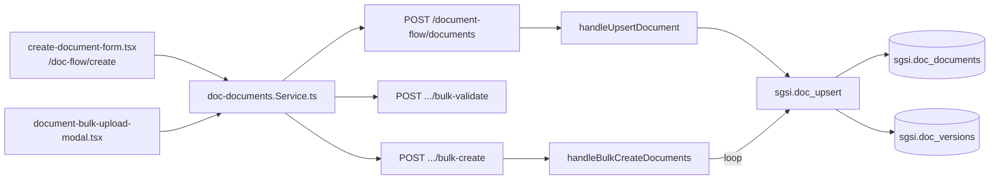

# Crear documento SGSI

## Propósito
Crear el registro inicial (documento + primera versión en estado BORRADOR) de un documento del SGSI, de forma individual desde el formulario o en lote desde una plantilla Excel.

## Entrada desde UI
`/doc-flow/create` → formulario `create-document-form.tsx` (individual) o botón "Carga masiva" → `document-bulk-upload-modal.tsx` (Excel).

## Flujo funcional
1. Individual: el usuario completa tipo de documento, título, área, grupos de visibilidad, editores, dueños por posición (información/proceso/riesgo/sistema), clasificación de información, controles ISO asociados y fecha límite; al guardar se llama `EP-DOC-UPSERT`.
2. Masivo: se sube un Excel; cada fila se valida en el cliente contra los catálogos reales (`EP-DOC-BULK-VALIDATE`, sin persistir nada) mostrando errores/advertencias/sugerencias de fuzzy-match por fila; solo las filas `VALID`/`WARNING` resueltas pasan a `EP-DOC-BULK-CREATE`, que las crea una por una.
3. `FN-DOC-UPSERT` rechaza títulos duplicados por cliente (409, código `DOCUMENT_TITLE_EXISTS`) antes de crear nada.

## Frontend
`document-flow-create.tsx` (orquestador de la pantalla) → `create-document-form.tsx` (formulario individual) / `document-bulk-upload-modal.tsx` (carga masiva) → `useDocDocuments()` → `docDocumentsStore`.

## API
`POST /document-flow/documents`, `POST /document-flow/documents/bulk-validate`, `POST /document-flow/documents/bulk-create` — acceso `admin-or-usuario`.

## Backend
`routers/doc-documents.ts` → `controllers/doc-documents.ts` (`handleUpsertDocument`, `handleBulkValidateDocuments`, `handleBulkCreateDocuments`) → `models/doc-documents.ts` (`upsertDocument`, `validateBulkDocuments`, `createBulkDocuments`) → `queries/doc-documents.ts`.

## Database
`sgsi.doc_upsert` (`funciones_sgsi.sql:4646-4793`) valida título único por cliente (vía `sgsi.doc_get_document_id_by_customer_and_title`), genera código de documento si no viene, crea/actualiza `sgsi.doc_documents`+`sgsi.doc_versions` (BORRADOR) y sincroniza grupos/editores N:M/controles/documentos relacionados. La validación masiva no invoca ninguna función PL/pgSQL — compone en Node varias consultas planas de catálogo (tipos de documento, áreas, políticas, grupos, cargos, controles ISO, personas).

## Reglas relevantes
- Título único por cliente, validado server-side (no solo en el Excel).
- El código se autogenera (`sgsi.generate_document_code`) salvo que se pase explícito o se esté editando un documento existente con código ya asignado.
- La carga masiva es un pipeline de 2 pasos (validar → crear) sin transacción conjunta: cada fila se crea individualmente, un fallo en una fila no revierte las anteriores.

## Consideraciones
- No existe una function SQL de "batch" real para la creación masiva — el loop ocurre en Node (`createBulkDocuments`), llamando `FN-DOC-UPSERT` una vez por documento.
- Esta Operación termina en un documento BORRADOR sin editor formalmente "enviado" — asignar el editor y arrancar la edición formal es una Operación separada (`FLOW-DOCFLOW-002`), aunque `editor_ids` ya pueda venir cargado desde la creación.

## Trazabilidad

