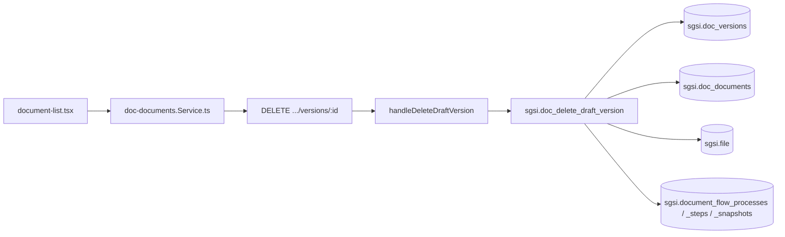

# Eliminar borrador de documento

## Propósito
Eliminar una versión de documento mientras esté en estado BORRADOR — con cascada completa (archivos, proceso de aprobación en configuración, documento) si es la única versión.

## Entrada desde UI
`/doc-flow/create` o listado de `/doc-flow/edition` → acción "Eliminar" sobre un documento BORRADOR.

## Flujo funcional
1. `deleteDraftVersion` (`EP-DOC-DELETE-DRAFT-VERSION`) exige `status = 'BORRADOR'` (único chequeo real — ver Consideraciones/hallazgo de seguridad).
2. Borra `sgsi.file` (imágenes/archivos) asociados a la versión.
3. Si es la única versión del documento: retrocede la secuencia de codificación, borra el proceso de aprobación `EN_CONFIGURACION` (steps+snapshots+proceso) asociado, la versión y el documento completo. Si hay otras versiones, solo borra la versión indicada.

## Frontend
`document-list.tsx` → `useDocDocuments()` → `docDocumentsStore`.

## API
`DELETE /document-flow/documents/versions/:versionId` — acceso `admin-or-usuario`.

## Backend
`routers/doc-documents.ts` → `controllers/doc-documents.ts#handleDeleteDraftVersion` → `models/doc-documents.ts#deleteDraftVersion` → `queries/doc-documents.ts`.

## Database
`sgsi.doc_delete_draft_version` (`funciones_sgsi.sql:596-679`).

## Reglas relevantes
- Solo elimina versiones en BORRADOR — cualquier otro estado retorna 409 (`DOCUMENT_NOT_DRAFT`).

## Consideraciones
- **SECURITY FINDING (no corregido)**: ni el router, ni el controller, ni el modelo, ni la query, ni la función SQL validan que la versión pertenezca al `customer_id` del usuario autenticado (`WHERE id = p_version_id`, sin filtro de tenant en ningún punto de la cadena). Cualquier usuario autenticado de cualquier cliente puede eliminar el borrador — y el documento completo, si es la única versión — de otro cliente, conociendo o adivinando el `versionId`. Evidencia completa (archivo:línea de cada capa) en `docs/00-catalog/docflow.md` § Hallazgos y en `EP-DOC-DELETE-DRAFT-VERSION.yaml` / `FN-DOC-DELETE-DRAFT-VERSION.yaml`. **No corregido en este pase** — documentación ≠ parche de seguridad.

## Trazabilidad

