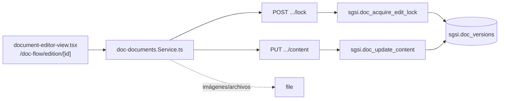

# Editar contenido de documento

## Propósito
Editar el contenido (editor TipTap enriquecido) de una versión asignada, con lock colaborativo para evitar ediciones simultáneas, e incluir imágenes/archivos adjuntos.

## Entrada desde UI
`/doc-flow/edition/[id]` → `document-editor-view.tsx`.

## Flujo funcional
1. Al abrir el editor se intenta `EP-DOC-ACQUIRE-LOCK` (timeout 15 min); si otro editor lo tiene, se muestra solo lectura con el nombre de quien bloquea.
2. El usuario edita contenido, sube imágenes (`EP-DOC-UPLOAD-IMAGE`) y archivos (`EP-DOC-UPLOAD-FILE`), que se insertan como referencias (`/file/download/:id`) dentro del `content_json`.
3. Al guardar, `EP-DOC-UPDATE-CONTENT` persiste el contenido y sincroniza documentos relacionados.
4. Al salir/cerrar, se libera el lock (`EP-DOC-RELEASE-LOCK`).
5. Enlaces a archivos legados embebidos en contenido histórico se resuelven con `EP-DOC-DOWNLOAD-LEGACY-FILE`.

## Frontend
`document-editor-view.tsx` → `useDocDocuments()` → `docDocumentsStore`.

## API
`POST .../lock`, `DELETE .../lock`, `PUT .../content`, `POST .../images`, `POST .../files`, `GET /document-flow/documents/files/:id/:fileName` — acceso `admin-or-usuario`.

## Backend
`routers/doc-documents.ts` → `controllers/doc-documents.ts` (`handleAcquireEditLock`, `handleReleaseEditLock`, `handleUpdateContent`, `handleUploadDocumentImage`, `handleUploadDocumentFile`, `handleDownloadLegacyFile`) → `models/doc-documents.ts` (`acquireEditLock`, `releaseEditLock`, `updateContent`) / `models/file.ts#upsert` / `controllers/file.ts#downloadById`.

## Database
`sgsi.doc_acquire_edit_lock` / `sgsi.doc_release_edit_lock` (`:527-592` / `:4482-4518`) sobre `sgsi.doc_versions.locked_by_id/locked_at`. `sgsi.doc_update_content` (variante de 5 args, `:4557-4602`) valida editor asignado (individual o N:M) y estado EN_EDICION/BORRADOR/DEVUELTO. Subida de imágenes/archivos no toca tablas de Doc-Flow — persiste en `sgsi.file` (dominio compartido).

## Reglas relevantes
- Existe un overload de 4 args de `doc_update_content` (sin `related_document_ids`) inalcanzable desde Node — la query TS siempre pasa 5 args.
- Antes de guardar, el controller (`assertNoNewBase64Images`) rechaza imágenes base64 nuevas embebidas directo en `content_json` — deben subirse por `EP-DOC-UPLOAD-IMAGE` y referenciarse por URL; imágenes base64 ya persistidas en versiones históricas siguen permitidas para no bloquear su edición legítima.
- El lock expira automáticamente a los 15 minutos de inactividad.

## Consideraciones
- La descarga de archivos legados (`EP-DOC-DOWNLOAD-LEGACY-FILE`) es, en la práctica, el mismo mecanismo del dominio `file` compartido (controller reexportado), no una capacidad propia de Doc-Flow — se documenta aquí como capacidad auxiliar de esta Operación por ser el único punto de entrada UI confirmado (enlaces dentro del contenido enriquecido).

## Trazabilidad

