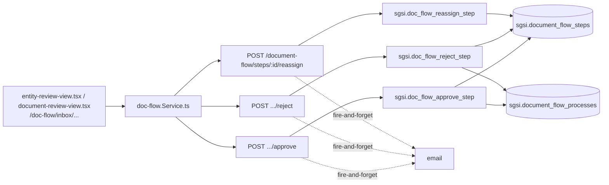

# Gestionar decisión de aprobación

## Propósito
Que un aprobador asignado decida sobre el step que le corresponde (aprobar o rechazar), o que un administrador reasigne un step pendiente a otra persona — las tres acciones comparten exactamente el mismo contexto de revisión (misma pantalla, mismo proceso/step).

## Entrada desde UI
`/doc-flow/inbox` (bandeja) → `document-review-view.tsx` (entity_type='DOCUMENT') o `entity-review-view.tsx` (cualquier otro entity_type, con previews específicos por tipo) → `ReviewActionBar.tsx` (aprobar/rechazar) / `ReassignApproverDialog.tsx` (reasignar).

## Flujo funcional
1. El aprobador revisa el snapshot enviado (ver `FLOW-DOCFLOW-010`) y decide: `approveStep` (`EP-DOCFLOW-APPROVE-STEP`) — exige que sea su step, esté `PENDIENTE`, y no haya un revisor anterior aún pendiente (orden secuencial); si era el último step pendiente de la iteración, el proceso pasa a `PENDIENTE_PUBLICAR`.
2. `rejectStep` (`EP-DOCFLOW-REJECT-STEP`) — exige justificación no vacía; marca el step `RECHAZADO`, los demás `PENDIENTE` de esa iteración como `NO_APLICA`, el proceso pasa a `DEVUELTO` con `current_iteration + 1`, y clona los mismos revisores como nuevos steps `PENDIENTE` de la nueva iteración.
3. `reassignStep` (`EP-DOCFLOW-REASSIGN-STEP`, solo admin) — cambia el `user_id` de un step `PENDIENTE`; si ese step era el activo, notifica al nuevo aprobador.
4. Notificaciones fire-and-forget según el caso (siguiente aprobador, publicador si no queda ninguno, editor si se rechazó, nuevo aprobador si se reasignó al step activo).

## Frontend
`entity-review-view.tsx` / `document-review-view.tsx` → `useDocFlow()` → `docFlowStore`.

## API
`POST .../steps/:stepId/approve`, `POST .../steps/:stepId/reject`, `POST /document-flow/steps/:stepId/reassign` — acceso `admin-or-usuario` (reasignar exige además `isSystemAdmin`/`hasAdminRole` en el controller).

## Backend
`routers/doc-flow.ts` → `controllers/doc-flow.ts` (`handleApproveStep`, `handleRejectStep`, `handleReassignStep`) → `models/doc-flow.ts` (`approveStep`, `rejectStep`, `reassignStep`) → `queries/doc-flow.ts`.

## Database
`sgsi.doc_flow_approve_step` (`:684-770`), `sgsi.doc_flow_reject_step` (`:2629-2746`), `sgsi.doc_flow_reassign_step` (variante 3 args, `:2555-2624`, valida pertenencia de la entidad al cliente vía `FN-DOC-FLOW-ENTITY-BELONGS-TO-CUSTOMER` y que el nuevo aprobador pertenezca al cliente).

## Reglas relevantes
- Orden secuencial estricto: no se puede aprobar/rechazar si hay un revisor de menor `step_order` aún pendiente en la misma iteración.
- Existe un overload de 2 args de `doc_flow_reassign_step` (sin `p_customer_id`) inalcanzable desde Node.
- Reasignar solo aplica a steps `PENDIENTE`.

## Consideraciones
- **Fusión validada (Checkpoint B/C)**: aprobar, rechazar y reasignar comparten el mismo contexto de revisión (mismos componentes `entity-review-view.tsx`/`document-review-view.tsx`) — se modelan como una sola Operación con 3 acciones, no 3 Operaciones separadas.
- `document-review-view.tsx` vs. `entity-review-view.tsx` es una bifurcación puramente de presentación (con previews por tipo de entidad en `entity-review-view/previews/*`) — ambas caen en los mismos 3 endpoints.

## Trazabilidad

