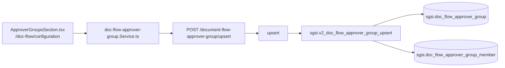

# Gestionar grupos de aprobadores

## Propósito
CRUD de grupos reutilizables de personas, usados como atajo al configurar los aprobadores de un proceso (`FLOW-DOCFLOW-004`, vía `PeopleFlowSelector.tsx`/`ApprovalFlowConfigurator.tsx`).

## Entrada desde UI
`/doc-flow/configuration` → tab "Grupos de aprobadores" → `ApproverGroupsSection.tsx` → `ApproverGroupModal.tsx`.

## Flujo funcional
1. Listado (`EP-DOC-FLOW-APPROVER-GROUP-GET-LIST`) — solo grupos no eliminados, con miembros y su estado de vigencia calculado en vivo.
2. Crear/editar (`EP-DOC-FLOW-APPROVER-GROUP-UPSERT`) — valida que cada persona exista y pertenezca al cliente antes de guardar; miembros con reemplazo completo (`order_index`).
3. Eliminar (soft delete, validando pertenencia al cliente dentro de la propia función SQL).

## Frontend
`ApproverGroupsSection.tsx` → `useDocFlowApproverGroup()` → `docFlowApproverGroupStore`.

## API
`GET /document-flow-approver-group/getListByCustomerId`, `GET .../getById/:id`, `POST .../upsert`, `POST .../deleteById/:id` — acceso `admin-or-usuario`.

## Backend
`routers/doc-flow-approver-group.ts` → `controllers/doc-flow-approver-group.ts` → `models/doc-flow-approver-group.ts` → `queries/doc-flow-approver-group.ts`.

## Database
`sgsi.v2_doc_flow_approver_group_get_list_by_customer_id` (`:15599-15660`), `sgsi.v2_doc_flow_approver_group_get_by_id` (`:15535-15594`), `sgsi.v2_doc_flow_approver_group_upsert` (`:15664-15739`), `sgsi.v2_doc_flow_approver_group_delete_by_id` (`:15505-15530`).

## Reglas relevantes
- A diferencia de los grupos de visibilidad, aquí el `customer_id` se valida **dentro** de cada función SQL (get_by_id, delete_by_id), no solo en el controller.
- Sin campo `is_global` — todos los grupos de aprobadores son listas explícitas de personas.

## Consideraciones
- No tiene acción de "reactivar" expuesta en la UI (a diferencia de los grupos de visibilidad) — solo 4 endpoints, no 5.

## Trazabilidad

