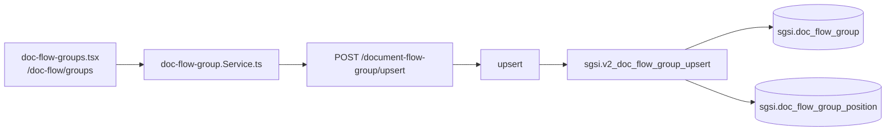

# Gestionar grupos de visibilidad de documentos

## Propósito
CRUD de grupos que determinan qué documentos puede ver un usuario en "Mis documentos" (`FLOW-DOCFLOW-008`), según su cargo (posición) o si el grupo es global.

## Entrada desde UI
`/doc-flow/groups` → `doc-flow-groups.tsx` (listado) → `doc-flow-group-modal.tsx` (crear/editar).

## Flujo funcional
1. Listado (`EP-DOC-FLOW-GROUP-GET-LIST`) incluye grupos activos e inactivos (el frontend filtra visualmente).
2. Crear/editar (`EP-DOC-FLOW-GROUP-UPSERT`) — grupo global (`is_global`) o vinculado a un set de cargos (`doc_flow_group_position`, reemplazo completo).
3. Eliminar (soft delete) / reactivar, con verificación de ownership por cliente (`FN-DOC-FLOW-GROUP-GET-CUSTOMER-ID`) antes de exponer/borrar el detalle.

## Frontend
`doc-flow-groups.tsx` → `useDocFlowGroup()` → `docFlowGroupStore`.

## API
`GET /document-flow-group/getListByCustomerId`, `GET .../getById/:id`, `POST .../upsert`, `POST .../deleteById/:id`, `POST .../reactivateById/:id` — acceso `admin-or-usuario`.

## Backend
`routers/doc-flow-group.ts` → `controllers/doc-flow-group.ts` → `models/doc-flow-group.ts` → `queries/doc-flow-group.ts`.

## Database
`sgsi.v2_doc_flow_group_get_list_by_customer_id` (`:15831-15884`, verificado contra migración `sprint5/7`, snapshot sincronizado), `sgsi.v2_doc_flow_group_get_by_id` (`:15776-15827`), `sgsi.v2_doc_flow_group_upsert` (`:15939-16000`), `sgsi.v2_doc_flow_group_delete_by_id` (`:15744-15772`), `sgsi.v2_doc_flow_group_reactivate_by_id` (`:15888-15934`), `sgsi.doc_flow_group_get_customer_id` (`:2185-2190`).

## Reglas relevantes
- Validación de ownership de tenant se hace en el **controller** (`getCustomerId`), no dentro de la función SQL de get/delete — patrón distinto al de grupos de aprobadores.
- Reactivar valida que no exista otro grupo activo con el mismo nombre (case-insensitive).

## Consideraciones
- Ninguna. Módulo de gestión simple, sin convergencias ni ramas.

## Trazabilidad

