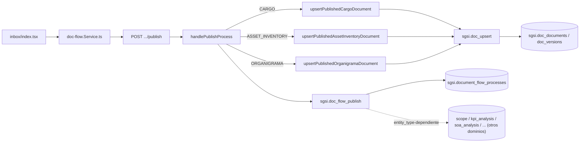

# Publicar documento/entidad

## Propósito
Cerrar/materializar el proceso de aprobación una vez que todos los steps de la iteración actual están `APROBADO` — sin fast-track: en este módulo publicar SIEMPRE cierra un proceso que ya completó su flujo de aprobación (a diferencia de SoA, que sí tiene una rama de publicación directa).

## Entrada desde UI
`/doc-flow/inbox` (rol `PUBLISHER` en la bandeja) o directamente desde `/doc-flow/edition/[id]` si el creador es quien publica.

## Flujo funcional
1. `handlePublishProcess` abre una transacción explícita (`BEGIN`/`COMMIT`/`ROLLBACK`) y toma un lock pesimista (`FOR UPDATE`) sobre el proceso; exige `status = 'PENDIENTE_PUBLICAR'` y que el usuario sea el creador original del proceso.
2. Lee el snapshot de la iteración actual (`FN-DOC-FLOW-GET-PROCESS-SNAPSHOT`).
3. **Generación automática de documento formal (rama TypeScript, dentro de la misma transacción), solo para 3 entity_type**:
   - `CARGO` → `upsertPublishedCargoDocument` (actualiza también `sgsi.position` con los datos del snapshot).
   - `ASSET_INVENTORY` → `upsertPublishedAssetInventoryDocument` (requiere al menos un activo en el snapshot).
   - `ORGANIGRAMA` → `upsertPublishedOrganigramaDocument`.
   Las tres siguen el mismo patrón: resuelven `base_document_type_id` por código, buscan si ya existe un documento de ese origen (`FN-DOC-GET-DOCUMENT-BY-POSITION-SOURCE`/`-BY-INVENTORY`/`-BY-ORGANIGRAMA`), calculan el siguiente `version_number` (`FN-DOC-VERSIONS-GET-NEXT-NUMBER`), llaman `FN-DOC-UPSERT`, y publican esa versión directamente (`FN-DOC-VERSIONS-SET-PREVIOUS-OBSOLETE` + `FN-DOC-VERSIONS-SET-PUBLISHED`) — un camino de publicación de versión **distinto** al de `FN-DOC-FLOW-PUBLISH` para `entity_type='DOCUMENT'`.
   Para `STAKEHOLDER` solo se registra el `version_id` del snapshot (sin generar documento nuevo).
   Para cualquier otro `entity_type` (incluyendo Riesgos y SoA, ya documentados, y Contexto/Gobierno/Alcance aún no documentados) no hay generación de documento — solo el paso 5.
4. `FN-DOC-FLOW-BACKFILL-SNAPSHOT-VERSION-ID`/`FN-DOC-FLOW-UPDATE-SNAPSHOT-VERSION-ID` enlazan el `version_id` generado a los snapshots del proceso (para que el historial de aprobación quede asociado al documento formal).
5. `FN-DOC-FLOW-PUBLISH` cierra el proceso (`FINALIZADO`) y, según `entity_type`, actualiza directamente en SQL la tabla física correspondiente — ver Consideraciones.
6. `COMMIT` de toda la transacción.

## Frontend
`inbox/index.tsx` / `document-editor-view.tsx` → `useDocFlow()` → `docFlowStore`.

## API
`POST /document-flow/process/:processId/publish` — acceso `admin-or-usuario`.

## Backend
`routers/doc-flow.ts` → `controllers/doc-flow.ts#handlePublishProcess` (con lógica de generación cross-domain inline) → `models/doc-flow.ts#publishProcess` + `models/doc-documents.ts` (`upsertPublishedCargoDocument`/`upsertPublishedAssetInventoryDocument`/`upsertPublishedOrganigramaDocument`) + `models/position.ts#upsert`.

## Database
`sgsi.doc_flow_publish` (`funciones_sgsi.sql:2217-2491`).

## Reglas relevantes
- Solo el creador original del proceso puede publicar.
- El proceso debe estar exactamente en `PENDIENTE_PUBLICAR`.
- `upsertPublishedAssetDocument` (para activos individuales, no el inventario completo) está importado en el controller pero **nunca invocado** — código muerto, ver `docs/00-catalog/docflow.md` § Hallazgos.

## Consideraciones
- **DIVERGENCIA MATERIAL encontrada en Implementación (no invalida el diseño, lo enriquece)**: `FN-DOC-FLOW-PUBLISH` no solo cierra `DOCUMENT` — es polimórfica y escribe DIRECTAMENTE, con sus propios `UPDATE`, sobre 9 tablas físicas de otros dominios: `sgsi.stake_holder_analysis` (STAKEHOLDER), `sgsi.scope` (SCOPE), `sgsi.kpi_analysis` (KPI), `sgsi.strategic_objective_analysis` (STRATEGIC_OBJECTIVE), `sgsi.pestel_analysis` (PESTEL), `sgsi.foda_analysis` (FODA), `sgsi.soa_analysis` (SOA), `sgsi.executive_summary` (EXECUTIVE_SUMMARY), `sgsi.communications_matrix_analysis` (COMMUNICATIONS_MATRIX) — típicamente desactivando la versión anterior activa y marcando la nueva como activa+completa. Para `SOA` en particular, esto significa que la publicación funcional de la Declaración de Aplicabilidad (`FLOW-SOA-002`) también depende, en última instancia, de esta función de `DOM-DOCFLOW` — no solo de `sgsi.v2_soa_analysis_mark_complete` (fast-track de SoA).
- **Generación cross-domain confirmada como parte de esta misma Operación** (no Operaciones separadas por tipo de entidad): las 3 ramas (CARGO/ASSET_INVENTORY/ORGANIGRAMA) convergen en el mismo mecanismo (`FN-DOC-UPSERT` + publicación directa de versión), disparado desde el mismo controller.
- Ownership funcional de las tablas cross-domain escritas por esta función sigue siendo de sus respectivos dominios (Contexto y Alcance, Partes Interesadas, SoA) — `DOM-DOCFLOW` es quien ejecuta la escritura, no quien es dueño del dato, mismo criterio de responsabilidad funcional ya aplicado en Riesgos/SoA (learning candidate v1.1, no incorporado aún a `TRACEABILITY_STANDARD.md`).

## Trazabilidad

