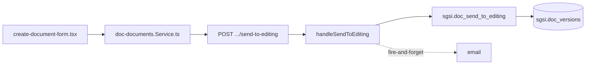

# Enviar documento a edición

## Propósito
Asignar formalmente un editor a una versión BORRADOR y pasarla a estado EN_EDICION — transición distinta de "enviar a aprobación" (`FLOW-DOCFLOW-004`).

## Entrada desde UI
`/doc-flow/create` → tras crear el documento (`create-document-form.tsx:950`), selección de manager/editor → `sendToEditing`.

## Flujo funcional
1. Con la versión ya en BORRADOR y un `editor_id` asignado, se llama `EP-DOC-SEND-TO-EDITING`.
2. `FN-DOC-SEND-TO-EDITING` exige status='BORRADOR' y editor_id no nulo; pasa la versión a EN_EDICION.
3. Fire-and-forget: se notifica por email al editor asignado.

## Frontend
`create-document-form.tsx` → `useDocDocuments()` → `docDocumentsStore`.

## API
`POST /document-flow/documents/versions/:versionId/send-to-editing` — acceso `admin-or-usuario`.

## Backend
`routers/doc-documents.ts` → `controllers/doc-documents.ts#handleSendToEditing` → `models/doc-documents.ts#sendToEditing` → `queries/doc-documents.ts`.

## Database
`sgsi.doc_send_to_editing` (`funciones_sgsi.sql:4523-4553`). Internamente el controller también llama `sgsi.doc_get_send_to_editing_email_context` para el contexto del correo.

## Reglas relevantes
- Solo aplica a versiones en BORRADOR — reintentar sobre una versión ya enviada retorna 409.
- No inicia ningún proceso de aprobación — eso es `FLOW-DOCFLOW-004`, disparado explícitamente después desde la pantalla de edición.

## Consideraciones
- **Divergencia real confirmada respecto al diseño inicial**: "Enviar a edición" (asignar editor) y "Enviar a aprobación" (iniciar el motor de `document_flow_processes`) son dos transiciones distintas, con endpoints y funciones SQL distintas — no una sola Operación. Documentado como decisión aprobada explícitamente por el usuario en Checkpoint C.

## Trazabilidad

