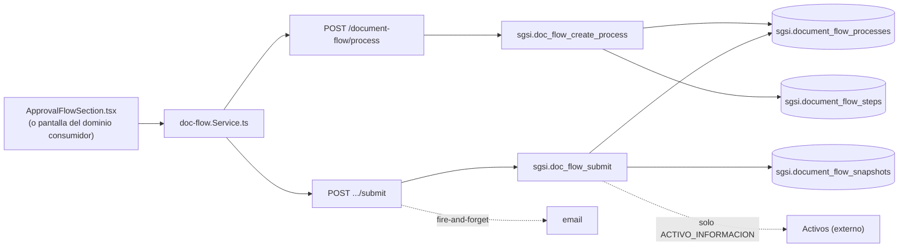

# Enviar documento/entidad a aprobación

## Propósito
Iniciar (o reconfigurar) el proceso formal de aprobación de una entidad — motor polimórfico compartido por todo el SGSI (`entity_type`: DOCUMENT, CARGO, ACTIVO_INFORMACION, ORGANIGRAMA, RISK_MATRIX, RISK_TREATMENT_PLAN, KPI_TRACKING, SOA, SCOPE, PESTEL, FODA, EXECUTIVE_SUMMARY, STRATEGIC_OBJECTIVE, COMMUNICATIONS_MATRIX, STAKEHOLDER, INITIATIVE) — con un snapshot inmutable de lo enviado.

## Entrada desde UI
Para `entity_type='DOCUMENT'`: `/doc-flow/edition/[id]` → `ApprovalFlowSection.tsx` (configurar aprobadores) → enviar. Para el resto de entity_type, la Operación se dispara desde la pantalla del dominio consumidor (ej. `/risk-treatment/[groupId]`, `/soa-controls/applicability-statement`, `/organization/positions`) reutilizando el mismo `docFlowStore`/endpoints — no hay pantalla propia de Doc-Flow para esos casos.

## Flujo funcional
1. `createProcess` (`EP-DOCFLOW-CREATE-PROCESS`) crea o reconfigura el proceso (`EN_CONFIGURACION`) y sus steps (uno por aprobador, en orden).
2. Solo entidades en `ADMIN_ONLY_ENTITY_TYPES` (`RISK_MATRIX`, `KPI_TRACKING`) exigen rol admin explícito, verificado en el controller.
3. Para `ACTIVO_INFORMACION`, se bloquea si ya hay un proceso activo (`doc_flow_is_asset_flow_locked_by_customer`).
4. `submitProcess` (`EP-DOCFLOW-SUBMIT-PROCESS`) arma el `entity_data_json` en Node según entity_type — para `ACTIVO_INFORMACION` construye un snapshot por cada activo (loop de `FN-DOC-FLOW-BUILD-ASSET-SNAPSHOT`); para `ORGANIGRAMA` genera y persiste la imagen del organigrama y arma el snapshot vía `FN-V2-DOCUMENT-WORKFLOW-SNAPSHOT-ORGANIGRAMA`; para el resto, `entity_data` viene tal cual del dominio consumidor — y llama `FN-DOC-FLOW-SUBMIT`, que pasa el proceso a `EN_APROBACION` y guarda el snapshot.
5. Si el proceso venía `DEVUELTO`, es obligatorio adjuntar una réplica/justificación (validado tanto en el controller como en la función SQL); puede guardarse antes como borrador (`EP-DOCFLOW-SAVE-DRAFT-REPLY`).
6. Notificación fire-and-forget al primer aprobador de la iteración.

## Frontend
`document-editor-view.tsx` / pantallas de los dominios consumidores → `useDocFlow()` → `docFlowStore`.

## API
`POST /document-flow/process`, `POST /document-flow/process/:processId/submit`, `POST /document-flow/process/:processId/draft-reply` — acceso `admin-or-usuario` (+ chequeo de rol admin en el controller para `ADMIN_ONLY_ENTITY_TYPES`).

## Backend
`routers/doc-flow.ts` → `controllers/doc-flow.ts` (`handleCreateProcess`, `handleSubmitProcess`, `handleSaveDraftReply`) → `models/doc-flow.ts` (`createProcess`, `submitProcess`, `saveDraftReply`) → `queries/doc-flow.ts`.

## Database
`sgsi.doc_flow_create_process` (variante 5 args, `:1117-1220`) valida pertenencia al cliente (`sgsi.doc_flow_entity_belongs_to_customer`) y crea/reconfigura proceso+steps. `sgsi.doc_flow_submit` (`:2836-2921`) valida estado, exige al menos un step, persiste el snapshot (UPSERT por `process_id+iteration`). `sgsi.doc_flow_save_draft_reply` (`:2806-2831`) guarda la réplica sin cambiar de estado.

## Reglas relevantes
- Existe un overload de 4 args de `doc_flow_create_process` (sin `p_customer_id`) inalcanzable desde Node.
- `ADMIN_ONLY_ENTITY_TYPES = {RISK_MATRIX, KPI_TRACKING}` — regla de negocio en el controller (`api-sgsi/src/controllers/doc-flow.ts:51`), no en SQL.
- Reenviar un proceso `DEVUELTO` sin `reply_justification` es rechazado (400) tanto en el controller (para `ACTIVO_INFORMACION`... en realidad para cualquier proceso vía `getProcessHeader`) como dentro de la función SQL.

## Consideraciones
- **Decisión aprobada explícitamente (Checkpoint C)**: esta Operación es distinta de `FLOW-DOCFLOW-002` (Enviar a edición) — endpoints, funciones y disparadores UI distintos, pese a formar parte del mismo ciclo de vida continuo del documento.
- Es la Operación de entrada al motor de aprobación consumida por Riesgos (`RISK_TREATMENT_PLAN`) y SoA (`SOA`), ya documentados, y por Gobierno (`CARGO`), Contexto y Alcance (`SCOPE`/`PESTEL`/`FODA`/`KPI`/`STRATEGIC_OBJECTIVE`/`EXECUTIVE_SUMMARY`/`COMMUNICATIONS_MATRIX`) y Partes Interesadas (`STAKEHOLDER`), aún no documentados.

## Trazabilidad

