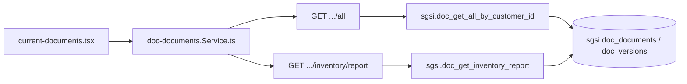

# Consultar documentos vigentes

## Propósito
Listado general de todos los documentos del cliente (una fila por documento, con su versión más representativa), con capacidad de exportar un reporte de inventario consolidado.

## Entrada desde UI
`/doc-flow/current-documents` → `current-documents.tsx`.

## Flujo funcional
1. `getAllDocuments` (`EP-DOC-GET-ALL`) trae el listado.
2. Exportar inventario: `getDocumentInventoryReport` (`EP-DOC-GET-INVENTORY-REPORT`), solo habilitado para administradores (chequeo en el controller), como capacidad auxiliar de esta misma Operación — no una Operación de exportación aparte.

## Frontend
`current-documents.tsx` → `useDocDocuments()`.

## API
`GET /document-flow/documents/all`, `GET /document-flow/documents/inventory/report` — acceso `admin-or-usuario` (inventario exige además rol admin).

## Backend
`routers/doc-documents.ts` → `controllers/doc-documents.ts` (`handleGetAllDocuments`, `handleGetDocumentInventoryReport`) → `models/doc-documents.ts` (`getAllDocumentsByCustomer`, `getDocumentInventoryReport`).

## Database
`sgsi.doc_get_all_by_customer_id` (`:2941-2991`). `sgsi.doc_get_inventory_report` (`:3406-3507`, reutiliza `FN-DOC-FLOW-GET-ACTIVE-PROCESS-INFO`).

## Reglas relevantes
- El listado prioriza la versión VIGENTE de cada documento; si no hay, EN_EDICION > BORRADOR > OBSOLETO.

## Consideraciones
- Exportación como capacidad auxiliar, siguiendo la decisión ya aplicada en SoA (`FLOW-SOA-005`) — no se documenta como Operación propia por formato.

## Trazabilidad

