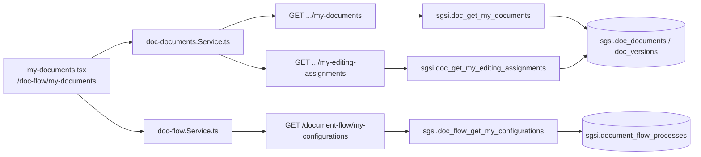

# Consultar "Mis documentos"

## Propósito
Vista personal consolidada de los documentos con los que el usuario tiene alguna relación: creador, editor asignado, aprobador en algún step, o dueño de un proceso todavía en configuración.

## Entrada desde UI
`/doc-flow/my-documents` → `my-documents.tsx`.

## Flujo funcional
1. Al entrar, se consultan en paralelo `getMyDocuments` (`EP-DOC-GET-MY-DOCUMENTS`), `getMyEditingAssignments` (`EP-DOC-GET-MY-EDITING-ASSIGNMENTS`) y `getMyConfigurations` (`EP-DOCFLOW-GET-MY-CONFIGURATIONS`).
2. El listado combinado se filtra por rol (`filterDocumentsByRole`, en Node) según si el usuario es admin o no.

## Frontend
`my-documents.tsx` → `useDocDocuments()` + `useDocFlow()`.

## API
`GET /document-flow/documents/my-documents`, `GET /document-flow/documents/my-editing-assignments`, `GET /document-flow/my-configurations` — acceso `admin-or-usuario`.

## Backend
`routers/doc-documents.ts` + `routers/doc-flow.ts` → `controllers/doc-documents.ts` (`handleGetMyDocuments`, `handleGetMyEditingAssignments`) + `controllers/doc-flow.ts#handleGetMyConfigurations` → modelos correspondientes.

## Database
`sgsi.doc_get_my_documents` (`:3512-3661`, reutiliza internamente `FN-DOC-FLOW-GET-ACTIVE-PROCESS-INFO`), `sgsi.doc_get_my_editing_assignments` (variante 2 args, `:3666-3741`, misma reutilización), `sgsi.doc_flow_get_my_configurations` (`:1437-1507`).

## Reglas relevantes
- Existe un overload de 1 arg de `doc_get_my_editing_assignments` (sin `p_customer_id`, sin aislamiento de tenant) inalcanzable desde Node.
- "Mis documentos" incluye visibilidad por grupo de visibilidad (posición del usuario en un grupo global o vinculado por cargo) — no solo relación directa (creador/editor/aprobador).

## Consideraciones
- Ninguna de las 3 consultas es exclusiva de esta Operación — `EP-DOCFLOW-GET-MY-CONFIGURATIONS` también podría considerarse parte del ciclo de creación, pero se agrupa aquí porque las 3 conviven en la misma pantalla y objetivo funcional ("qué tengo pendiente/mío").

## Trazabilidad

