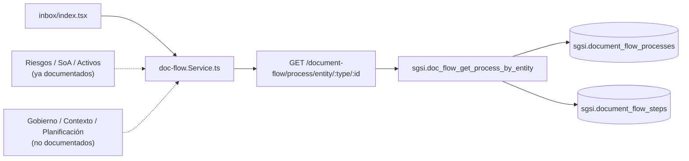

# Consultar procesos, historial y snapshots de aprobación

## Propósito
Capacidad transversal de consulta sobre el motor de aprobación: bandeja de pendientes propios, banner de estado, historial completo de iteraciones (snapshots + steps) de un proceso — es la Operación más grande y más reutilizada del módulo.

## Entrada desde UI
`/doc-flow/inbox` (bandeja propia), banner de estado en `/doc-flow/edition/[id]` (historial de rechazo/aprobación del documento), y — **entrante desde otros dominios ya documentados o pendientes** — cualquier pantalla que muestre el estado de aprobación de su propia entidad (Riesgos: `group-risk-treatment-plan.tsx`/`group-risk-matrix.tsx`; SoA: `soa-applicability-statement.tsx`; Activos: `asset-inventory.tsx`; y, sin documentar aún, Gobierno/`positions.tsx`, Contexto y Alcance/`monitoring-results.tsx`, Planificación/`Initiatives.tsx`).

## Flujo funcional
1. Bandeja: `getMyPending` (`EP-DOCFLOW-GET-MY-PENDING`) trae 3 roles combinados (aprobador/publicador/editor pendientes) en una sola llamada.
2. Banner de Activos: `getActiveAssetProcess` (`EP-DOCFLOW-GET-ACTIVE-ASSET-PROCESS`).
3. Consulta puntual por entidad: `getProcessByEntity` (`EP-DOCFLOW-GET-PROCESS-BY-ENTITY`, con steps de la iteración actual embebidos) y `getAllProcessesByType` (`EP-DOCFLOW-GET-ALL-PROCESSES-BY-TYPE`, para listar variantes por tipo, ej. varias iniciativas).
4. Historial: `getProcessSnapshot`/`getAllProcessSnapshots`/`getSnapshotsByEntity`/`getProcessSteps` reconstruyen la evolución completa (rechazos, réplicas, aprobaciones) de un proceso a través de sus iteraciones.
5. El detalle de una versión de documento (`EP-DOC-GET-DOCUMENT-DETAIL`) embebe su propio `approval_flow` calculado, sin pasar por estos endpoints.

## Frontend
`inbox/index.tsx`, `document-editor-view.tsx` → `useDocFlow()` / `useDocDocuments()`.

## API
`GET /document-flow/my-pending`, `/active-asset-process`, `/process/entity/:type/:id`, `/process/entity/:type`, `/process/:id/snapshot(s)`, `/snapshots/entity/:type/:id`, `/process/:id/steps`, `GET /document-flow/documents/versions/:id` — todos acceso `admin-or-usuario`.

## Backend
`routers/doc-flow.ts` + `routers/doc-documents.ts` → `controllers/doc-flow.ts` (7 handlers) + `controllers/doc-documents.ts#handleGetDocumentDetail` → modelos correspondientes.

## Database
`sgsi.doc_flow_get_my_pending` (`:1512-1723`), `sgsi.doc_flow_get_active_asset_process_by_customer` (`:1293-1319`), `sgsi.doc_flow_get_process_by_entity` (`:1812-1888`), `sgsi.doc_flow_get_all_processes_by_type` (`:1397-1433`), `sgsi.doc_flow_get_process_snapshot` (`:1914-1935`), `sgsi.doc_flow_get_all_process_snapshots` (`:1343-1392`), `sgsi.doc_flow_get_snapshots_by_entity` (`:2076-2126`), `sgsi.doc_flow_get_steps` (`:2130-2180`), `sgsi.doc_get_detail` (`:3027-3260`).

## Reglas relevantes
- `EP-DOCFLOW-GET-PROCESS-BY-ENTITY` y `EP-DOCFLOW-GET-ALL-PROCESSES-BY-TYPE` fueron reclasificados de `PARTIAL` a `LIVE` en Diseño — 6+ consumidores confirmados fuera de Doc-Flow.

## Consideraciones
- **Es la Operación que resuelve la dependencia `doc-flow` declarada en `docs/00-catalog/activos.md`, `riesgos.md` y `soa.md`** (junto con `FLOW-DOCFLOW-004`/`006` para la parte de envío/publicación) — ver diffs aplicados en esos 3 catálogos.
- No incluye la generación del PDF de un proceso/documento (`doc_pdf_workflow_document_payload`, `doc_pdf_soa_payload`, `doc_pdf_stakeholder_payload`, `document_flow_snapshot_get_by_version_id`) — esas 4 funciones pertenecen al dominio compartido `pdf`, que LEE de `document_flow_snapshots`/`document_flow_processes` pero no se documenta aquí (dirección de dependencia inversa a la estimada en Discovery).

## Trazabilidad

