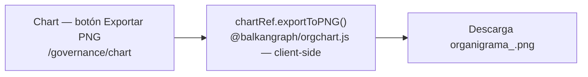

# Exportar el organigrama a PNG

## Propósito
Descargar el organigrama como imagen PNG para usarlo fuera del sistema (presentaciones, anexos, correo), sin pasar por el flujo documental.

## Entrada desde UI
Botón **Exportar PNG** en la barra de acciones de `/governance/chart`.

## Flujo funcional
1. `handleExportPNG` (`chart.tsx:475-499`) comprueba que el gráfico esté instanciado y que no haya otra exportación en curso (`isExportingPngRef`).
2. Arma el nombre del archivo a partir del nombre de la empresa ya presente en el store (`customer?.customer?.name`), reemplazando espacios por guiones bajos; si no hay empresa cargada usa el literal `"empresa"`.
3. Llama `chartRef.current.exportToPNG({ fileName: "organigrama_<empresa>.png" })` — la librería `@balkangraph/orgchart.js` genera y descarga el archivo **íntegramente en el navegador**.
4. Un `setTimeout` de 10 s libera el flag de "exportando", ya que la librería no expone callback de finalización.

## Frontend
`Chart` → `chartRef.current.exportToPNG(...)`. No usa hooks de store para esta acción ni llama a ningún servicio.

## API
No aplica — esta Operación **no llama a ningún endpoint**. No se inventó ninguno para representarla.

## Backend
No aplica.

## Database
No aplica.

## Reglas relevantes
- Exporta exactamente lo que está renderizado en pantalla: refleja los datos ya cargados por `FLOW-GOV-010`, no relee la base.
- El nombre del archivo depende de `customer` en el store, que **esta pantalla nunca solicita**: si el usuario no visitó `/governance/company` en la misma sesión, el archivo se llama `organigrama_empresa.png`.
- La exportación no deja rastro en base de datos ni en el índice de archivos: es una descarga del navegador.

## Consideraciones
- Se documenta como Operación **`clientSideOnly`** separada de `FLOW-GOV-010` siguiendo el precedente de `FLOW-SOA-005` (Exportar Declaración SoA) y de la exportación a Excel de Activos: distinto objetivo funcional ("obtener un archivo") y mecanismo técnico sin backend.
- **No debe confundirse con la captura que hace `FLOW-GOV-010`**: aunque ambas producen una imagen, la captura del envío a aprobación usa `utils/organigrama-image-capture.ts` (serializa el SVG a base64 y lo guarda en `sessionStorage` para que Doc-Flow lo persista), mientras que esta usa el exportador nativo de la librería y solo dispara una descarga. Son dos mecanismos técnicos distintos.
- Al no tener `technical`, esta Operación **no genera ninguna arista `uses`** hacia endpoints.

## Trazabilidad

