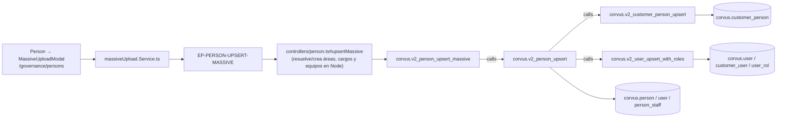

# Carga masiva de Personas

## Propósito
Dar de alta (o actualizar) muchas personas de una sola vez a partir de una plantilla, resolviendo por **nombre** sus cargos, áreas y equipos, y creando los que falten.

## Entrada desde UI
`/governance/persons` → botón **Carga masiva** → `MassiveUploadModal` configurado con `personMassiveUploadConfig` (`src/data/massive-upload/person-config.ts`, `apiEndpoint: "/person/massive"`).

## Flujo funcional
1. El modal descarga/valida la plantilla en cliente, arma el array de personas y llama `uploadMassiveData(data, {endpoint: "/person/massive"})`.
2. El controller (`controllers/person.ts:415-660`) **precarga** los catálogos del cliente: cargos, áreas, distritos, equipos y personas ya existentes.
3. Por cada fila resuelve por nombre y **crea lo que falte**:
   - área inexistente → `AreaModel.upsert` (`:510`)
   - cargo inexistente, y también el cargo del superior → `PositionModel.upsert` (`:535`, `:561`, `:572`)
   - equipo inexistente → `StaffModel.upsert` (`:596`)
4. Con los ids ya resueltos invoca `PersonModel.upsertMassive` → `corvus.v2_person_upsert_massive`, que itera y delega fila a fila en `corvus.v2_person_upsert`.
5. Para las personas con roles, genera contraseña aleatoria, crea el usuario y envía el correo de bienvenida.
6. `handleMassiveUploadSuccess` recarga el listado al cerrar.

## Frontend
`Person` → `MassiveUploadModal<PersonType>` → `massiveUpload.Service.ts#uploadMassiveData`.
No pasa por `personStore` para el envío: el modal llama al servicio genérico de carga masiva directamente.

## API
`POST /person/massive` → `EP-PERSON-UPSERT-MASSIVE` (`verifyAdminOnly`).

## Backend
`routers/person.ts:26` → `controllers/person.ts#upsertMassive` → `models/person.ts#upsertMassive` → `queries/person.ts#_upsertMassive`.

## Database
`corvus.v2_person_upsert_massive` (`funciones_corvus.sql:24328-24379`). No tiene lógica propia de negocio ni declara tablas: todas sus escrituras llegan por `calls` a `corvus.v2_person_upsert`, que a su vez llama a `v2_customer_person_upsert` y `v2_user_upsert_with_roles`.

## Reglas relevantes
- La resolución "por nombre" y la creación de áreas, cargos y equipos ocurre **en Node**, no en SQL.
- Como cada fila termina en `v2_person_upsert`, se hereda toda su cascada: `corvus.person`, `customer_person`, `user`, `customer_user`, `user_rol`, `person_staff`.
- La creación de un cargo desde aquí dispara además la cascada de `FLOW-GOV-009` hacia Activos: `v2_position_upsert` crea el activo de información TA-13 vinculado y su entrada en `sgsi.asset_history`.
- El servicio de carga usa un timeout de 60 s y soporta cancelación (`AbortController`).

## Consideraciones
- **Operación separada de `FLOW-GOV-005`** (precedente: `FLOW-ACT` "Importar activos"): distinto punto de entrada, distinto endpoint, distinto contrato de datos y efectos colaterales que el alta unitaria no tiene (creación implícita de áreas, cargos y equipos).
- **Efecto cross-domain indirecto**: esta Operación puede crear activos de información sin que el usuario lo pida explícitamente, a través de los cargos que crea. La arista estructural hacia `sgsi.asset` se ve en `FN-V2-POSITION-UPSERT`, alcanzable desde `FLOW-GOV-009`.
- `models/person.ts#getTrainingPersonById` está exportado pero **ningún controller lo invoca** (deuda registrada en Hallazgos).

## Trazabilidad

