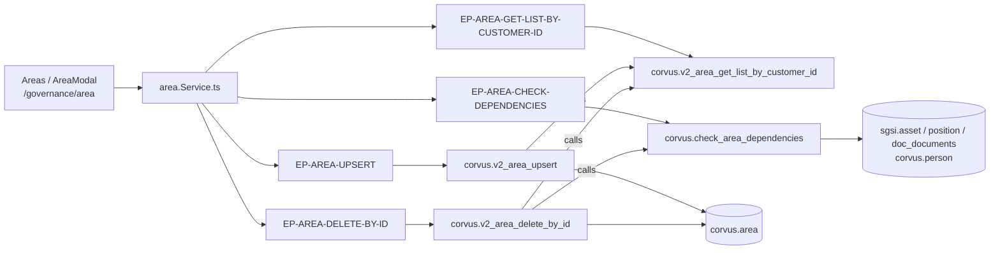

# Gestionar Áreas

## Propósito
Mantener el catálogo de áreas organizacionales del cliente. El área es una pieza transversal del SGSI: clasifica cargos, personas, activos de información y documentos, y es obligatoria para generar el descriptor de cargo.

## Entrada desde UI
`/governance/area` (segundo ítem de la sección Gobierno del SGSI).

## Flujo funcional
1. Al montar, `Areas` llama `getAreaListByCustomerId()` → `EP-AREA-GET-LIST-BY-CUSTOMER-ID`, y pinta métricas + `DataTable` (con vista alternativa en tarjetas para móvil).
2. **Crear**: "Agregar área" abre `AreaModal` en blanco → `upsertArea` → `EP-AREA-UPSERT`.
3. **Editar**: clic en la fila (o acción "Editar") abre el mismo `AreaModal` precargado → mismo endpoint (convergencia directa crear/editar, igual que `FLOW-ACT-003`/`004` en Activos).
4. **Eliminar**: `handleDeleteClick` llama primero `checkDependencies(area.id)` → `EP-AREA-CHECK-DEPENDENCIES`. Si devuelve dependencias, el diálogo pasa a modo informativo (sin botón de confirmar) y lista activos, personas, documentos y cargos que impiden la baja. Si devuelve `null`, el diálogo ofrece confirmar → `EP-AREA-DELETE-BY-ID`.
5. Tanto el upsert como el delete devuelven el listado completo actualizado, así que el store no necesita recargar.

## Frontend
`Areas` → `useArea()` → `areaStore` → `area.Service.ts`. `area-table-columns.tsx` define las acciones de fila (copiar nombre, editar, eliminar) y `area-modal.tsx` el formulario (`react-hook-form`).

## API
- `GET /area/getListByCustomerId` → `EP-AREA-GET-LIST-BY-CUSTOMER-ID`
- `POST /area/upsert` → `EP-AREA-UPSERT`
- `GET /area/dependencies/:id` → `EP-AREA-CHECK-DEPENDENCIES`
- `POST /area/deleteById/:id` → `EP-AREA-DELETE-BY-ID`

Router montado **`admin-or-usuario`** (`app.ts:53`), sin guardas por ruta.

## Backend
`routers/area.ts:7-10` → `controllers/area.ts` → `models/area.ts` → `queries/area.ts`.
En `deleteById` y `checkDependencies` el controller valida el tenant con `AreaModel.getCustomerId` (`FN-AREA-GET-CUSTOMER-ID`) antes de operar, y traduce el `P0001` de la función a un **409** con el detalle de dependencias.

## Database
Las funciones viven en el esquema **`corvus`**, no en `sgsi`: `corvus.v2_area_get_list_by_customer_id`, `corvus.v2_area_upsert`, `corvus.check_area_dependencies`, `corvus.v2_area_delete_by_id` y el helper `corvus.area_get_customer_id`. Tabla propia: `corvus.area` (WRITE). Solo lectura en el chequeo de dependencias: `sgsi.asset`, `sgsi.position`, `sgsi.doc_documents`, `corvus.person`.

## Reglas relevantes
- No se puede eliminar un área con activos, personas, documentos o cargos asociados.
- El `code` se autogenera con `corvus.generate_sgsi_code('AREA', …)` cuando no viene en el payload.
- La baja es lógica (`deleted_at` / `deleted_by`).
- El área también puede crearse **indirectamente**, sin pasar por esta pantalla: la carga masiva de personas (`FLOW-GOV-006`) crea las áreas que falten por nombre, y `sgsi.v2_document_area_ensure` (dominio Doc-Flow) crea "Recursos Humanos" si no existe al publicar un organigrama.

## Consideraciones
- **Divergencia funcional activa** (no corregida, ver `docs/00-catalog/gobierno.md` § Hallazgos): `corvus.check_area_dependencies` cuenta personas sobre `corvus.person.area_id`, columna que la migración **sprint5** dejó de escribir — el área por empresa vive ahora en `corvus.customer_person.area_id`. Para toda persona creada o reasignada después de esa migración el chequeo **no la cuenta**, de modo que `EP-AREA-DELETE-BY-ID` puede permitir eliminar un área que sí tiene personas asignadas (solo falla el bloqueo si además no hay activos, documentos ni cargos, que sí se cuentan bien). Esta misma función se romperá cuando se ejecute el `DROP COLUMN` pendiente de `sprint5/3_2026-09-07_drops_columnas_obsoletas.sql`.
- **Resurrección silenciosa**: la rama UPDATE de `v2_area_upsert` setea `deleted_at = NULL`, por lo que reutilizar el id de un área dada de baja la reactiva.
- **Seguridad (authorization)**: las tres rutas de escritura/consulta de dependencias no declaran `verifyAdminOnly` y no tienen consumidor no-admin, pese a que la sección Gobierno es admin-only en la UI. `EP-AREA-GET-LIST-BY-CUSTOMER-ID` **sí** tiene un consumidor no-admin legítimo (`PositionPreview.tsx` en `/doc-flow/inbox`), por lo que su acceso `admin-or-usuario` es intencional.
- **Protección de tenant de una sola capa**: `v2_area_delete_by_id` no recibe `customer_id`; la validación vive solo en el controller.

## Trazabilidad

