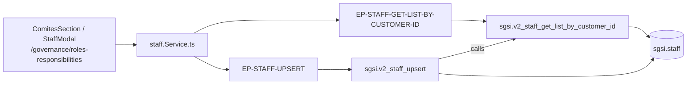

# Registrar los Comités del SGSI

## Propósito
Declarar los comités y equipos del SGSI (Comité de Seguridad, Comité de Crisis, etc.). Un comité no es una persona sino un grupo: el sistema lo usa para enviar notificaciones grupales cuando ocurre algo que el comité debe decidir.

## Entrada desde UI
Segunda sección de `/governance/roles-responsibilities` ("Quiénes colaboran"), renderizada por `ComitesSection`.

## Flujo funcional
1. Al montar, `ComitesSection` llama `getStaffListByCustomerId()` → `EP-STAFF-GET-LIST-BY-CUSTOMER-ID` y pinta las tarjetas de comité con su nombre y código.
2. Hay un buscador local que filtra por nombre o código sobre la lista ya cargada (`normalizeForSearch`), sin volver al backend.
3. "Agregar" abre `StaffModal`, que al confirmar llama `upsertStaff(newStaff)` → `EP-STAFF-UPSERT` y recarga el listado (`handleStaffCreated`).

## Frontend
`RolesResponsibilities` → `ComitesSection` → `useStaff()` → `staffStore` → `staff.Service.ts`.
`StaffModal` también consume `usePosition()` para ofrecer cargos al armar el comité.

## API
- `GET /staff/getListByCustomerId` → `EP-STAFF-GET-LIST-BY-CUSTOMER-ID`
- `POST /staff/upsert` → `EP-STAFF-UPSERT`

Router `/staff` montado **`admin-only`** (`app.ts:56`).

## Backend
`routers/staff.ts:12-13` → `controllers/staff.ts` → `models/staff.ts` → `queries/staff.ts`.

## Database
`sgsi.v2_staff_get_list_by_customer_id` (`funciones_sgsi.sql:27193-27225`) y `sgsi.v2_staff_upsert` (`:27229-27290`), que devuelve el listado actualizado. Tabla: `sgsi.staff` (WRITE).

## Reglas relevantes
- `sgsi.v2_staff_upsert` usa `ON CONFLICT (company_id, code) WHERE deleted_at IS NULL`, de modo que el `code` es la clave natural del comité dentro de la empresa.
- Cuando no viene `code`, se autogenera con `corvus.generate_sgsi_code`.
- Desde esta pantalla **solo se puede dar de alta**: no hay edición ni baja.

## Consideraciones
- **Deslinde con Catálogos**: el CRUD completo de equipos vive en *Catálogos → Equipos (staff)* (`/organization/staff`), que es el único consumidor de `POST /staff/deleteById/:id` y `GET /staff/dependencies/:id`. Esos dos endpoints son LIVE pero **no** se nodalizan en `DOM-GOV`.
- **Acoplamiento con el gobierno**: `sgsi.staff` es también donde `FLOW-GOV-003` materializa el Responsable del SGSI y la Alta Dirección, mediante dos filas de sistema con `code = 'RESP_SGSI'` y `'ALTA_DIR'` que `v2_government_upsert` auto-siembra. Esas dos entradas aparecerán en este listado aunque no se hayan creado desde aquí.
- **Convergencia**: `EP-STAFF-GET-LIST-BY-CUSTOMER-ID` lo consumen además el Organigrama (`FLOW-GOV-010`) y la pantalla de Catálogos.
- El botón flotante "Guardar mapeo completo" de la pantalla **no** guarda esta sección: cada comité se persiste al confirmar su propio modal.

## Trazabilidad

