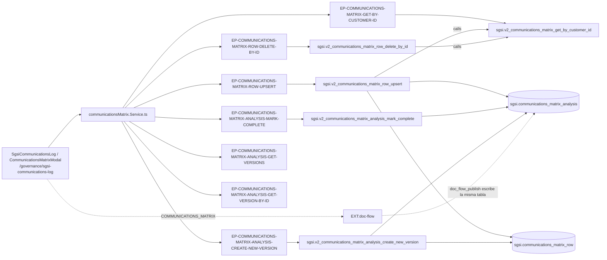

# Gestionar el Registro de Comunicaciones del SGSI

## Propósito
Mantener el plan de difusión del SGSI: qué se comunica, cuándo, a qué audiencia, quién lo emite (un cargo) y por qué canal oficial; versionarlo y llevarlo por el flujo de aprobación hasta publicarlo.

## Entrada desde UI
`/governance/sgsi-communications-log`, séptimo ítem de la sección Gobierno del SGSI.

## Flujo funcional
1. Al montar carga la versión vigente con sus filas (`EP-COMMUNICATIONS-MATRIX-GET-BY-CUSTOMER-ID`), el historial (`EP-…-GET-VERSIONS`) y el catálogo de cargos (`EP-POSITION-GET-LIST-BY-CUSTOMER-ID`, de `FLOW-GOV-009`) para el selector de emisor.
2. Con el `analysis.id` consulta el proceso Doc-Flow (`getProcessByEntity("COMMUNICATIONS_MATRIX", id)`); si está `DEVUELTO`, lee los pasos y muestra la última justificación de rechazo.
3. **Editar matriz**: abre `CommunicationsMatrixModal`, que gestiona las filas una a una — cada fila se guarda con `EP-…-ROW-UPSERT` y se borra con `EP-…-ROW-DELETE-BY-ID`. Ambos devuelven el estado completo `{analysis, rowList}`.
4. **Enviar a revisión** (`openFinalizeModal`, sin proceso activo o en `DEVUELTO`): exige al menos una fila y navega a `/doc-flow/configuration?type=COMMUNICATIONS_MATRIX&entityId=<analysisId>&entityName=Registro de Comunicaciones v<N>&code=COMMUNICATIONS_MATRIX`.
5. **Publicar Registro** (estado `PENDIENTE_PUBLICAR`, solo el creador del proceso): abre el modal de justificación y ejecuta `handleConfirmFinalize`.
6. **Reintentar Publicación** (estado `FINALIZADO` pero `isComplete = false`): mismo modal, pero solo ejecuta la parte local.
7. **Crear una nueva versión** (cuando la vigente está publicada): `EP-…-CREATE-NEW-VERSION`.
8. **Historial**: `VersionHistoryTableCard` lista las versiones y `handleViewVersion` abre el detalle con `EP-…-GET-VERSION-BY-ID`.

## Frontend
`SgsiCommunicationsLog` → `useCommunicationsMatrix()`, `usePosition()`, `useDocFlow()`, `useUser()` → `communicationsMatrixStore` → `communicationsMatrix.Service.ts`.

## API
Los 7 endpoints del router `/communications-matrix`, montado `admin-or-usuario` (`app.ts:95`) sin guardas por ruta.

## Backend
`routers/communicationsMatrix.ts:15-22` → `controllers/communicationsMatrix.ts` → `models/communicationsMatrix.ts` → `queries/communicationsMatrix.ts`.

## Database
`sgsi.v2_communications_matrix_get_by_customer_id`, `..._row_upsert`, `..._row_delete_by_id`, `..._analysis_mark_complete`, `..._analysis_create_new_version`, `..._analysis_get_versions` y `..._analysis_get_version_by_id`.
Tablas propias (WRITE): `sgsi.communications_matrix_analysis`, `sgsi.communications_matrix_row`. Lecturas: `sgsi.position`, `corvus.user`, `corvus.person`.

## Reglas relevantes
- **Auto-siembra**: si no existe una versión activa, `row_upsert` crea la v1 antes de insertar la primera fila.
- Campos obligatorios de una fila: qué comunicar, audiencia, cargo emisor y canal (mínimo 3 caracteres cada texto en la validación del modal).
- Una versión finalizada (`is_complete = true`) no admite altas, ediciones ni bajas de filas.
- `create-new-version` exige que la vigente esté finalizada, desactiva la anterior, crea la siguiente ya editable y **copia todas las filas vigentes** reseteando la auditoría.
- No se puede enviar a revisión sin al menos una fila.
- Solo el creador original del proceso puede publicar (regla de Doc-Flow).

## Consideraciones
- **Deslinde confirmado**: `sgsi.communications_matrix_analysis` es escrita por `sgsi.doc_flow_publish`, pero **no pertenece a `DOM-CTX`** (así lo dejó anotado `docs/00-catalog/contexto-alcance.md`) ni a `DOM-DOCFLOW`: su UI, su versionado y su decisión de publicación viven aquí. Doc-Flow solo aporta el workflow de aprobación.
- **Publicación redundante confirmada (Technical Debt + Bug potencial, no corregida)**. Hay **dos rutas**:
  - *Ruta normal* (`PENDIENTE_PUBLICAR`): `sgsi-communications-log.tsx:238-239` llama **primero** `publishProcess(processId, justification)` y **después** `markComplete(justification)`. `sgsi.doc_flow_publish` (rama `COMMUNICATIONS_MATRIX`, `funciones_sgsi.sql:2458-2485`) desactiva las demás versiones, activa la del `entity_id` y escribe `is_complete`, `completed_by`, `completed_at` y `justification = COALESCE(param, justificación del paso APROBADO, actual)`. Inmediatamente después, `v2_communications_matrix_analysis_mark_complete` **vuelve a escribir las mismas 4 columnas de la misma fila**, resolviendo la justificación con `NULLIF(TRIM(...), '')`.
  - *Ruta retry* (`FINALIZADO` con `isComplete = false`): `markComplete` es el **único** mecanismo de publicación. Por eso la redundancia no es eliminable sin decidir antes qué pasa con este camino de recuperación.
  - Dos vectores de bug: (a) si la justificación llegara vacía por API, `NULLIF(TRIM(...),'')` sobrescribe con `NULL` la que Doc-Flow ya había resuelto; (b) `mark_complete` selecciona la fila por `customer_id + is_active = true`, **no** por el `entity_id` del proceso, así que si la versión activa cambió entre el envío y la publicación marcaría completa la fila equivocada.
- **Divergencia funcional (guardas incompletas en backend, no corregida)**: `row_upsert` y `row_delete_by_id` solo bloquean por `is_complete`; **no consultan el estado del proceso Doc-Flow**, de modo que una versión en `EN_APROBACION` sigue siendo mutable por API aunque la UI oculte el botón. Igualmente, `create-new-version` desactiva la versión vigente sin comprobar si tiene un proceso abierto.
- **Seguridad**: *tenant isolation* — `EP-…-GET-VERSION-BY-ID` no valida `customer_id` ni en el controller ni en la función, permitiendo leer el plan de difusión de otro cliente (asimetría explícita frente a `get-versions`, que sí filtra). *Authorization* — las 4 rutas de escritura del router no declaran `verifyAdminOnly` y no tienen consumidor no-admin, así que un usuario sin rol Admin puede editar filas, crear versiones y **marcar una versión como publicada**. En cambio `EP-…-GET-VERSION-BY-ID` sí tiene consumidor no-admin legítimo (`CommunicationsMatrixPreview.tsx` en `/doc-flow/inbox`), por lo que su acceso `admin-or-usuario` es intencional.
- **Overload muerto**: `v2_communications_matrix_analysis_mark_complete` tiene una variante de 2 argumentos (`funciones_sgsi.sql:13362`) que nadie invoca — registrada en Hallazgos, sin nodo.
- **Una sola Operación**, no tres: mantener las filas, versionar y publicar son pasos del mismo ciclo en la misma pantalla — mismo criterio aplicado en `manage-foda-analysis.md` y el resto de la familia de `DOM-CTX`.

## Trazabilidad

