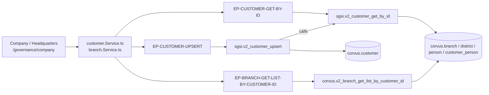

# Consultar y editar la información de la empresa

## Propósito
Mantener los datos base de la organización que ampara el SGSI: razón social, RUT, actividad económica, descripción, año de fundación, número de empleados y Casa Matriz. Es la ficha de identidad del cliente sobre la que se apoyan el resto de los módulos.

## Entrada desde UI
Primer ítem de la sección **Gobierno del SGSI** del menú lateral (`app-sgsi/src/data/menu.ts:97-102`), etiquetado *Organización*. Ruta `/governance/company`.

## Flujo funcional
1. Al montar, `Company` dispara `getCustomerById()` y `getBranchListByCustomerId()` (`company.tsx:293-296`).
2. La tarjeta **Detalles de la empresa** muestra razón social, RUT, actividad económica, descripción, año de fundación y empleados. Solo 3 campos son editables: `industry`, `description` y `yearFounded`; el resto se renderiza con `edit={false}`.
3. "Editar" (`handleStartEdit`) copia los 3 valores al estado local, saneándolos con `sanitizeText` y recortando `yearFounded` a 4 dígitos numéricos.
4. "Guardar" (`handleUpsert`) valida longitud máxima y formato (`/^\d{0,4}$/` para el año) y llama `updateCompany({industry, description, yearFounded})` → `EP-CUSTOMER-UPSERT`.
5. La tarjeta **Casa Matriz** (`headquarters.tsx`) es de solo lectura: filtra de `company.customerBranch` la sucursal con `isHeadquarters = true` y muestra su dirección, correo, teléfono y comuna.

## Frontend
`Company` → `useCustomer()` / `useBranches()` → `customerStore` / `branchStore` → `customer.Service.ts` / `branch.Service.ts`.
`Headquarters` es puramente presentacional: recibe `company` y `companyBranch` por props y no consulta ningún store.

## API
- `GET /customer/getById` → `EP-CUSTOMER-GET-BY-ID`
- `POST /customer/upsert` → `EP-CUSTOMER-UPSERT`
- `GET /branch/getListByCustomerId` → `EP-BRANCH-GET-LIST-BY-CUSTOMER-ID`

Los tres routers están montados **`admin-only`** en `api-sgsi/src/app.ts` (`:47` y `:58`).

## Backend
`routers/customer.ts` → `controllers/customer.ts#getById|upsert` → `models/customer.ts` → `queries/customer.ts`.
`routers/branch.ts:7` → `controllers/branch.ts#getListByCustomerId` → `models/branch.ts`.
En los tres casos el `customerId` sale del token (`dataUser(req).customerId`), nunca del cliente.

## Database
`sgsi.v2_customer_get_by_id` (`funciones_sgsi.sql:14740-14804`), `sgsi.v2_customer_upsert` (`:14875-14999`) y `corvus.v2_branch_get_list_by_customer_id` (`funciones_corvus.sql:23450-23489`). Tablas: `corvus.customer` (WRITE), `corvus.branch`, `corvus.district`, `corvus.person`, `corvus.customer_person` (READ).

## Reglas relevantes
- Razón social, RUT y número de empleados **no son editables** desde esta pantalla: el conteo de empleados lo calcula la función SQL sobre `corvus.customer_person`.
- El listado de representantes legales se resuelve por `corvus.customer_person.is_legal_representative` (post-sprint5), no por la columna legacy de `corvus.person`.
- `yearFounded` se almacena como texto y solo acepta hasta 4 dígitos.
- Durante el guardado no se deshabilita el formulario completo; solo se sanean los valores antes de enviarlos.

## Consideraciones
- **Deslinde**: el CRUD de sucursales (`POST /branch/upsert`, `GET /branch/getById`, `POST /branch/deleteById/:id`) **no** pertenece a `DOM-GOV` — su consumidor real es *Catálogos → Sucursales* (`/organization/branches`). Aquí solo se lee la lista para pintar la Casa Matriz.
- **Convergencia**: `EP-CUSTOMER-UPSERT` también lo usa el Wizard con el payload completo de la empresa; esta pantalla solo envía 3 campos.
- **Código muerto en la misma carpeta** (ver `docs/00-catalog/gobierno.md` § Hallazgos): `governance/company/` contiene además `needs.tsx`, `expectations.tsx`, `information-security.tsx`, `legal-regulatory.tsx` y `select-laws-modal.tsx` (~1.619 líneas) que **ningún archivo importa** — quedaron superados por `components/functional/stake-holder/quadrant-edit-*`. No forman parte de esta Operación.
- **Overload muerto**: `sgsi.v2_customer_upsert` tiene un segundo overload `(uuid, uuid, varchar)` inalcanzable desde la query actual — registrado en Hallazgos, sin nodo propio.

## Trazabilidad

