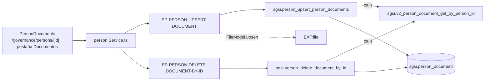

# Gestionar el expediente documental de una persona

## Propósito
Mantener el expediente de documentos firmados de cada persona (contratos, acuerdos de confidencialidad, aceptaciones de política, etc.), con su nombre, estado (firmado / pendiente) y fecha de firma.

## Entrada desde UI
Pestaña **Documentos** dentro de `/governance/persons/[id]`, renderizada por `PersonDocuments` (`person-details.tsx:807`).

## Flujo funcional
1. `PersonDocuments` **no consulta ningún endpoint de lectura**: toma los documentos de `currentPerson.documents`, que ya vienen embebidos en el payload de `EP-PERSON-GET-BY-ID` (`PersonDocuments.tsx:74-77`).
2. **Adjuntar**: seleccionar un archivo abre un diálogo que pide nombre, estado y fecha de firma; al confirmar se arma un `FormData` y se llama `upsertPersonDocument(personId, formData)` → `EP-PERSON-UPSERT-DOCUMENT` (`multipart/form-data`).
3. El controller valida el archivo y el schema, llama a la función SQL y además registra el archivo en el índice compartido (`FileModel.upsert`, `entity_type='person-document'`).
4. **Eliminar**: `deletePersonDocumentById(documentId)` → `EP-PERSON-DELETE-DOCUMENT-BY-ID`, que hace soft-delete y devuelve el listado restante.

## Frontend
`PersonDetails` → `PersonDocuments` → `usePerson()` → `personStore` → `person.Service.ts`.

## API
- `POST /person/upsertDocument/:personId` → `EP-PERSON-UPSERT-DOCUMENT`
- `POST /person/deleteDocumentById/:documentId` → `EP-PERSON-DELETE-DOCUMENT-BY-ID` (`verifyAdminOnly`)

## Backend
`routers/person.ts:27-33` → `controllers/person.ts#upsertDocument|deleteDocumentById` → `models/person.ts` → `queries/person.ts`.
El borrado valida el tenant con `sgsi.person_document_get_customer_id` (`FN-PERSON-DOCUMENT-GET-CUSTOMER-ID`); la subida **no**.

## Database
`sgsi.person_upsert_person_documents` (`funciones_sgsi.sql:7245-7314`) y `sgsi.person_delete_document_by_id` (`:6769-6795`), ambas devolviendo el listado vía `sgsi.v2_person_document_get_by_person_id`. Tabla propia: `sgsi.person_document` (WRITE).

## Reglas relevantes
- La función de alta recibe **arrays paralelos** (rutas, nombres, mime types, tamaños, fechas, estados) aunque el controller siempre envía un único documento por llamada (`upload.single('document')`).
- El borrado es lógico: marca `deleted_at` y **no elimina el archivo del disco**.
- El archivo físico vive fuera de la base: la tabla guarda su ruta, y el índice `file` lo referencia por separado.

## Consideraciones
- **Endpoint huérfano**: `GET /person/:personId/documents` tiene cadena técnica completa (router → controller → model → `sgsi.v2_person_document_get_by_person_id`) y acciones de store y hook, pero **ningún componente lo invoca**, porque la pestaña lee los documentos embebidos en `getById`. Queda registrado en Hallazgos y **no se genera nodo** para él. La function sí se documenta, porque vive por sus 4 llamadores internos.
- **Seguridad, doble hallazgo sobre `EP-PERSON-UPSERT-DOCUMENT`** (no corregido):
  - *Tenant isolation*: el controller (`controllers/person.ts:198-252`) nunca compara `personId` con `dataUser(req).customerId`, así que permite adjuntar un documento al expediente de una persona de **otro cliente**, escribiendo `sgsi.person_document` y `sgsi.file` con el `customer_id` del atacante. Es la única escritura **cross-tenant** del dominio sin ninguna barrera.
  - *Authorization*: es la única ruta de escritura de `/person` **sin `verifyAdminOnly`**, y no tiene consumidor no-admin (su UI vive dentro de una pantalla admin-only).
  - La asimetría es evidente: el **borrado** del mismo recurso sí valida tenant y sí exige admin.

## Trazabilidad

